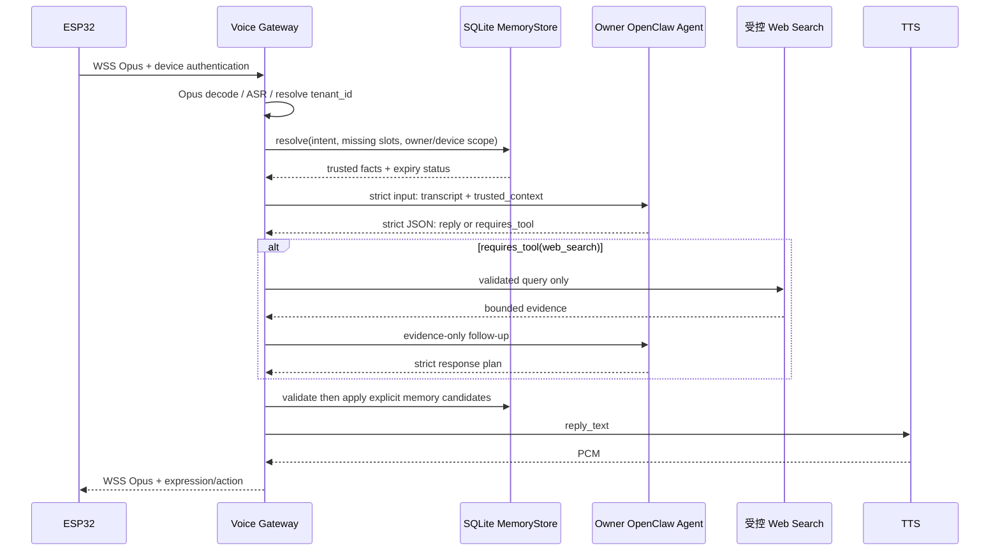

# Research: Gateway 结构化记忆 + OpenClaw 语义记忆

- 日期：2026-08-06
- 状态：技术设计，未实施。
- 依据：`v1.2.1` Gateway 源码与 OpenClaw 官方文档。

## 决策

采用两层记忆：

1. **Gateway SQLite 结构化记忆**是精确业务变量的唯一事实来源，例如 `weather.last_city`、时区、音量、称呼和明确的设备偏好。
2. **OpenClaw 内置语义记忆**只保存同一归属人的对话摘要、偏好解释和机器人长期背景；它不能替代结构化字段。

## 关键修正

### 身份不能凭空出现

当前 WSS 设备链路会校验设备 Token，并由 Gateway 的服务端 `device_users[device_id]` 映射取得 `user_id`；这能确认设备归属的 owner，但不能证明当前说话者是谁。`device_id + user_id` 只有在该服务端映射、登录或身份识别来源可信时才可作为记忆范围。

首版按「一台设备 = 一个已绑定 owner」实施：云端使用从设备认证映射出的 `tenant_id`（owner）与 `device_id` 作为范围。不要信任 ESP32 上传的任意 `user_id`。

多人共用一台机器人时，在接入账号选择或说话人识别且完成误识别处理前，不能创建个人记忆；只能使用设备公共记忆。

### OpenClaw 工作区不能混放不同用户的记忆

OpenClaw 的 `USER.md`、`MEMORY.md` 都是 agent 工作区文件，启动会被注入该 agent 上下文。一个共享 `sesame` agent 的单一工作区不能存放多位客户的个人偏好，否则存在串人风险。

若启用用户级 OpenClaw 语义记忆，需为每个 owner 分配私有 agent/workspace，例如：

```text
agent_id: sesame-owner-<opaque-owner-id>
workspace: /var/lib/openclaw/workspaces/sesame-owner-<opaque-owner-id>
```

OpenClaw 文档支持非默认 agent 使用独立 workspace，且每个 agent 的内置记忆索引存放在该 agent 的 SQLite 数据库。创建、备份和删除 owner-agent 是 Gateway/账号服务的自定义运维能力，当前仓库尚未实现。

## 数据模型

```sql
CREATE TABLE memory_facts (
  fact_id TEXT PRIMARY KEY,
  tenant_id TEXT NOT NULL,
  device_id TEXT NOT NULL,
  scope TEXT NOT NULL CHECK (scope IN ('owner', 'device')),
  namespace TEXT NOT NULL,
  fact_key TEXT NOT NULL,
  value_json TEXT NOT NULL,
  source_kind TEXT NOT NULL CHECK (source_kind IN ('owner_utterance', 'owner_confirmation', 'system')),
  source_turn_id TEXT NOT NULL,
  source_quote TEXT NOT NULL,
  confidence REAL NOT NULL CHECK (confidence >= 0 AND confidence <= 1),
  updated_at TEXT NOT NULL,
  expires_at TEXT,
  supersedes_fact_id TEXT,
  deleted_at TEXT,
  UNIQUE(tenant_id, device_id, scope, namespace, fact_key)
);
```

`weather.last_city` 与 `profile.default_city` 不能混用：

- `weather.last_city`：最近一次明确天气查询的城市，7 天过期；例如「广州天气怎么样」。
- `profile.default_city`：只有「以后默认查广州天气」或显式确认后写入；无自动过期，直到用户修改/删除。

## 请求路径



## 写入与读取的硬规则

1. ASR 文本先通过意图/槽位提取器产生 `MemoryCandidate`，不直接写库。
2. Candidate 必须带原始 utterance 的 `source_quote`、`turn_id`、范围、过期时间和覆盖键；Schema 不完整即拒绝。
3. `weather.last_city` 仅在同一句包含天气意图与明确城市实体时写入。ASR 不确定或地点歧义时只询问，不写入。
4. `profile.default_city` 仅在明确「默认/以后/记住」语义或一次确认后写入。
5. 搜索结果、网页内容、模型推断和工具输出一律不得写入 owner 结构化记忆。
6. 每个事实读出时检查 tenant、device、scope、过期和删除状态。查询不到或过期时，OpenClaw 必须追问城市，不得猜测。
7. 删除、改写和「忘记我」走同一版本化 API，保留最小审计记录而不保留原始音频。

## OpenClaw 语义记忆配置原则

- 不开启跨用户共享。每个 owner 独立 agent、独立 workspace、独立 agent SQLite。
- `USER.md`：稳定且明确的沟通偏好，如「简短回答」；`MEMORY.md`：人工审核或 consolidation 后的长期摘要；`memory/YYYY-MM-DD.md`：短期日记/摘要。
- 首期采用内置 SQLite + FTS（`provider: "none"`）验证写入、隔离和召回；它无需把记忆文本发给 embedding 服务。
- 第二期才可启用 `provider: "local"`；官方 llama.cpp provider 的默认本地模型约 0.6 GB。变更 embedding provider/model 后必须重建索引。
- 不启用 `rememberAcrossConversations` 来代替结构化记忆。若对 owner agent 启用，它只能在同一 agent 的已识别私有会话中进行有界召回；沙盒会限制这种特殊跨会话授权。
- 在单个 owner agent 内，开启 Session Memory 前选择一种来源：会话摘要 hook 或完整 transcripts，避免同一内容双重索引和额外 embedding 成本。

## 隐私与删除

- Gateway SQLite 只存白名单事实和来源短句，不存 Opus、PCM、完整转录或搜索页正文。
- OpenClaw workspace 和其 SQLite 是用户数据；禁止放入共享 workspace、公共 Git 或日志。
- 账户解绑/删除时：软删事实立即生效，异步清理 owner workspace、OpenClaw agent SQLite、向量索引和短期会话；生成可审计的删除任务记录。
- OpenClaw Sandbox 不是数据隔离替代品。官方说明 workspace 本身不是硬沙盒；需要按 agent 启用 sandbox，并限制 workspace access 和工具权限。

## 技术栈与容器边界

### 已有实现（v1.2.1）

| 层 | 已有技术 |
|---|---|
| ESP32 | ESP-IDF `>=5.5.4,<5.6.0`、C/C++、`esp_audio_codec 2.6.0`、WebSocket client、mDNS、Arduino-ESP32 组件 |
| 电脑端 Gateway | Python `>=3.12`、FastAPI、Uvicorn、Pydantic v2、JSON Schema、`opuslib`、DashScope ASR/TTS、`websockets` |
| OpenClaw | npm 依赖固定为 `openclaw 2026.7.1-1` |

### 推荐生产实现

| 层 | 推荐技术 | 职责 |
|---|---|---|
| 接入层 | Python 3.12 + FastAPI + Uvicorn | WSS、Opus、ASR/TTS 编排、结构化协议校验 |
| 临时状态 | Redis 7 | WSS 在线状态、1800 秒会话、速率限制、分布式锁；不是长期记忆 |
| 事实记忆 | PostgreSQL 16 + SQLAlchemy/Alembic | `memory_facts`、owner/device 绑定、删除审计、事务和行级租户隔离；SQLite 仅用于单机开发/测试 |
| Agent 编排 | OpenClaw 2026.7.1-1 | 对话、语义记忆、结构化输出；不能拥有事实库写权限 |
| 语义索引 | OpenClaw builtin SQLite + FTS，随后 local embedding | owner 私有 workspace 内的摘要检索 |
| 部署 | Docker Compose（单机试点）→ Kubernetes/容器编排（规模化） | 服务版本固定、私网、资源限制和滚动升级 |
| 可观测性 | Gateway 既有 dashboard + JSON 结构化日志；后续 OpenTelemetry + Prometheus/Grafana | `turn_id` 的端到端追踪，不记录原始音频 |

### 是否一个用户一个 Docker

- **开发/小规模验证**：一个 OpenClaw 容器承载多个 owner-agent，每个 owner 独立 agent/workspace/SQLite。这只提供逻辑隔离。
- **生产隐私边界**：一个 owner 一个 `openclaw-agent` worker 容器；Voice Gateway、PostgreSQL、Redis 是共享服务。每个 owner 容器没有公网端口，只能通过私有网络接受 Gateway 的内部请求，并用只读根文件系统、非 root 用户、资源上限、受限 egress 和工具默认拒绝配置运行。
- 不是「一个用户一整套 Gateway」。公开 WSS Gateway 必须共享，否则 ESP32 连接、证书、监控和升级都会被重复运维。

一个 owner 一个容器会增加容器调度、版本升级、资源计费和删除编排成本；它是以运维成本换取较强文件系统/进程隔离的选择。OpenClaw 的独立 workspace 是必要条件，但其文档明确 workspace 本身不是硬沙盒。

## 官方依据

- [Memory overview](https://docs.openclaw.ai/concepts/memory)：`USER.md`、`MEMORY.md`、每日文件、memory tools 和默认 SQLite backend。
- [Memory architecture](https://docs.openclaw.ai/concepts/memory-architecture)：memory 分层、来源元数据、写入门控、自动注入范围。
- [Memory search](https://docs.openclaw.ai/concepts/memory-search)：FTS、local embedding、混合检索与索引重建。
- [Memory configuration](https://docs.openclaw.ai/reference/memory-config)：per-agent 覆盖、跨会话检索边界、内置索引位置。
- [Agent workspace](https://docs.openclaw.ai/concepts/agent-workspace)：每 agent workspace、workspace 非硬沙盒的限制。
