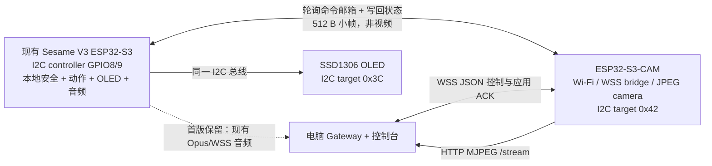

# Research: ESP32-S3-CAM + Sesame V3 双 MCU、I2C 任务桥与视频图传

> **Date:** 2026-08-13  
> **Bead:** N/A（当前环境未安装 `bd`）  
> **Status:** Complete  
> **Target baseline:** ESP-IDF v5.5.4；Sesame Distro Board V3；CAM 板具体 SKU 待确认

## Summary

芯片能力上可行，但不能按“四针一一相连后直接发送 JSON 文件”来实施。推荐让现有 Sesame V3 继续作为 GPIO8/9 I2C 控制器，OLED 保持地址 `0x3C`，ESP32-S3-CAM 作为地址 `0x42` 的 I2C 目标端并提供命令邮箱；CAM 通过独立 Wi-Fi 通道与电脑网关交换控制消息，并通过 HTTP MJPEG 向电脑提供近实时预览。

该方案的板级接线仍有一个硬门槛：必须先确认 CAM 板的完整型号、四针接口 GPIO、电压、板载上拉和电源方向。首版只经 I2C 发送带长度、序号、校验和应用回执的小型控制消息，不传视频、不传实时音频，也不重复发送完整动作资产。

## Key Findings

### 1. ESP32-S3 支持双 I2C 控制器，但每个控制器需要确定单一总线角色

> **Confidence:** high — ESP-IDF v5.5.4 明确给出控制器数量、角色和 100/400 kHz 支持边界。

- ESP32-S3 有两个 I2C controller（控制器/端口）；单个端口可作为 master/controller 或 slave/target。[S1]
- I2C 是半双工、开漏双线总线；SDA/SCL 必须上拉。ESP-IDF 建议外部上拉通常在 `1 kΩ–10 kΩ`，并明确 master SCL 不应超过 `400 kHz`。[S1]
- ESP-IDF v5.5.4 建议使用 I2C slave driver v2；旧 slave driver 将在 IDF v6.0 移除。[S1]

因此，两块 ESP32-S3 可以做板间 I2C，但 GPIO、端口角色、地址、上拉和消息协议都必须在固件中显式实现；四个焊盘/针脚本身不会自动形成“JSON 接口”。

### 2. 当前 V3 最合理的总线角色不是 CAM master，而是 V3 master + CAM target

> **Confidence:** high — 芯片级规则与本地 V3 原理图、上游固件引脚定义一致。

当前 Sesame Distro V3 已有一条可直接复用的 I2C 总线：

| V3 JST1 | 信号 | 现有用途 |
|---:|---|---|
| 1 | GND | 公共地 |
| 2 | 3V3 | OLED 供电与上拉电源 |
| 3 | GPIO9 / SCL | OLED I2C clock |
| 4 | GPIO8 / SDA | OLED I2C data |

原理图还显示 GPIO8、GPIO9 各有 `4.7 kΩ` 上拉至 3.3 V。[L1] 上游 V3 固件将 OLED 地址固定为 `0x3C`，并以 `Wire.begin(8, 9)` 初始化总线。[L2]

V3 扩展排针虽然露出 GPIO1/2/3/14/47/48/45，但正式音频固件已经占用 GPIO1/2/14/47/48；GPIO3、GPIO45 是 ESP32-S3 strapping pins（启动配置脚），不应拿来作为首版板间 I2C。[L3][S2]

所以推荐：

- V3：I2C controller/master，沿用 GPIO8/9；
- OLED：target `0x3C`；
- CAM：target `0x42`（最终仍应扫描总线确认无冲突）；
- V3 每 20 ms 读取 CAM 的短状态寄存器；有待处理命令时再读取完整帧；
- V3 写回 `RECEIVED/EXECUTING/DONE/REJECTED/FAILED` 状态。

这种角色分配的代价是 CAM 不能主动发起总线事务；命令可见延迟由轮询周期决定。若以后必须立即通知，可增加第五根 `READY/IRQ` 线，但不是首版所需。

### 3. 四针中的 VCC 不是 I2C 通信线，当前不能直接连接

> **Confidence:** high — 官方电气资料明确 GPIO 电压和供电要求；CAM 板级输入方向仍未知。

- 真正的 I2C 信号只有 SDA/SCL；两板还需要共地。VCC 是供电或上拉参考，不属于 I2C 协议。[S1]
- Espressif FAQ 给出的 GPIO 电压耐受上限为 3.6 V；不能把 ESP32-S3 I2C 视为 5 V tolerant（耐压兼容）。[S3]
- ESP32-S3 单芯片电源设计已建议 3.3 V、至少 500 mA，且 Wi-Fi 发射会带来瞬态电流；完整 CAM 板还包含传感器、PSRAM、补光灯和稳压器，不能从 V3 的普通 3V3/I2C 口想当然供电。[S4]

首版电气规则：

1. V3 与 CAM 按各自板卡要求独立供电或从同一合规电源分别稳压；
2. 先只接 `GND + SCL + SDA`；
3. CAM 端 SDA/SCL 必须是 3.3 V 开漏，并确认没有上拉到 5 V；
4. V3 JST1 已有 4.7 kΩ 上拉，先测总线等效上拉，不重复盲加；
5. 两板若分别由 USB 供电，不连接两个 VCC/3V3 输出，避免反灌；
6. 线束先控制在约 10–20 cm，并远离舵机电源/PWM 线；这是首版工程约束，不是 Espressif 给出的硬性长度保证。

在 CAM 原理图确认前，只能给出信号映射，不能按连接器视觉位置直插：

| CAM 标识 | V3 信号 | 处理 |
|---|---|---|
| GND | JST1 pin 1 / GND | 连接 |
| SCL | JST1 pin 3 / GPIO9 | 确认 CAM GPIO 后连接 |
| SDA | JST1 pin 4 / GPIO8 | 确认 CAM GPIO 后连接 |
| VCC | JST1 pin 2 / 3V3 | **首版悬空；核对原理图后再决定** |

### 4. I2C 可以承载 JSON 字节消息，但不应被当作文件传输或视频通道

> **Confidence:** high for the transport limit; medium-high for the proposed frame format, which is a project design choice.

ESP-IDF I2C API 发送的是 byte buffer（字节缓冲区）和长度，不理解 JSON、文件或“任务已完成”。400 kbit/s 扣除每字节 ACK 后，理想数据上限约 `44 kB/s`；100 kHz 时约 `11 kB/s`，还未计算地址、START/STOP、轮询和重试开销。[S1]

首版消息帧建议：

| 字段 | 长度 | 说明 |
|---|---:|---|
| magic | 2 B | 固定同步字，例如 `SM` |
| version | 1 B | 板间协议版本 |
| type | 1 B | `COMMAND/ACK/STATUS/PING` |
| sequence | 4 B | 排序、重试、去重 |
| payload_length | 2 B | JSON UTF-8 长度 |
| CRC32 | 4 B | payload 完整性 |
| payload | 0–512 B | 小型 JSON 控制信封 |

控制 payload 复用现有项目语义，但只发送高层 ID：

```json
{
  "v": 1,
  "type": "action.execute",
  "request_id": "req_92",
  "ttl_ms": 2000,
  "payload": {"action": "wave", "duration_ms": 1200}
}
```

约束：

- `MAX_PAYLOAD = 512 B`，超限在 CAM 端拒绝；
- `request_id + sequence` 做幂等，同一命令重试不能重复执行；
- I2C ACK 只表示字节传输被响应，不代表 JSON 合法、命令入队或动作完成；
- `stop` 使用独立最高优先级槽位，不能排在普通动作队列后；
- ISR 回调只复制数据/投递 FreeRTOS queue，CRC、JSON 解析和动作执行在普通 task 中完成；
- 首版不经 I2C 发送摄像头帧、Opus 音频、完整动作时间轴或 OLED 位图。

当前正式协议已经有 `request_id`、`sequence`、`timestamp_ms`、动作/表情类型和 `action.result`，可以复用语义；但其通用上限是 16 KiB，不能原样当成板间单帧上限。[L4]

### 5. ESP32-S3-CAM 可以同时做 Wi-Fi 网关与近实时图传，但视频必须独立通道

> **Confidence:** high — Espressif 摄像头组件、CameraWebServer 和 HTTP server 文档给出直接实现路径。

- `esp32-camera` 支持 ESP32-S3；除 CIF 或更低 JPEG 外，驱动通常要求启用 PSRAM。[S5]
- YUV/RGB 在 PSRAM + Wi-Fi 下更容易缺数据；官方建议优先捕获 JPEG。[S5]
- 两个或更多 frame buffers 可进入连续模式、提高帧率，但会增加 CPU/内存压力，而且只应配合 JPEG。[S5]
- Espressif 的 CameraWebServer 使用 `multipart/x-mixed-replace` 持续发送 JPEG，即 HTTP MJPEG；这是最适合 MVP 的官方示例路径。[S6]

建议首版 CAM 配置（起始测试值，不是芯片性能保证）：

```text
pixel_format = PIXFORMAT_JPEG
frame_size   = FRAMESIZE_QVGA       # 320×240
jpeg_quality = 12–15
fb_location  = CAMERA_FB_IN_PSRAM
fb_count     = 2
grab_mode    = CAMERA_GRAB_LATEST
fps_limit    = 10
```

视频通道与任务通道必须拆开：

- `/stream`：CAM 上的 HTTP MJPEG server，电脑浏览器/控制台直接读取；
- `/v1/bridge-stream`：CAM 主动连接电脑 Gateway 的 WSS 文本控制通道；
- 视频客户端变慢时丢弃旧帧，只保留最新帧，不能让视频积压阻塞任务和 I2C；
- 首版只允许一个视频客户端；不要把 JPEG 塞进现有 `/v1/device-stream` 二进制通道。

“实时视频”应定义为近实时监看。帧率、延迟受传感器、曝光、JPEG 大小、PSRAM、RSSI、AP 和客户端影响，必须实测，不能从 802.11 PHY 速率直接承诺。[S7]

### 6. 当前 Gateway 和正式固件不能直接接入第二块 CAM

> **Confidence:** high — 代码路径和数据模型明确限制了当前接入方式。

现有 Gateway `/v1/device-stream` 要求 `session.hello` 必须带固定 Opus 音频契约，并将任何 binary frame（主二进制帧）按 SSM1 Opus 解析；JPEG 会被判为非法并关闭连接。[L5] `GatewayHub.active_device` 也只在恰好一个 device session 时有效，第二个 CAM 若复用同一注册表会让控制台失去 active device。[L5]

因此需要新增而不是硬塞：

```text
Gateway
  sessions[(robot_id, "voice")]  -> 现有 ESP32-S3 WSS 音频
  sessions[(robot_id, "bridge")] -> CAM WSS 控制/状态

Console command
  -> bridge session
  -> CAM command mailbox
  -> V3 I2C poll
  -> RobotAdapter / RobotDriver
  -> I2C application ACK
  -> bridge session
  -> Gateway / Console
```

现有 ESP32-S3 的语音 Opus/WSS 首版继续直连电脑，不经 I2C 转发。若要求 CAM 成为唯一网络入口，就必须另行设计音频转发或把音频硬件迁到 CAM；这已经是新的系统架构，不属于本次四针 + 视频 MVP。

### 7. 当前真正阻塞动作落地的不是 I2C，而是正式 RobotDriver 尚未接入

> **Confidence:** high — `app_main()` 当前显式用空 driver 构造 `RobotAdapter`。

正式固件已有 `RobotDriver` 抽象和动作安全策略，但 `app_main` 当前是 `RobotAdapter robot(nullptr)`，所以真实舵机/OLED 执行链尚未接入。[L6] 双板方案应把 I2C 收到的命令交给同一个传输无关的 command dispatcher（命令分发器）和 `RobotAdapter`，而不是复制一套绕过白名单/TTL/急停的控制代码。

## Recommended Architecture



## Landing Plan

### Phase 0 — 板型与电气门禁

1. 取得 CAM 的厂商、完整 SKU、硬件版本、商品页/原理图、四针正反面照片。
2. 确认模组丝印与 PSRAM 容量，例如是否为 `N8R8`；启动后用 `esp_psram_get_size()` 实测。
3. 确认摄像头传感器是否原生输出 JPEG、SCCB 使用哪个 I2C 端口、四针 SDA/SCL 映射到哪些 GPIO。
4. 确认四针 VCC 是 3V3、5V/VBUS、输入还是输出，确认板载上拉接到哪条电源。
5. 用万用表确认实物 Sesame 板与当前 V3 原理图一致，特别是 JST1 pin 1–4 和 GPIO8/9 上拉。

**Gate:** 上述任一项不明，不连接 VCC，不做带电直连。

### Phase 1 — 独立视频最小闭环

1. CAM 先只运行官方 `esp32-camera` + HTTP MJPEG 路径。
2. QVGA/JPEG/10 FPS/单客户端，PSRAM 帧缓冲。
3. 电脑直接打开 `/stream`，连续运行 30 分钟。
4. 记录 FPS、JPEG 平均/p95 大小、视频延迟、capture failures、internal heap/PSRAM 最小值和 reset reason。

**Gate:** 无重启、无持续内存下降、视频 p95 延迟目标不高于 300 ms。

### Phase 2 — I2C 电气与邮箱协议

1. 两板独立供电，只接 GND/SCL/SDA；100 kHz 启动。
2. V3 扫描并同时发现 OLED `0x3C` 和 CAM `0x42`。
3. 实现 `PING -> STATUS`，再实现 8-byte status poll 和 512-byte command frame。
4. 加 CRC32、sequence 去重、超时、NACK、总线恢复和有界队列。
5. 通过逻辑分析仪/示波器检查 SDA/SCL 上升沿；稳定后升至 400 kHz。

**Gate:** 视频开启和舵机动作时，连续 10,000 次 PING/STATUS 无总线卡死、无重复执行、无复位。

### Phase 3 — 真实控制链

1. 在 V3 正式 ESP-IDF 固件中落地真实 `RobotDriver`，恢复舵机与 OLED，不再使用 `nullptr` driver。
2. 新建传输无关的 command dispatcher；WSS 与 I2C 都只负责把已校验的命令交给它。
3. 仅接 `stop`、`get_status`、`action.execute(wave/rest/stand)`、`expression.set`。
4. 保持动作白名单、duration 上限、TTL、request_id 幂等和本地急停。

**Gate:** 每个命令都能返回 `RECEIVED` 和最终 `DONE/REJECTED/FAILED`；断网、CAM 重启或 I2C 重试不会重放旧动作。

### Phase 4 — Gateway 与控制台集成

1. 新增独立 `/v1/bridge-stream`，不修改现有 Opus 二进制语义。
2. Gateway 会话改为 `(robot_id, role)`；命令定向发送到 `bridge`，语音仍走 `voice`。
3. 控制台展示 CAM `/stream`；局域网 MVP 可直连，远程场景必须由电脑 Gateway 做 TLS/auth proxy，不能把 CAM HTTP server 直接暴露公网。
4. 视频与控制并发压测；视频拥塞时优先降 FPS/quality，控制队列不允许无界增长。

**Gate（项目验收目标，不是官方保证）:**

- QVGA 10 FPS 中位值达标；
- 视频 p95 延迟 ≤ 300 ms；
- 图传开启时，Gateway -> CAM -> V3 -> ACK 的 p95 ≤ 100 ms；
- 连续 30 分钟无重启、无 heap 持续下降、无控制饥饿；
- Wi-Fi 重连后过期命令不执行。

## Comparisons

| 方案 | 优点 | 关键问题 | Verdict |
|---|---|---|---|
| CAM master，V3 target，独立 GPIO | 数据方向直观，CAM 可主动写 | V3 扩展口只剩 GPIO3/45，均为启动配置脚；需飞线/改板 | 当前 V3 不作为首选 |
| V3 master，CAM target，共用 OLED GPIO8/9 | 不新增危险 GPIO；复用现有 JST1、上拉和 I2C 总线 | CAM 命令需由 V3 轮询 | **推荐 MVP** |
| 视频和控制共用现有 `/v1/device-stream` | 端点少 | 当前 binary 固定按 Opus 解析；视频会阻塞/破坏音频语义 | 拒绝 |
| CAM HTTP MJPEG + 独立 WSS 控制 | 官方示例成熟、职责清楚、容易调试 | 两个通道、需会话角色管理 | **推荐 MVP** |
| CAM 作为唯一网络入口 | 对外只有一块联网板 | 现有语音 Opus/WSS 也要迁移或板间转发，扩大实时与可靠性风险 | 后续独立架构任务 |

## Disagreements

通用双 MCU 设计通常会让“收到电脑命令的 CAM”做 I2C master，让执行板做 target；这使发送方向更直接。[S1] 但本地 V3 的安全可用引脚比通用芯片能力更具约束力：扩展口可用脚已被音频占用或属于 strapping pins，而 GPIO8/9 已形成带 4.7 kΩ 上拉的 OLED 总线。[L1][L3] 因此本方案选择 V3 master + CAM target，并接受 20 ms 轮询延迟。

## Codebase Context

- 正式 V3 源为 `firmware-work/Sesame_Robot_V3_IDF/`，当前使用 ESP-IDF v5.5.4、4 MB Flash 配置并启用 Octal PSRAM。[L3]
- I2S 固定占用 GPIO14/47/48/2/1；BOOT 使用 GPIO0。[L3]
- 当前 Gateway 是单设备开发骨架；第二个会话会使 `active_device` 失效，且当前 binary 仅接受 SSM1 Opus。[L5]
- 现有控制信封和 `RobotDriver` 抽象可复用，但正式动作驱动未接入。[L4][L6]
- 根目录 Git 当前没有提交，无法用提交记录证明哪份固件已烧录到实物；接线前必须以万用表和实物丝印复核。

## Recommendations

1. 认可双板方向，但把 CAM 定位为“视觉 + 网络桥 + 命令邮箱”，不是实时运动控制器。
2. 首版复用 V3 GPIO8/9 OLED 总线；不要使用 GPIO3/45，不要让 CAM 与 V3 同时做 master。
3. VCC 暂不接；先拿到 CAM 精确型号/原理图，并让 CAM 使用其规定电源。
4. 视频使用 JPEG/MJPEG 独立通道；控制使用 WSS + I2C 小帧，禁止视频进入 I2C 或现有 Opus 通道。
5. 在做双板业务联调前，先补齐正式 `RobotDriver`，否则“命令成功下发”仍不会变成真实动作。
6. 首版保留现有 V3 语音 WSS；是否把 CAM 升级成唯一联网主控，另开架构决策。

## Recommended Work Items

当前环境无 `bd`，以下仅记录建议任务：

- P0 `确认 ESP32-S3-CAM 精确板型、四针电气与供电` — 决定是否允许通电直连。
- P0 `实现并验证 CAM 独立 MJPEG 预览` — 先证明视频资源和电源稳定性。
- P0 `定义 sesame-i2c-link.v1 邮箱协议与故障用例` — 固定帧、状态机和恢复行为。
- P0 `在正式固件接入真实 RobotDriver` — 当前真实动作链阻塞项。
- P1 `新增 Gateway bridge role 与控制台视频入口` — 避免破坏现有音频协议。
- P1 `完成视频 + I2C + 舵机联合压力测试` — 验证电源、EMI、延迟和恢复。

## Open Questions

1. CAM 开发板的厂商、完整型号、硬件版本、传感器和模组丝印是什么？
2. CAM 四针接口的物理顺序、电压、上拉和对应 GPIO 是什么？
3. 你要求 CAM 成为所有网络通信的唯一入口，还是只接管新的视频与动作转发？
4. 实物 Sesame 板是否确实为 Distro V3 Rev.3，JST1 是否仍连接 OLED？
5. 视频只在同一局域网电脑观看，还是未来需要跨公网远程观看？

## Refuted / Discarded Claims

- “四根线接起来即可通信” — 缺少 I2C 角色、地址、GPIO、电压、上拉、消息边界、ACK 和供电确认。
- “VCC 是第四根 I2C 通信线” — VCC 是供电/参考，不是 I2C 协议信号。
- “可以直接下发 JSON 文件” — I2C 传字节；首版应传 ≤512 B 的有边界控制消息。
- “CAM 可以把实时视频也经 I2C 发给下板/电脑” — 400 kHz 驱动边界只适合控制与状态，视频走 Wi-Fi。
- “实时视频帧率可以预先保证” — 官方只给能力和示例，实际 FPS/延迟必须在具体板卡和网络上实测。
- “CAM 可直接复用现有 `/v1/device-stream`” — 该端点要求 Opus 音频契约并把 binary 固定解析为 SSM1。

## Sources

- **[S1]** [ESP-IDF v5.5.4 — ESP32-S3 I2C](https://docs.espressif.com/projects/esp-idf/en/v5.5.4/esp32s3/api-reference/peripherals/i2c.html) — Espressif official; controller count, roles, pull-ups, 100/400 kHz, target driver v2, master/target transactions.
- **[S2]** [ESP-IDF v5.5.4 — ESP32-S3 GPIO](https://docs.espressif.com/projects/esp-idf/en/v5.5.4/esp32s3/api-reference/peripherals/gpio.html) — Espressif official; GPIO restrictions, strapping, USB-JTAG, flash/PSRAM pins.
- **[S3]** [ESP-FAQ — Hardware Design](https://docs.espressif.com/projects/esp-faq/en/latest/hardware-related/hardware-design.html) — Espressif official; GPIO voltage tolerance is 3.6 V.
- **[S4]** [ESP32-S3 Hardware Design Guidelines — Power Supply](https://docs.espressif.com/projects/esp-hardware-design-guidelines/en/latest/esp32s3/schematic-checklist.html#power-supply) — Espressif official; 3.3 V/≥500 mA baseline and decoupling guidance.
- **[S5]** [esp32-camera v2.1.7 README](https://github.com/espressif/esp32-camera/blob/v2.1.7/README.md) — Espressif official component, 2026-06-05; ESP32-S3 support, JPEG/PSRAM/frame-buffer constraints.
- **[S6]** [Arduino-ESP32 CameraWebServer `app_httpd.cpp`](https://github.com/espressif/arduino-esp32/blob/master/libraries/ESP32/examples/Camera/CameraWebServer/app_httpd.cpp) — Espressif official example; HTTP MJPEG implementation.
- **[S7]** [ESP-IDF — ESP32-S3 Wi-Fi Performance and Power Save](https://docs.espressif.com/projects/esp-idf/en/stable/esp32s3/api-guides/wifi-driver/wifi-performance-and-power-save.html) — Espressif official; measured throughput conditions, shared memory, power-save/latency tradeoff.
- **[L1]** [`Schematic_Sesame-Distro-Board-V3_2026-05-30.png`](../../github_refs/sesame-robot/hardware/pcb/distro-v3/assets/Schematic_Sesame-Distro-Board-V3_2026-05-30.png) — local V3 schematic; JST1, GPIO8/9 and 4.7 kΩ pull-ups.
- **[L2]** [`sesame-firmware-main.ino`](../../github_refs/sesame-robot/firmware/sesame-firmware-main/sesame-firmware-main.ino) — local upstream reference; OLED `0x3C`, SDA=8, SCL=9.
- **[L3]** [`audio_contract.h`](../../firmware-work/Sesame_Robot_V3_IDF/components/sesame_audio/include/sesame_audio/audio_contract.h) and [`sdkconfig.defaults`](../../firmware-work/Sesame_Robot_V3_IDF/sdkconfig.defaults) — local current firmware; active GPIO and target configuration.
- **[L4]** [`control_event.h`](../../firmware-work/Sesame_Robot_V3_IDF/components/sesame_protocol/include/sesame_protocol/control_event.h) — local current control envelope and size limits.
- **[L5]** [`endpoint-gateway/app.py`](../../endpoint-gateway/src/sesame_endpoint_gateway/app.py) — local current Gateway session, audio handshake and binary parsing constraints.
- **[L6]** [`app_main.cpp`](../../firmware-work/Sesame_Robot_V3_IDF/main/app_main.cpp) and [`robot_adapter.h`](../../firmware-work/Sesame_Robot_V3_IDF/components/sesame_robot/include/sesame_robot/robot_adapter.h) — local current driver integration state.
