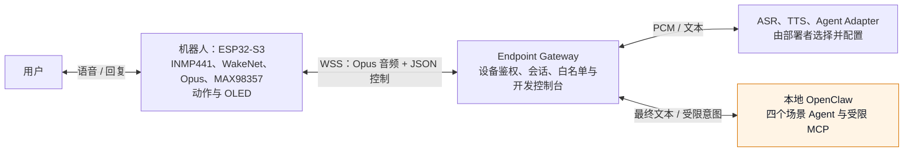

# Sesame Robot V3

Sesame Robot V3 是一个运行在 ESP32-S3 机器人与本地电脑之间的语音交互方案：机器人负责本地唤醒、音频采集和播放、动作与表情；电脑上的 Endpoint Gateway 负责设备连接、对话状态与安全控制；OpenClaw 只负责文字对话和受限的场景能力。

这不是原版 Sesame Robot 的简单升级包。原版仓库提供机械结构、PCB、Arduino 基线和 Sesame Studio；V3 在此之外增加了 ESP32-S3 语音固件、WSS（加密 WebSocket）通信、电脑端 Gateway 和本地 OpenClaw 配置模板。

> **当前状态：软件链已完成修复与全量测试，整机验收待进行。** `gateway/` 已包含 DashScope ASR/TTS、OpenClaw、受限联网搜索和 Opus/WSS 语音链；ESP32-S3 固件、场景接口和 OpenClaw 模板也已纳入项目。当前没有连接 ESP32，因此刷机、MAX98357 实际出声、真实舵机执行和整机压力测试仍需在硬件在线后完成。

## 项目要解决什么

用户对机器人说话后，系统应在本地唤醒，再把语音交给电脑端完成识别、理解与合成，最后让机器人播放语音、显示表情，并在通过安全校验的前提下执行已验收的动作。系统将实时音频、AI 决策和硬件控制分开，避免大模型直接控制 GPIO 或舵机角度。



OpenClaw 不接收 ESP32 的实时音频，也不能直接连接设备、读取设备 token、执行宿主机命令或控制舵机。Gateway 是它与物理设备之间的安全边界。

## 当前能做什么、还不能做什么

下面的“已具备”表示仓库已有相应源码、模板或可验证的开发基线，不表示整机体验已经全部完成。

| 部分 | 已具备的内容 | 仍未完成或不能据此保证的内容 |
| --- | --- | --- |
| ESP32-S3 端 | `firmware-work/Sesame_Robot_V3_IDF/` 中的 I2S 音频、WakeNet、Opus、WSS、NVS 配置与主机侧协议测试基线。 | 真实硬件接线、每台设备的网络凭据和实机验收仍需单独完成。 |
| Endpoint Gateway | 单设备 WSS 入口、协议/设备 token 校验、开发控制台、动作/表情白名单、场景 API 和 MCP bridge。 | 它不是公网服务；生产认证、TLS 终止、审计存储和多设备运营能力尚未配置。 |
| OpenClaw | 四个 Agent 的脱敏 workspace 模板，以及仅读取/切换场景的 `sesame-scene` MCP 配置模板。 | 不含本机 `~/.openclaw/`、模型凭据、会话或个人记忆；知识库检索尚未接入。 |
| 语音与 Agent | `gateway/` 中实现 DashScope ASR/TTS、OpenClaw Adapter、Gateway 执行的单次受限联网搜索以及 Opus 下行。 | Provider 凭据和远程语音许可只在部署环境配置；当前不能用软件测试代替 MAX98357 实机验收。 |
| 动作与表情 | Gateway 可以校验白名单并向设备转发受控命令；开发控制台可发起人工动作。 | ESP-IDF 的 `RobotAdapter` 尚未接入真实 `RobotDriver`。因此不能保证命令会让真实舵机动作；当前 OpenClaw 输出的动作也会被 Gateway 忽略。 |

### 已有的场景

Gateway 支持一个正常模式与三个场景模式。场景切换已有限制，主要用于选择对应的 OpenClaw Agent；它不是硬件控制权限。

| 场景 ID | 用途 | Agent ID | 当前约束 |
| --- | --- | --- | --- |
| `normal` | 日常基础对话 | `sesame` | 独立的基础对话状态。 |
| `learning` | 学习陪伴 | `sesame-learning` | 重点是结论、原因和一个下一步。 |
| `children` | 儿童互动 | `sesame-children` | 短句、故事问答、一次一个任务。 |
| `work` | 工作辅助 | `sesame-work` | 重点是结论、待办、风险和下一步。 |

当前 MCP 只提供 `list_scenes`、`get_scene` 和 `select_scene` 三个工具。四个 Agent 的动作输出固定为空数组，只能请求 `default`、`happy`、`thinking` 三种表情；这是在真实动作执行经过硬件验证前的有意限制。

## 目录说明

| 目录 | 内容 | 是否属于 V3 应交付内容 |
| --- | --- | --- |
| `firmware-work/Sesame_Robot_V3_IDF/` | V3 ESP-IDF 正式固件。 | 是 |
| `gateway/`、`contracts/` | 正式 Voice Gateway、开发控制台、ASR/OpenClaw/TTS/搜索编排、测试和共享协议 Schema。 | 是 |
| `endpoint-gateway/` | 早期简化 Gateway，仅保留作迁移与兼容参考；不作为正式运行入口。 | 否 |
| `ops/openclaw/` | OpenClaw workspace、Agent 与 MCP 的脱敏项目模板。 | 是 |
| `docs/` | 架构、实施、技术设计与跨设备搭建资料。 | 是 |
| `firmware/INMP441_Audio_Test/`、`flash-diagnostics/` | 音频实验和刷机诊断。 | 按调试需要保留 |
| `Bottango/`、`tools/`、`assets/` | 动作创作和辅助材料。 | 按是否维护动作资产决定 |
| `github_refs/sesame-robot/` | 原版 Sesame 的本地参考副本。 | 不要作为 V3 源码交付；记录其上游来源和 commit 即可 |
| `output/`、`restore-archives/`、`.internal/` | 历史任务产物、备份与本机状态。 | 否 |

原版 Sesame 的上游仓库是 [dorianborian/sesame-robot](https://github.com/dorianborian/sesame-robot)。需要打印、装配或维修机体时，另外克隆该仓库并使用其 `hardware/`、装配与接线资料；不要把原版源码与 V3 改动混在同一个源代码目录中。

## 快速开始

### 只验证电脑端 Gateway

这是新设备上最先应完成的路径：不需要机器人、不需要 OpenClaw Provider，也不能证明语音或舵机已经可用。

```bash
cd gateway
python3 -m venv .venv
. .venv/bin/activate
uv sync --frozen --python 3.12
sh tests/run_lab_tests.sh
```

正式运行配置见 `gateway/README.md`。控制台仅供受信任的本机/局域网开发环境使用，不应直接暴露到公网。

### 继续搭建完整开发环境

完整流程、ESP-IDF v5.5.4 构建、每台设备 NVS 配置和 OpenClaw 安装，见以下文档。先从人类指南开始；换电脑后交给 AI 执行时使用 AI 交接文档。

- [换电脑后的搭建指南](docs/setup/new-machine-setup-guide.md)
- [给 AI 的新电脑搭建交接文档](docs/setup/ai-agent-new-machine-handoff.md)
- [OpenClaw 本地配置](ops/openclaw/README.md)

## 必须遵守的安全边界

- 不提交 `.env`、真实 `device-config.json`、`device-nvs.bin`、设备 token、Wi-Fi 密码或私有 CA 证书。
- 不复制或提交完整 `~/.openclaw/`；其中包含模型凭据、会话、个人记忆与 sandbox 运行状态。只提交 `ops/openclaw/` 的模板。
- 不让模型直接生成舵机角度、GPIO、固件代码片段或任意宿主机命令。模型只能表达通过白名单的高层意图。
- 不把本机开发控制台当作生产设备入口。实机需要 `wss://.../v1/device-stream`、私有 CA、设备身份和单独的网络部署。
- 没有完成机械校准、限位、急停和断电测试前，不要让真实机器人执行高风险动作。

## 阅读路径

| 你想了解什么 | 先读什么 |
| --- | --- |
| 当前 V3 全链路和职责边界 | [当前完整架构图](docs/architecture/sesame-robot-v3-current-complete-architecture.md) |
| V3 与原版 GitHub 的差异、哪些文件要带到新设备 | [项目范围与跨设备快速复现指南](docs/sesame-robot-v3-scope-and-replication-guide.md) |
| Gateway 的 API、控制台与当前限制 | [Voice Gateway README](gateway/README.md) |
| OpenClaw 的安装、四个 workspace 与 MCP bridge | [OpenClaw 本地配置](ops/openclaw/README.md) |
| ESP32、Opus、OpenClaw 的平台级技术设计 | [技术设计](docs/technical-design/esp32-opus-openclaw-platform.md) |
| Voice Gateway 后续实现细节 | [Voice Gateway 后端实现指南](docs/implementation/voice-gateway-backend.md) |

## V3 代码交付边界

如果要把项目放到 GitHub 或迁移到另一台电脑，应建立独立的私有 `sesame-robot-v3` 仓库，至少包含 `firmware-work/Sesame_Robot_V3_IDF/`、`gateway/`、`contracts/`、`ops/openclaw/`、`docs/` 以及必要的动作资产。原版 Sesame 保持为清晰记录的上游依赖，历史输出、构建目录、虚拟环境和任何凭据不进入 Git。

具体清单和两种迁移方式见[项目范围与跨设备快速复现指南](docs/sesame-robot-v3-scope-and-replication-guide.md)。
