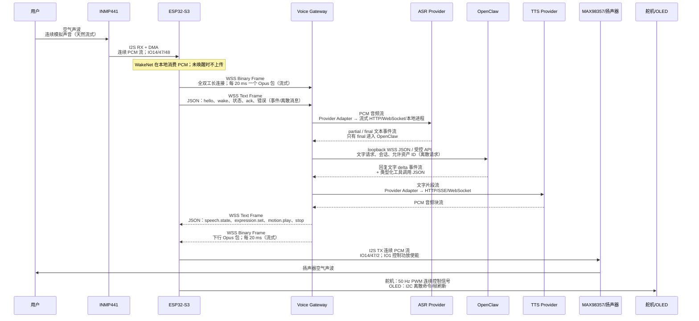
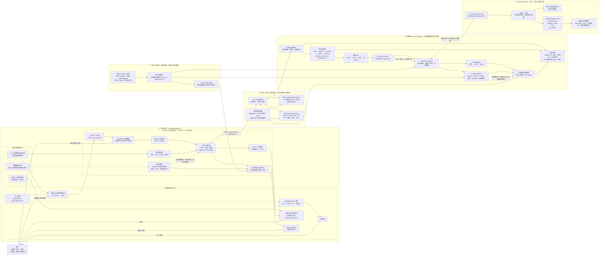

# Sesame Robot V3 当前完整架构图

> 日期：2026-07-27  
> 状态：当前权威总览图  
> 范围：INMP441、MAX98357、ESP32-S3、Wi-Fi/WSS、Voice Gateway、OpenClaw、动作/表情资产与安全控制。  
> 阅读方式：实线是业务/媒体流，虚线是安全、日志或资产发布流；OpenClaw 只在文字与控制面出现。

## 1. 全链路通信方式图

> 这张图专门回答“每一段怎么传、是否流式”。其中 `流式` 指数据持续分小块传输，而不是等整段语音或整句回复完成后再一次性发送。



## 2. 各环节通信方式对照表

| 起点 → 终点 | 传输内容 | 通信方式 | 是否流式 | 说明 |
| --- | --- | --- | --- | --- |
| 用户 → INMP441 | 空气声波 | 声学模拟信号 | 是，连续 | 用户实际说话产生的声音。 |
| INMP441 → ESP32 | 数字音频采样 | I2S RX + DMA；IO14/47/48 | 是，连续 PCM | 机器人耳朵到主控；不是网络传输。 |
| ESP32 PCM → WakeNet | 本地音频缓冲 | FreeRTOS 任务 + PCM ring buffer（环形缓冲） | 是，连续帧 | 本地唤醒，不出设备。 |
| ESP32 PCM → Opus | 本地编码 | FreeRTOS 任务 + 有界队列 | 是，20 ms 帧 | PCM 每 20 ms 编成一个 Opus 包。 |
| ESP32 ⇄ Voice Gateway | Opus、控制、回执 | Wi-Fi 上的 WSS 长连接；TCP/TLS/WebSocket | 音频是流式；JSON 是事件/请求响应 | 这是机器人与电脑唯一的业务网络连接。 |
| Voice Gateway → ASR | PCM 音频 | ASR Provider Adapter；具体可为本地进程、流式 HTTP 或 WebSocket | 是，流式 | Provider 的实现可替换，但网关内部统一看成 PCM 流。 |
| ASR → Voice Gateway | 识别文字 | ASR 事件流 | `partial` 是流式，`final` 是单轮确定结果 | 只有 `final` 进入 OpenClaw。 |
| Voice Gateway ⇄ OpenClaw | 文字、会话、工具调用 | 本机 loopback WSS JSON 或受控 API | 回复文字可流式；工具调用是离散 JSON | 不传 PCM、WAV 或 Opus。 |
| Voice Gateway → TTS | 回复文字片段 | TTS Provider Adapter；可为 HTTP/SSE/WebSocket | 可流式 | 文本一有完整可朗读片段即可开始生成。 |
| TTS → Voice Gateway | PCM 音频块 | Provider 流式返回 | 是，流式 | 网关统一采样率后重新编码为 Opus。 |
| Voice Gateway → ESP32 | 表情、动作、状态 | WSS Text Frame + JSON | 否，离散命令 | 需要 `ack/error`，可按 `request_id` 去重。 |
| Voice Gateway → ESP32 | TTS 音频 | WSS Binary Frame + Opus | 是，20 ms 包 | 与 JSON 共用连接，但不是同一种帧。 |
| ESP32 → MAX98357 | PCM 音频 | I2S TX；IO14/47/2 | 是，连续 PCM | MAX98357 将数字 PCM 放大成扬声器功率信号。 |
| ESP32 → 舵机 | 动作角度/脉宽 | 50 Hz PWM | 是，周期控制信号 | 运行时只按已验收 `action_id` 执行。 |
| ESP32 → OLED | 表情位图/状态 | I2C 控制命令与帧刷新 | 否，离散刷新 | 运行时只按 `expression_id` 选择。 |
| 资产包 → ESP32 | 动作/表情文件 | 低频版本同步：WSS JSON 清单 + 分块二进制，或刷机预置 | 否，低频分块 | 不与实时 Opus 对话流混传。 |



## 3. 图中最重要的四条规则

1. **实时媒体只走 ESP32 ⇄ Voice Gateway**：Opus 在 WSS 二进制帧中传输；OpenClaw 不接触 PCM 或 Opus。
2. **OpenClaw 只能表达意图**：它只能选择白名单中的 `action_id`、`expression_id` 和回复文字；Control Adapter 才能下发设备命令。
3. **唤醒在机器人本地完成**：WakeNet 命中后才上传用户语音；单 INMP441 不能实现声源方向识别。
4. **安全优先于内容**：`stop/flush`、断线和任务看门狗可以取消旧动作与旧音频；动作 JSON、表情 JSON 与 Opus 不能混成一个消息。

## 4. 整个系统在做什么

这套架构把一个机器人回复拆成四种不同性质的工作：

1. **机器人端的实时物理工作**：听声音、判断是否被唤醒、播放声音、驱动舵机和 OLED，并在异常时先保证安全。
2. **电脑 Voice Gateway 的实时编排工作**：接收 Opus、执行 ASR/TTS、管理一轮对话的开始/结束/打断，并把合法意图送给机器人。
3. **OpenClaw 的理解与决策工作**：根据最终文字和会话记忆生成回复，选择已经允许的动作和表情。
4. **资产管理工作**：把动作与表情变成有版本、可校验、可白名单管理的资产；运行时不让模型直接写舵机角度或 OLED 原始位图。

它们必须分开：物理实时任务不能等待大模型；大模型也不能绕过安全校验直接控制硬件。

## 5. A 区：机器人端每一个板块

### A1. 供电与物理安全

| 图中模块 | 做什么 | 为什么需要 | 输入 / 输出 |
| --- | --- | --- | --- |
| 独立 5 V 舵机电源 | 给 8 路 MG90S 提供高电流电源。 | 舵机启动、站立或动作时电流波动很大，不能依赖 ESP32 的 3.3 V 电源。 | 输入：外部电源；输出：5 V 舵机电源。 |
| 3.3 V 逻辑/麦克风电源 | 给 ESP32-S3、INMP441 和逻辑侧供电。 | 减少舵机电流波动对主控和麦克风的干扰。 | 输入：电源转换后的 3.3 V；输出：逻辑模块电源。 |
| 公共地 | 连接舵机电源、ESP32、麦克风、功放的 GND。 | 没有共同参考地，PWM 和 I2S 信号都可能不稳定。 | 输出：所有模块共享的信号参考。 |
| 物理断电方式 | 电源开关、拔电或可快速断电的供电方案。 | 软件失控、接线错误、舵机卡死时，物理断电是最后保护。 | 人工触发；输出：立即停止供电。 |

这里不负责对话，也不负责网络。它只负责让机器人在电气层面能安全上电、稳定运行和立即停止。

### A2. INMP441 麦克风与 I2S 采集

INMP441 把空气中的声音变成 I2S 数字数据，不需要模拟 ADC。它向 ESP32 输出的是连续数字音频流：

```text
用户声音
→ INMP441
→ I2S：IO14 BCLK + IO47 WS/LRCLK + IO48 DOUT
→ ESP32 I2S RX DMA
→ 16 kHz / 单声道 PCM
```

- `BCLK` 是每一位数据的时钟。
- `WS/LRCLK` 表示当前音频采样所属的声道/帧位置。
- `DOUT` 是 INMP441 输出给 ESP32 的麦克风数据。
- `DMA` 让 ESP32 把连续音频搬到内存缓冲区，不必由 CPU 每个采样点手工读取。

这个模块只采集声音，**不做 ASR**。它不知道用户说了什么，只把声音变成 PCM 给后续唤醒和编码任务。

### A3. WakeNet 本地唤醒与语音状态机

WakeNet 是本地唤醒词检测。机器人空闲时仍读取 INMP441 的 PCM，但不把普通环境声持续发送给电脑 ASR。它只判断是否听到了配置好的唤醒词。

状态含义如下：

| 状态 | 机器人在做什么 | 如何离开 |
| --- | --- | --- |
| `IDLE` | 等待，运行 WakeNet；不创建 ASR 对话轮次。 | 唤醒词命中。 |
| `WAKE` | 显示已唤醒，可播放提示音或切换表情。 | 进入聆听窗口。 |
| `LISTEN` | 采集并上传用户说话的音频。 | VAD 判断用户说完，或等待超时。 |
| `THINK` | 等待 ASR、OpenClaw 和 TTS 首段结果。 | 收到下行语音或错误。 |
| `SPEAK` | 播放 TTS，同时显示说话表情；第一版为半双工，不继续识别用户语音。 | 播放结束、收到 `stop/flush`，或用户开始新的唤醒。 |

单 INMP441 只能判断“是否说了唤醒词”，不能判断声源来自哪个方向。真实方向识别需要增加至少一个麦克风和相应算法。

### A4. Opus 编码、Wi-Fi 和 WSS 客户端

用户被唤醒后，PCM 不直接传到电脑，而是按固定短帧交给 Opus 编码器。Opus 的作用是压缩语音，减少 Wi-Fi 带宽和传输延迟。

```text
PCM
→ 每 20 ms 切一帧
→ Opus 编码
→ 一个 Binary WebSocket Frame
→ WSS 发送到 Voice Gateway
```

ESP32 的 WSS 客户端负责：

- 连接到电脑 Voice Gateway；
- 设备认证；
- 发送心跳、发现断线、按策略重连；
- 区分二进制 Opus 帧与文字 JSON 控制帧；
- 收到新的 `generation_id` 后丢弃旧一轮语音，避免断线重连或打断后播放过期回复。

它不直接连接 OpenClaw。OpenClaw 不应该持有 ESP32 的 IP、密钥或 WebSocket 连接。

### A5. MAX98357、扬声器与下行音频

下行链路是上行的反向过程：

```text
Voice Gateway 下发 Opus
→ ESP32 解码为 PCM
→ I2S TX
→ IO2 输出到 MAX98357 DIN
→ MAX98357 驱动扬声器
```

`IO1` 用于 MAX98357 的 `SD/EN`，让固件可以控制功放使能。下行缓冲必须有上限：它的目的是吸收短暂 Wi-Fi 抖动，而不是缓存整段回复。用户打断时，旧 Opus、PCM 和 I2S 播放缓冲都必须清空。

### A6. 动作、表情与本地机器人运行时

机器人运行时收到的不是“第 0 路舵机转多少度”这类原始指令，而是经过审核的业务指令，例如：

```json
{"type":"motion.play","payload":{"action_id":"wave"}}
```

运行时依次完成：

1. 校验消息版本、`request_id`、截止时间和 `action_id`；
2. 查找本机动作资产；
3. 再检查当前姿态和动作是否允许执行；
4. 执行动作播放器并驱动 8 路舵机；
5. 切换 OLED 表情；
6. 回传 `ack`、`command.result` 或 `error`。

这样即使 OpenClaw 输出错误的动作名称，ESP32 也能拒绝；它不会接受模型临时编造的舵机角度。

### A7. 看门狗与安全控制

安全控制是固件的独立优先级，不是普通动作的一部分。它监视：WSS 是否还连接、命令是否超时、任务是否卡死、是否收到 `stop/flush`。

发生异常时，它的目标是：停止待执行动作、取消旧音频、让表情退出说话状态、向网关报告错误，并避免继续执行旧命令。它不会凭空解决机械碰撞或舵机堵转；这些仍依赖前期校准、动作限位和物理断电能力。

## 6. B 区：Wi-Fi/WSS 传输层每一个板块

WSS 是加密 WebSocket。它保持一条长连接，使 ESP32 不必为每个 Opus 包或每个动作重新发起 HTTP 请求。

| 图中模块 | 做什么 | 典型内容 |
| --- | --- | --- |
| TLS + 设备认证 | 加密链路并确认连接的是哪台机器人。 | 设备凭证、设备 ID、连接 ID。 |
| Binary WebSocket Frame | 传实时 Opus 音频。 | 一包 Opus 加协议头：版本、上/下行类型、`generation_id`、序号、长度。 |
| Text WebSocket Frame | 传小型控制 JSON。 | `session.hello`、`ack`、`motion.play`、`expression.set`、`stop`、状态和错误。 |
| 单发送调度器 | 管理同一连接的发送顺序。 | 先 `stop/flush`，再控制 JSON，最后语音包。 |

为什么要分 Binary 与 JSON：音频是高频、短小、允许丢失的实时数据；控制命令是低频、必须可追踪和确认的数据。把 Opus 转成 Base64 塞进 JSON 会增加体积和解析负担，也会让协议难以处理。

## 7. C 区：电脑 Voice Gateway 每一个板块

Voice Gateway 是电脑上的本地服务，也是整个系统的“实时交通枢纽”。它不是 OpenClaw；它负责把实时音频、对话状态和机器人控制安全地连接起来。

### C1. 设备 WSS 接入

它接收 ESP32 的 WSS 连接，完成设备身份校验、连接数量限制、协议版本和最大帧长校验。验证成功后，才为这台机器人创建会话对象。

### C2. 会话状态机

会话状态机记录这一轮对话处于什么阶段，以及哪些数据属于同一轮：

- `session_id`：同一段持续对话；
- `turn_id`：用户说一句、机器人答一句的单轮；
- `generation_id`：一次可播放的机器人回复版本。

`generation_id` 用来解决打断：用户在第 7 代回复播放时开始新一轮，网关取消第 7 代，后续 ESP32 只播放更高代际的数据。

### C3. 媒体上行、VAD 和 ASR

网关收到上行 Opus 后：

```text
Opus 解码为 PCM
→ VAD 判断用户是否还在说话、何时说完
→ 流式 ASR 输出 partial/final
→ 只有 final 文本进入 OpenClaw
```

`partial` 是识别过程中的临时文本，可能变化，不能作为 Agent 的正式输入；`final` 才是稳定的一句话。

### C4. OpenClaw Adapter

它是 Voice Gateway 与 OpenClaw 之间的翻译层。它把 ASR 最终文本、会话 ID 和允许使用的资产 ID 发给 OpenClaw；再把 OpenClaw 的两类输出拆开：

- 回复文字流 → 交给 TTS Adapter；
- 类型化工具调用 → 交给 Control Adapter。

这层使 OpenClaw 的具体连接协议、版本或部署方式不会泄漏到音频处理和 ESP32 固件里。

### C5. TTS Adapter

TTS Adapter 接收回复文字，调用选定的 TTS Provider，得到 PCM 音频块。之后它统一采样率、切成固定帧、编码为 Opus，并把下行音频交给发送调度器。

它必须支持取消：用户打断时，旧 TTS 任务必须停止，不能继续把旧句子排进播放队列。

### C6. Control Adapter

Control Adapter 是 OpenClaw 与真实机器人之间最重要的安全门。它检查：

- 工具名称是否在四个允许工具内；
- `action_id` / `expression_id` 是否来自资产注册表；
- 动作时长、调用频率、截止时间是否合规；
- 同一 `request_id` 是否已经执行，避免重连重试导致动作重复；
- 该命令是否属于当前 `generation_id`。

通过后，它才生成 ESP32 看得懂的 JSON。拒绝时只返回结构化错误，不尝试“猜一个近似动作”。

### C7. 发送调度器与日志

发送调度器是 Voice Gateway 对设备的唯一出口，避免 TTS、动作和停止命令同时抢写 WebSocket。它保证高优先级停止命令先发送，再发动作/表情，最后连续发 Opus。

日志记录请求 ID、设备 ID、阶段耗时、错误码和命令结果，用于排查“慢在哪里、哪个模块失败”。日志不应保存原始 Opus、访问密钥或完整敏感对话。

## 8. D 区：OpenClaw 中台每一个板块

OpenClaw 是“理解用户意图和选择表达”的中台，不是语音编解码服务器，也不是硬件驱动。

| 图中模块 | 做什么 | 绝对不做什么 |
| --- | --- | --- |
| OpenClaw Gateway | 接受 Voice Gateway 的文字请求，返回文字流和工具调用。 | 不接受 ESP32 的 WSS 音频连接。 |
| Agent + LLM | 理解用户文字、结合角色设定与上下文生成回复。 | 不直接下发 GPIO、舵机角度或 Opus。 |
| 会话记忆 | 保存同一用户/设备的对话上下文。 | 不与其他用户/设备混用。 |
| Sesame 工具 | 只表达 `set_expression`、`perform_action`、`stop`、`get_status` 四类机器人意图。 | 不执行 shell、读写宿主文件、访问任意网页或安装插件。 |
| 工具策略与沙盒 | 限制 Agent 的能力范围，即使提示词被攻击也不能越权。 | 不能被“模型说可以”绕过。 |

例如用户说“你好小汉，跟我打个招呼”，OpenClaw 可以生成“你好，很高兴见到你”，并调用 `perform_action(wave)` 和 `set_expression(talk_happy)`。它不能直接决定 8 个舵机的 PWM 数据。

## 9. E 区：动作、表情资产与发布

资产区解决的是“动作和表情从哪里来、谁允许使用、机器人如何得到它们”。它不属于每一轮实时对话。

| 图中模块 | 做什么 |
| --- | --- |
| `robot-assets.v1.json` | 统一描述动作和表情的 ID、版本、hash、风险级别、最大时长、播放模式等。 |
| 资产注册表 | 只将真实机器人已经验证通过的资产 ID 提供给 OpenClaw 和 Control Adapter。 |
| ESP32 资产存储 | 保存固件预置资产或 LittleFS 中的版本化资产，供本地运行时按 ID 调用。 |

首次刷机或资产更新时，网关比较版本和 hash，必要时再同步；实时对话时只发 `wave`、`talk_happy` 这样的 ID。这样不会在用户说话时传完整动作 JSON、OLED 位图或语音文件。

## 10. 一轮正常对话如何完整运行

1. 机器人空闲，INMP441 持续采音，WakeNet 只监听唤醒词。
2. 用户说唤醒词，ESP32 进入 `WAKE` 和 `LISTEN`。
3. 用户说完整需求，ESP32 将 20 ms Opus 包通过 WSS 发送到 Voice Gateway。
4. Voice Gateway 解码 Opus、用 VAD 判断说话结束、由 ASR 产生最终文字。
5. Voice Gateway 将最终文字、会话信息和白名单资产 ID 发给 OpenClaw。
6. OpenClaw 生成回复文字，以及可选的动作/表情工具调用。
7. Control Adapter 校验动作/表情是否允许；不合法就拒绝，不发给机器人。
8. TTS Adapter 将回复文字转成 PCM，再编码成下行 Opus。
9. Voice Gateway 先发 `speech.state`、表情和动作 JSON，再连续发送 Opus。
10. ESP32 显示说话表情、执行允许动作、播放 TTS；同时回传命令执行结果。
11. 播放结束后，机器人回到 `IDLE`，继续只监听唤醒词。

## 11. 打断、断线和错误时如何运行

### 用户打断

用户在机器人说话时重新说话或触发唤醒。Voice Gateway 增加 `generation_id`，取消旧 OpenClaw 请求和旧 TTS，发送 `flush/stop`。ESP32 清空旧下行音频、停止当前动作或恢复空闲表情，只接受更新后的代际。

### WSS 断线

ESP32 的连接任务检测到断线，停止继续发送/接收业务数据，取消不应继续的循环动作，进入本地安全状态，并按退避策略重连。重连后重新完成 `hello/ready`，不能把旧会话的控制命令盲目重放。

### ASR、TTS 或 OpenClaw 出错

Voice Gateway 记录错误码，将会话从 `LISTEN`/`THINK`/`SPEAK` 收敛到可恢复状态，并向 ESP32 发送相应表情或错误状态。故障不应让机器人维持说话表情、持续动作或播放旧语音。
