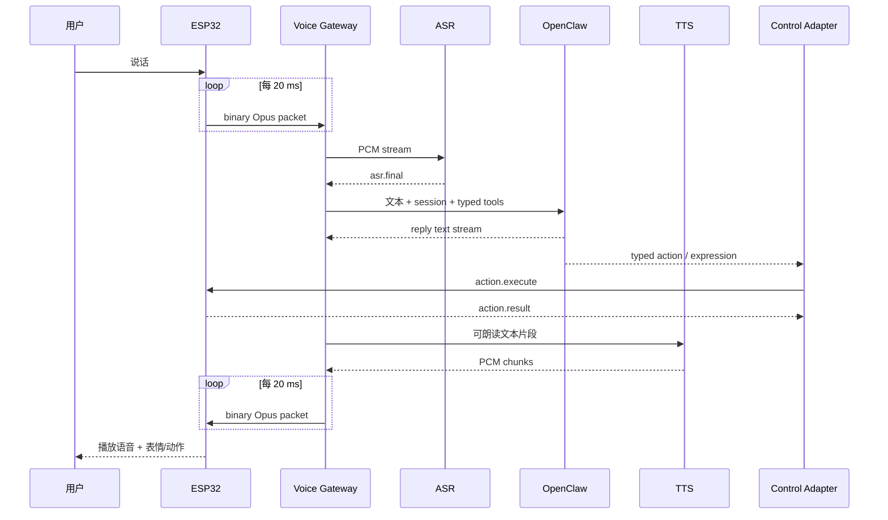

# Sesame Robot V3 项目架构

> **已被替代：** 用户于 2026-07-26 确认实际链路改为“V3 固件 + ESP32 舵机控制 + UART 连接电脑网关 + ASR + 文控网关 + TTS”。当前架构请以 [`sesame-robot-v3-uart-gateway-architecture.md`](sesame-robot-v3-uart-gateway-architecture.md) 为准；本文件保留为旧版 Wi-Fi/WSS 方案记录。
>
> 日期：2026-07-26  
> 状态：架构基线  
> 范围：集成音频版 V3 硬件、机器人固件、动作/表情资产、实时语音后端、OpenClaw、多用户与安全边界  
> 核心决策：采用 OpenClaw，但 OpenClaw 只进入 Agent 控制面，不处理实时 Opus 音频，也不直接控制舵机角度。

## 1. 项目目标

Sesame Robot V3 是一个具备四足动作、OLED 表情、双向语音和 Agent 能力的桌面机器人。用户可以自然语言对话，机器人通过语音、表情和预定义动作作出回应；后续支持每个用户拥有自己的设备、记忆、工具和隐私空间。

第一版必须跑通完整垂直闭环：

```text
用户说话
→ 机器人采集音频
→ ESP32 编码并上传 Opus
→ 电脑端 ASR 转文字
→ OpenClaw 生成回复和受约束工具调用
→ TTS 生成语音
→ ESP32 播放语音，同时执行表情/动作
```

不把第一版扩成通用机器人操作系统，也不让大模型直接生成未经审核的电机控制数据。

## 2. 总体架构

```mermaid
flowchart TB
    User["用户：说话 / 打断 / 查看状态"]

    subgraph HW["A. Sesame Robot V3 硬件层"]
        direction LR
        PowerIn["0. 电源输入<br/>USB-C PD 12 V / 2S 电池"]
        PowerPath["LTC4416 + 双 MOSFET<br/>电源选择与防倒灌"]
        P5["TPS54531 → 5V 舵机电源 / 5V 音频电源<br/>820 µF 储能"]
        P33["SY8120 → 3.3V 主控电源 / 3.3V 音频电源"]
        Mic["1. 双 MSM381 麦克风"]
        ADC["2. ES7210 多通道模数转换器（ADC）<br/>双麦克风 + 回声消除参考"]
        MCU["3. ESP32-S3-WROOM-1-N16R8<br/>16 MB 闪存 / 8 MB 伪静态内存（PSRAM）"]
        DAC["ES8311 数模转换器（DAC）"]
        PA["NS4150 D 类功放"]
        Speaker["4 Ω / 3 W 扬声器"]
        OLED["SSD1306 128×64 OLED<br/>I2C GPIO8/9"]
        Servo["8 × MG90S 舵机<br/>PWM GPIO4/5/6/7/10/11/12/13"]

        PowerIn --> PowerPath
        PowerPath --> P5
        PowerPath --> P33
        P5 --> Servo
        P5 --> PA
        P33 --> MCU
        P33 --> ADC
        P33 --> DAC
        Mic -->|"模拟音频"| ADC
        ADC -->|"I2S 采集数据"| MCU
        MCU -->|"I2S 播放数据"| DAC --> PA --> Speaker
        MCU -->|"I2C"| OLED
        MCU -->|"50 Hz PWM"| Servo
    end

    subgraph FW["B. ESP32 实时固件层：Arduino-ESP32 技术基线 + FreeRTOS 实时任务"]
        direction LR
        Boot["4. 安全启动 / 闪存加密 / 非易失存储（NVS）<br/>读取设备编号、固件版本与凭证"]
        SelfTest["5. 自检<br/>I2S / OLED / 舵机 / Wi-Fi"]
        Discover["6. 配网与发现<br/>2.4 GHz Wi-Fi + mDNS"]
        Auth["7. 获取短期令牌 / 设备证书认证"]
        Connect["8. 建立加密 WebSocket（WSS）长连接<br/>TLS 加密 + 心跳 + 断线重连"]
        OTA["在线升级（OTA）/ 固件签名 / A-B 分区回滚<br/>产品化阶段启用"]
        Capture["9. I2S 接收 + DMA<br/>PCM 16 kHz / 16 位 / 单声道"]
        AFE["ESP-SR 音频前端（AFE）/ 声学回声消除（AEC）<br/>半双工 MVP 可旁路；全双工接入播放参考信号"]
        Encode["10. libopus 编码<br/>20 ms = 320 个采样点<br/>16–24 kbps"]
        UplinkQ["11. 有界上行队列<br/>200–400 ms 上限"]
        Packet["12. 二进制音频包<br/>版本/类型/标志/流/代际/<br/>序号/时间戳/时长/长度"]
        Ctrl["JSON 控制消息<br/>握手/就绪/语音活动/打断/清空/<br/>动作/表情/结果/心跳/错误"]
        DownQ["有界下行队列<br/>60–120 ms 预缓冲<br/>300–500 ms 硬上限"]
        Decode["Opus 解码为 PCM"]
        Playback["I2S 发送 + DMA → 扬声器"]
        Runtime["机器人运行时<br/>命令队列 + 安全校验"]
        Motion["动作片段（MotionClip）非阻塞播放器<br/>角度/速度/时长/机械限位"]
        Face["表情片段（FaceClip）播放器<br/>帧 / 时长 / 循环模式"]
        Watchdog["看门狗 / 安全停机<br/>断线、超时、停止命令最高优先级"]

        Boot --> SelfTest --> Discover --> Auth --> Connect
        Connect -.-> OTA -.-> Boot
        Capture --> AFE --> Encode --> UplinkQ --> Packet --> Connect
        Connect --> DownQ --> Decode --> Playback
        Playback -.->|"播放参考 PCM"| AFE
        Connect <--> Ctrl
        Ctrl --> Runtime
        Runtime --> Motion --> Servo
        Runtime --> Face --> OLED
        Watchdog --> Runtime
    end

    subgraph VG["C. 电脑或服务器：语音网关实时音频数据面"]
        direction LR
        Entry["13. 设备 WSS 接入网关<br/>Python 3.12 + FastAPI/Starlette"]
        Identity["14. 设备认证<br/>解析租户/用户/设备凭证<br/>限流、帧长和协议版本校验"]
        Session["15. 语音会话工作器<br/>asyncio 结构化并发任务组"]
        Receive["接收循环<br/>二进制音频 / JSON 控制分流"]
        ServerCodec["16. libopus 解码<br/>Opus → 16 位小端 PCM"]
        VAD["17. 语音活动检测（VAD）/ 句末检测<br/>判断一句话是否结束"]
        AsrAdapter["18. ASR 服务适配器<br/>本地 FunASR/其他模型或云端 WSS API"]
        ASREvents["19. ASR 中间结果 / 最终结果<br/>只有最终文本进入智能体"]
        Turn["20. 轮次管理器<br/>会话编号 / 轮次编号 / 请求编号 / 代际编号"]
        AgentLoop["智能体处理循环"]
        Sentence["句子切分器<br/>文本流切成可朗读片段"]
        TtsAdapter["25. TTS 服务适配器<br/>本地模型或云端流式 API"]
        Resample["26. 流式重采样器<br/>统一为 16 kHz PCM"]
        ServerEncode["27. libopus 编码<br/>每包 20 ms"]
        Send["发送循环<br/>下行二进制 Opus + JSON 控制消息"]

        Entry --> Identity --> Session
        Session --> Receive --> ServerCodec --> VAD --> AsrAdapter --> ASREvents --> Turn --> AgentLoop
        AgentLoop --> Sentence --> TtsAdapter --> Resample --> ServerEncode --> Send
    end

    subgraph AGENT["D. OpenClaw 智能体控制面"]
        direction LR
        Router["21. 智能体路由器<br/>把稳定文本路由到所属租户"]
        OC["22. 每用户/家庭独立<br/>OpenClaw 网关单元"]
        Memory["独立会话 / 记忆 / 工作区"]
        LLM["大语言模型服务<br/>生成回复文本 + 类型化工具调用"]
        Sandbox["双层隔离<br/>外层无根权限租户容器<br/>内层会话工具沙盒"]
        Tools["23. Sesame 类型化工具<br/>设置表情 / 执行动作 /<br/>停止 / 获取状态"]
        ControlAdapter["24. 机器人控制适配器<br/>JSON 结构校验 + 枚举白名单 + 有效期/截止时间<br/>幂等、串行、速率限制、停止优先"]

        Router --> OC --> LLM
        OC --> Memory
        OC --> Sandbox
        LLM --> Tools --> ControlAdapter
    end

    subgraph PLATFORM["E. 平台控制面与数据层"]
        direction LR
        Web["用户/管理端（待实现）<br/>建议 Next.js + TypeScript"]
        API["账号 / 设备 API<br/>FastAPI"]
        PG[("PostgreSQL + 行级安全（RLS）<br/>租户/用户/设备/语音会话/<br/>设备命令/结果/资产/运行实例")]
        Redis[("Redis<br/>连接目录、短期状态、配额、锁")]
        Orchestrator["租户运行实例编排器<br/>创建/启动/停止/升级/健康检查/删除"]
        Secrets["密钥管理器<br/>设备密钥、模型服务密钥、网关令牌"]
        Observe["OpenTelemetry + Prometheus/Grafana<br/>监控 WSS、队列、ASR/TTS/智能体延迟和错误率"]
        Lifecycle["数据与设备生命周期<br/>导出 / 删除 / 凭证轮换 / OTA 策略"]
        Resilience["外部服务韧性策略<br/>超时 / 重试 / 熔断 / 降级"]

        Web --> API --> PG
        API --> Redis
        API --> Orchestrator --> OC
        Orchestrator --> Secrets
        API --> Lifecycle
        API -.->|"设备配对 / 短期令牌"| Auth
        Secrets -.-> Auth
        Entry --> Redis
        Entry --> Observe
        Session --> Observe
        OC --> Observe
        Resilience -.-> AsrAdapter
        Resilience -.-> TtsAdapter
        Resilience -.-> LLM
    end

    subgraph AUTHOR["F. 动作与表情离线创作/发布链"]
        direction LR
        Bottango["Bottango 动作编辑器<br/>8 舵机关键帧 + 贝塞尔曲线 + 真机低速预览"]
        MotionJSON["动作 JSON"]
        MotionValidate["机械限位 / 速度 / 时长 / 稳定性校验"]
        Pixelorama["Pixelorama<br/>128×64 黑白逐帧动画"]
        PNG["逐帧 PNG / 精灵图"]
        Convert["仓库内 1 位黑白转换脚本"]
        Review["人工审核 + 版本签名"]
        Assets["动作片段 / 表情片段资产包"]

        Bottango --> MotionJSON --> MotionValidate --> Review
        Pixelorama --> PNG --> Convert --> Review
        Review --> Assets --> Runtime
        Assets --> PG
    end

    subgraph SECURITY["G. 跨层安全与隐私规则"]
        direction LR
        NetSec["网络：只允许加密 WebSocket（WSS）<br/>短期令牌/证书、重放防护、连接/帧率/码率配额"]
        DataSec["数据：原始 PCM/Opus 默认仅在内存中流转<br/>日志不含完整对话、令牌和密钥"]
        TenantSec["租户：租户编号 + PostgreSQL 行级安全<br/>Redis 键、存储卷和链路追踪全部隔离"]
        AgentSec["智能体：禁用命令行、宿主文件和任意网址访问<br/>禁用动态插件；使用出站网络白名单"]
        RobotSec["物理：白名单动作、机械限位和看门狗<br/>断线安全停机；大模型不直接下发舵机角度"]
    end

    subgraph DEPLOY["H. 部署阶段"]
        direction LR
        Dev["开发最小可用版本：Mac/Linux + Docker Compose<br/>语音网关 + OpenClaw + PostgreSQL + Redis<br/>ASR/TTS 可使用本地模型或云端 API"]
        Prod["多用户产品化：共享 WSS/ASR/TTS/大模型资源池<br/>每租户独立 OpenClaw 单元 + 密钥管理 + 监控<br/>实测规模后再评估 Kubernetes"]
        Blocker["投板/上线阻塞<br/>统一音频 GPIO；确认 MSM381→ES7210 接法；<br/>8 舵机+Wi-Fi+满音量电源/温升/EMI；<br/>麦克风声道、扬声器声腔、真实 AEC"]

        Dev --> Prod
        Blocker --> Prod
    end

    User -->|"S1 用户说话"| Mic
    Connect <-->|"S2 加密 WebSocket：二进制 Opus + JSON 控制"| Entry
    ASREvents -->|"S3 最终识别文本"| Router
    Router -->|"S4 租户/会话/文本/工具结构"| OC
    LLM -->|"S5 流式回复文本"| AgentLoop
    ControlAdapter -->|"S6 执行动作 / 设置表情"| Send
    Send --> Entry
    Entry -->|"S7 下行 WSS"| Connect
    Runtime -->|"S8 动作结果 / 设备状态"| Connect
    Connect -->|"S9 回执"| Entry
    Playback -->|"S10 语音输出"| User
    Servo -->|"S11 动作输出"| User
    OLED -->|"S12 表情/状态输出"| User

    Ctrl -->|"用户打断"| Turn
    Turn -->|"取消 OpenClaw/TTS；代际编号加一；清空旧音频"| Send
    Connect -.->|"断线/超时"| Watchdog
    NetSec -.-> Connect
    NetSec -.-> Entry
    DataSec -.-> Session
    TenantSec -.-> PG
    AgentSec -.-> Sandbox
    RobotSec -.-> Runtime
```



### 2.1 架构图文字描述

这张图描述的是 Sesame Robot V3 从“用户说话”到“机器人说话、做动作、显示表情”的完整端到端系统。系统被划分为硬件、ESP32 实时固件、语音网关、OpenClaw 智能体、平台数据、动作表情资产、安全规则和部署阶段八个部分。

1. **硬件供电与执行**：USB-C PD 12 V 或 2S 电池进入电源选择和防倒灌电路，再分别生成 5 V 舵机/音频电源与 3.3 V 主控/音频电源。ESP32-S3 连接双麦克风、ES7210、ES8311、功放、扬声器、OLED 和 8 路 MG90S 舵机，完成声音采集、语音播放、表情显示和动作执行。
2. **设备启动与联网**：ESP32 启动后执行安全启动、闪存加密、配置读取和硬件自检，然后完成 Wi-Fi 配网、mDNS 发现、短期令牌或设备证书认证，最终与语音网关建立带 TLS 加密、心跳和断线重连的 WSS 长连接。
3. **用户语音上行**：双麦克风采集模拟声音，经 ES7210 转成 I2S 数字音频。ESP32 通过 DMA 获取 16 kHz、16 位、单声道 PCM，经过音频前端和可选 AEC 后，以 20 ms 为一包编码成 Opus，再进入有容量上限的队列，通过 WSS 上传。
4. **网关接收与语音识别**：Python、FastAPI 和 Starlette 构成语音网关。网关先认证设备并校验协议、帧长和速率，再用 `asyncio` 会话任务分流二进制音频与 JSON 控制消息。Opus 被解码为 PCM，VAD 判断句末，ASR 服务把音频转成文本；只有最终识别文本进入智能体。
5. **OpenClaw 推理与工具调用**：智能体路由器根据租户和会话把文本送入对应的 OpenClaw 网关单元。每个用户或家庭拥有独立会话、记忆和工作区。大语言模型生成回复文本，并且只能调用经过类型、枚举、有效期、幂等和速率限制校验的动作、表情、停止和状态工具。
6. **语音下行**：回复文本先按句子切分，再交给本地或云端 TTS 服务生成流式音频。网关将音频重采样为 16 kHz PCM，编码为 20 ms Opus 包，通过 WSS 下发。ESP32 使用有界下行队列预缓冲，解码后经 I2S、ES8311、NS4150 和扬声器播放。
7. **动作与表情输出**：OpenClaw 只能选择已经审核的动作片段和表情片段。ESP32 机器人运行时校验命令并串行执行：动作播放器控制 8 路舵机，表情播放器控制 OLED，同时向网关返回动作结果和设备状态。
8. **打断与安全停机**：用户打断时，轮次管理器取消当前 OpenClaw 和 TTS 任务，递增代际编号并清空旧音频，防止过期回复继续播放。设备断线、命令超时或看门狗触发时，安全停机具有最高优先级。
9. **平台与多租户**：FastAPI 账号/设备 API 管理用户、设备配对和运行实例；PostgreSQL 使用行级安全隔离租户数据；Redis 保存连接目录、短期状态、配额和锁；密钥管理器保存设备及模型服务凭证；OpenTelemetry、Prometheus 和 Grafana 负责延迟、队列、连接和错误率监控。
10. **资产制作与部署**：Bottango 负责舵机关键帧动作，Pixelorama 负责 128×64 黑白表情。资产经过机械限位、速度、时长、人工审核和版本签名后才可发布。第一阶段用 Docker Compose 跑通单设备完整闭环，多用户阶段再引入每租户 OpenClaw 单元、集中密钥管理和资源池。

### 2.2 核心边界

- **ESP32 负责实时和物理安全**：采音、播放、动作、表情、缓冲、看门狗和安全停机。
- **语音网关负责实时音频处理**：Opus、VAD、ASR、TTS、重采样、背压和打断。
- **OpenClaw 负责对话与决策**：记忆、推理和受约束工具调用，不处理逐包音频。
- **大语言模型不直接控制舵机角度**：只能选择审核过的动作与表情资产。
- **原始音频默认不落盘**：仅在内存中流转；租户数据、Redis 键、存储卷和追踪信息全部隔离。

## 3. 分层职责

| 层 | 主要组件 | 职责 | 明确禁止 |
| --- | --- | --- | --- |
| 机器人硬件层 | ESP32-S3、双麦、Codec、功放、OLED、8 舵机 | 感知、播放、动作和表情 | 本地运行 OpenClaw 或大模型 |
| 机器人实时层 | I2S、Opus、WSS、状态机、MotionClip/FaceClip | 有界缓冲、音频收发、动作急停 | 长期记忆、任意网络工具 |
| 实时语音数据面 | Voice Gateway、ASR/TTS Provider | Opus/PCM、ASR、TTS、打断和背压 | Agent 长期状态、自由工具调用 |
| Agent 控制面 | OpenClaw、Memory、Typed Tools | 对话、记忆、技能和场景编排 | 处理 PCM/Opus、直接访问 ESP32 IP |
| 平台控制面 | 用户、设备、租户、Runtime、密钥、审计 | 多用户隔离、生命周期与运维 | 进入逐包实时音频路径 |

## 4. 硬件架构

### 4.1 V3 主控与现有执行器

- 主控：ESP32-S3-WROOM-1-N16R8。
- 舵机：8 路，当前 V3 信号脚为 GPIO 4、5、6、7、10、11、12、13。
- OLED：SSD1306 128×64，I2C 使用 GPIO 8/9。
- 电源：舵机 5 V 与逻辑/音频 3.3 V 需要受控分区，舵机大电流回路不得经过麦克风和 Codec 地参考。

### 4.2 集成音频版建议链路

```text
双 MSM381 麦克风
→ ES7210 多通道 ADC
→ I2S
→ ESP32-S3
→ I2S
→ ES8311 DAC
→ NS4150 Class-D 功放
→ 4 Ω / 3 W 扬声器
```

AEC（声学回声消除）参考从 DAC/功放前级获取，经衰减网络送入 ES7210 第三路；真正的 AEC 算法仍在 ESP-SR AFE 或后端实现。

集成音频板当前仍有投板阻塞项：

1. 音频 GPIO 存在两套历史方案：早期方案为 MCLK/BCLK/LRCK/ADC/DAC = GPIO 15/16/17/18/21；较新的整板规格为 BCLK/LRCK/ADC/DAC = GPIO 47/48/14/1，MCLK 待定。必须结合当前 PCB 和固件重新审计后统一，不能直接拿任一套投板。
2. MSM381 单端输出到 ES7210 差分输入的正式接法仍需按最新版数据手册关闭。
3. 需要完成 8 舵机 + Wi-Fi + 最大音量下的电源、温升和噪声验证。
4. 板框、麦克风声孔、扬声器声腔和固定孔必须与结构 CAD 一起冻结。

因此，软件架构可以先开发，但不能把当前集成音频 PCB 视为已量产验证。

## 5. ESP32 固件架构

### 5.1 任务划分

```text
Audio Capture Task
I2S RX DMA → PCM ring buffer → Opus encoder → bounded uplink queue

Network Task
WSS connect/reconnect → binary audio + JSON control → bounded queues

Audio Playback Task
downlink Opus queue → Opus decoder → PCM ring buffer → I2S TX DMA

Robot Runtime Task
command queue → safety validator → MotionClip / FaceClip player

System Task
device identity、heartbeat、watchdog、OTA、metrics
```

所有队列必须有 `maxsize`。网络拥塞时只能丢弃完整旧 Opus packet，并发送 discontinuity；不得截断 packet，也不得无限缓存。

### 5.2 音频协议基线

- PCM：16 kHz、16-bit、mono。
- Opus：20 ms/packet，每包 320 samples。
- 每个 WebSocket binary message 只承载一个完整 Opus packet。
- JSON control message 承载 `hello`、`interrupt`、`flush`、`action.execute`、`action.result`、`expression.set` 等事件。
- 使用 `session_id`、`turn_id`、`request_id` 和 `generation_id` 区分会话、轮次、动作请求和 TTS 代际。

### 5.3 机器人运行状态

```text
BOOTING
→ IDLE
→ LISTENING
→ THINKING
→ SPEAKING
→ IDLE

任意状态 + STOP / 断线 / watchdog
→ SAFE_STOP

用户重新说话
→ INTERRUPTING
→ 清除旧 TTS generation
→ LISTENING
```

MVP 先做半双工。全双工必须在真实扬声器、双麦和舵机噪声环境下完成 AEC 验证后再开启。

## 6. 动作与表情架构

当前上游固件把动作写成大量 C++ 函数和 `Servo.write() + delay`，不适合后续 AI 调用、急停和可视化创作。V3 应改为资产化播放器。

### 6.1 动作格式

```cpp
struct MotionFrame {
  uint16_t at_ms;
  uint8_t angles[8];
  uint8_t easing;
};

struct MotionClip {
  const char* name;
  const MotionFrame* frames;
  uint16_t frame_count;
  bool loop;
};
```

运行时只允许执行已经审核并编译进固件或签名资产包的 MotionClip。

### 6.2 表情格式

FaceClip 包含表情名称、1-bit 位图帧、每帧时长、loop/once/boomerang 模式。动作轨和表情轨可共享时间轴，但播放器彼此独立，避免 OLED 刷新阻塞舵机。

### 6.3 创作工具链

```text
动作：Bottango
→ 8 舵机关键帧与曲线
→ 导出 JSON
→ 校验机械限位/速度/持续时间
→ MotionClip
→ 低速真机预览
→ 人工审核
→ 发布

表情：Pixelorama
→ 128×64 黑白逐帧 PNG
→ 仓库内转换脚本
→ FaceClip
→ OLED 预览
→ 发布
```

Sesame Studio 后续升级为轻量 Pose + 时间线编辑器；第一阶段不重复开发 Bottango 已有的完整动画能力。

### 6.4 AI 控制边界

OpenClaw 只能调用：

```text
sesame.set_expression(expression, ttl_ms)
sesame.perform_action(action, duration_ms)
sesame.stop()
sesame.get_status()
```

`action` 和 `expression` 都是白名单枚举。LLM 不得在运行时生成 8 路舵机角度并直接执行；自然语言生成的新动作只能成为离线草稿，必须经过校验、低速预览和人工批准。

## 7. Voice Gateway 架构

推荐 Python 3.12、FastAPI、asyncio 和 Provider Adapter（供应商适配器）：

```text
voice_gateway/
├── routers/device_audio.py
├── sessions/
│   ├── registry.py
│   ├── state.py
│   └── voice_session.py
├── audio/
│   ├── opus_codec.py
│   ├── resampler.py
│   ├── vad.py
│   └── sentence_chunker.py
├── providers/
│   ├── asr/
│   ├── tts/
│   └── agent/openclaw.py
├── services/
│   ├── turn_manager.py
│   └── control_adapter.py
└── tests/
```

每个设备连接至少有五条有界协程：

```text
receive_loop
asr_loop
agent_loop
tts_loop
send_loop
```

ASR 和 TTS 分别通过 Provider 接口封装，本地模型与云 API 都可以替换，不让供应商 SDK 进入会话状态机。

## 8. OpenClaw 与多用户架构

共享资源：

- Device WSS Gateway。
- Voice Session Workers。
- ASR/TTS/LLM 推理池。
- PostgreSQL、Redis、监控。

隔离资源：

- 每个用户或家庭一个 OpenClaw Gateway cell。
- 独立 token、session、memory、workspace 和 provider SecretRef。
- 独立容器网络身份和资源配额。

```text
平台宿主
└── 用户 A 的 OpenClaw Gateway 容器
    └── 用户 A 某个 session 的 Agent Tool Sandbox
```

外层容器解决用户之间的隔离；内层 sandbox 解决 Agent 工具执行风险。两层不能互相替代。

## 9. 数据模型

核心表：

| 表 | 用途 |
| --- | --- |
| `tenants` | 用户/家庭租户 |
| `users` | 租户内用户 |
| `devices` | 设备身份、归属、固件版本和状态 |
| `voice_sessions` | 一次设备语音会话及保留策略 |
| `device_commands` | 动作/表情请求、幂等键和 deadline |
| `device_command_results` | accepted/running/completed/failed 等回执 |
| `agent_runtimes` | 每租户 OpenClaw runtime 状态 |
| `motion_assets` | 已审核动作资产及版本 |
| `expression_assets` | 已审核表情资产及版本 |

所有用户业务表必须包含 `tenant_id`，同时使用应用层授权和 PostgreSQL RLS（行级安全）限制跨租户访问。

## 10. 安全与隐私

### 10.1 设备与网络

- 生产只允许 `wss://`。
- 每台设备有唯一身份，使用设备证书或短期 token；服务端从认证结果解析 tenant/user/device。
- 不接受 ESP32 在 JSON 中自报的 `user_id`。
- 限制每设备连接数、消息尺寸、帧率、码率、会话时长和重连频率。
- 原上游 V3 的无认证 HTTP API 只能用于本地开发，不能直接暴露到公网。

### 10.2 用户数据

- 原始 PCM/Opus 默认只在内存流转，不落盘。
- ASR 文本和 transcript 是否保留由用户策略决定。
- 日志不记录原始音频、完整对话、token、密钥和 Wi-Fi 凭据。
- 用户删除时同时清理 Gateway、volume、数据库、cache 和对象存储，并记录审计结果。

### 10.3 机器人物理安全

- 动作名称、角度、速度、持续时间和并发组合必须校验。
- `stop` 优先级最高；断线触发 watchdog 和安全姿态。
- 持续移动动作第一版不开放给 Agent。
- 未知命令必须拒绝，不能沿用“返回成功但不执行”的上游行为。

## 11. 部署架构

### 11.1 开发与单用户 MVP

```text
Mac / Linux PC
├── Voice Gateway
├── 本地或云 ASR Provider
├── OpenClaw Gateway
├── 本地或云 TTS Provider
├── PostgreSQL
└── Redis

Sesame V3 通过家庭 2.4 GHz Wi-Fi 接入
```

使用 Docker Compose 管理后端服务；模型可本地运行，也可通过 API 调用。ESP32 固件和硬件调试独立进行。

### 11.2 多用户产品化

```text
WSS/API 入口
→ 共享 Voice Gateway 集群
→ 共享 ASR/TTS/LLM Pool
→ Agent Router
→ 每租户 OpenClaw Gateway cell
→ PostgreSQL RLS / Redis / Secret Manager
```

不要在 MVP 阶段直接上 Kubernetes。先用单机容器验证真实设备并发、延迟、内存和每租户成本，再决定编排平台。

## 12. 关键时序



## 13. 实施顺序

1. **冻结硬件接口**：确认音频引脚、电源、MCLK、声学结构和安全角度。
2. **建立原版 V3 基线**：8 舵机、OLED、Wi-Fi、stop、状态查询稳定运行。
3. **完成单设备音频闭环**：ESP32 Opus ⇄ Voice Gateway ⇄ ASR/TTS，暂不接 OpenClaw。
4. **接入 OpenClaw**：只接文本和四个 typed tools。
5. **动作/表情资产化**：MotionClip、FaceClip、非阻塞播放器、Bottango/Pixelorama 管线。
6. **打断与安全**：generation、flush、watchdog、动作回执、限流和审计。
7. **多用户隔离**：设备身份、RLS、每租户 Gateway、Secret Manager 和删除流程。
8. **产品化优化**：AEC、全双工、OTA、监控、压测和容灾。

## 14. 第一版验收标准

- 机器人完成“听到问题 → 返回语音 → 同步表情/动作”的完整闭环。
- 连续运行 30 分钟，不出现持续内存增长、音频队列无限积压或舵机失控。
- 网络短断后自动重连，不播放旧 generation 的 TTS。
- 任意时刻 `stop` 都能进入安全姿态；断线 watchdog 生效。
- OpenClaw 无法执行 shell、访问任意公网、读取宿主文件或调用未授权动作。
- 用户 A 无法读取用户 B 的 session、memory、volume、cache 或设备数据。
- 原始音频默认不落盘，日志不含密钥和完整对话。

## 15. 已定决策与待定项

### 已定决策

1. 采用 OpenClaw，但只作为 Agent 控制面。
2. ESP32 与电脑/服务器之间使用 WSS 双向流式 Opus。
3. ASR、TTS、Opus 和 WebSocket 位于 Voice Gateway，不放进 OpenClaw。
4. 先做半双工；全双工依赖 AEC 实测。
5. 动作/表情必须白名单、结构化、可回执、可急停。
6. 多用户采用共享语音/模型资源 + 每用户/家庭独立 OpenClaw cell。

### 待定项

1. 首版使用集成音频主板，还是先用外接音频模块验证链路。
2. `AUDIO_MCLK` 最终 GPIO 和 ES7210 单端麦克风输入网络。
3. ASR/TTS 首发使用本地模型还是云 API。
4. 第一版是否只支持单用户本地部署，之后再升级多租户。
5. MotionClip 插值器自研，还是原型阶段使用 ServoEasing。
6. 集成板采用 4 层的最终层叠、铜厚、板厚和音频/舵机电源验收指标。

## 16. 现有依据

- `docs/technical-design/esp32-opus-openclaw-platform.md`
- `docs/implementation/voice-gateway-backend.md`
- `.internal/research/2026-07-22-xiaozhi-structured-voice-agent-design.md`
- `.internal/research/2026-07-22-sesame-motion-expression-authoring.md`
- `github_refs/sesame-robot/firmware/README.md`
- `github_refs/sesame-robot/software/sesame-studio/README.md`
- `/Users/mac/Desktop/行业调查/research/projects/07-sesame-v3-integrated-audio-full-board-spec.md`
