# Sesame Robot V3：UART + 电脑网关项目架构

> **已被替代：** 用户于 2026-07-26 确认机器人端采用 INMP441 与 MAX98357，ESP32 通过 Wi-Fi/WSS 传输 JSON 与 Opus，不使用 UART 作为业务链路；OpenClaw 作为文字和受限控制中台。请以 [`sesame-robot-v3-wifi-openclaw-architecture.md`](sesame-robot-v3-wifi-openclaw-architecture.md) 为准。本文件仅保留为此前 UART 方案记录。

> 日期：2026-07-26  
> 状态：新架构基线  
> 当前阶段：机器人机械结构已组装完成，尚未完成 V3 固件校准、UART JSON 协议和电脑网关闭环  
> 事实基线：ESP32 负责舵机与 OLED；ESP32 通过 UART 连接电脑网关；电脑负责 ASR、文控网关调用、TTS、语音播放和 JSON 资产管理。

## 1. 先说结论

这个版本不再采用“ESP32 通过 Wi-Fi/WSS 直接传 Opus”的旧架构。新的主链路是：

```text
用户说话
→ 电脑麦克风采音
→ 电脑网关调用 ASR 得到文字
→ 电脑网关把文字发送到文控网关
→ 文控网关返回回复文字和可选的动作/表情意图
→ 电脑网关校验结构化结果
→ 文字发送给 TTS
→ 电脑播放 TTS 语音
→ 电脑网关通过 UART 向 ESP32 发送动作、表情和说话状态 JSON
→ ESP32 控制 8 路舵机和 OLED
→ ESP32 通过 UART 返回接收、执行、完成或错误事件
```

当前 V3 基础仓库可以复用舵机、动作、表情、OLED 和串口入口，但还不能直接完成上述链路：

- 主固件当前启用的是 S2 Mini 引脚，不是 V3 引脚。
- 现有串口是 115200 波特率、32 字节缓冲的文本命令行，不支持完整 JSON。
- 动作位于 `movement-sequences.h` 的 C++ 函数中，不是动作 JSON。
- 表情位于 `face-bitmaps.h` 的 C++ 位图数组中，不是表情 JSON。
- Sesame Studio 当前生成 `setServoAngle()` C++ 代码，不生成动作 JSON。
- 仓库中没有可运行的电脑网关、ASR、文控网关适配器或 TTS 实现。

## 2. 新版总架构图

```mermaid
flowchart LR
    User["用户<br/>说话 / 听回复 / 观察动作和表情"]

    subgraph ROBOT["A. Sesame Robot V3 机器人端"]
        direction TB
        Power["电源与机械安全<br/>稳定 5 V 舵机电源、公共地、无卡死"]
        ESP["ESP32-S3 V3 固件<br/>Arduino-ESP32 + C++"]
        UartFirmware["UART 协议任务<br/>接收、分帧、JSON 解析、校验、回执"]
        Dispatcher["机器人命令分发器<br/>停止 > 动作 > 表情 > 状态"]
        MotionRuntime["动作运行时<br/>8 路 MG90S、50 Hz PWM<br/>机械限位、超时、可停止"]
        FaceRuntime["表情运行时<br/>SSD1306 128×64 OLED<br/>帧率、循环、说话表情"]
        Watchdog["看门狗与安全停机<br/>串口超时、非法命令、舵机异常"]
        Servo["8 路舵机<br/>GPIO 4/5/6/7/10/11/12/13"]
        OLED["OLED<br/>I2C GPIO 8/9"]

        Power --> ESP
        ESP --> UartFirmware --> Dispatcher
        Dispatcher --> MotionRuntime --> Servo
        Dispatcher --> FaceRuntime --> OLED
        Watchdog --> Dispatcher
    end

    subgraph UART["B. ESP32 与电脑的 UART 边界"]
        direction TB
        Physical["物理链路<br/>USB CDC 或 3.3 V UART + USB 转串口<br/>具体 RX/TX 引脚待 V3 板确认"]
        Framing["传输格式<br/>MVP：一行一个 JSON（NDJSON）<br/>UTF-8 + 换行分帧"]
        Envelope["统一消息信封<br/>版本、类型、消息编号、时间戳、载荷"]
        Reliability["可靠性<br/>确认/失败回执、超时、重试、去重<br/>CRC/分块留给大文件阶段"]
        Rule["重要边界<br/>运行期只传小型命令 JSON<br/>音频和大型位图不直接塞入 JSON"]

        Physical --> Framing --> Envelope --> Reliability --> Rule
    end

    subgraph PC["C. 电脑网关：系统编排中心"]
        direction TB
        SerialManager["串口管理器<br/>Python 3.12 + pyserial-asyncio<br/>连接、收发、重连、请求关联"]
        Session["会话状态机<br/>空闲 / 监听 / 识别 / 思考 / 说话 / 打断"]
        Mic["电脑麦克风采集<br/>sounddevice 或 PyAudio<br/>PCM + VAD"]
        ASR["ASR 适配器<br/>本地 FunASR/Whisper 或云 API<br/>输出中间文本和最终文本"]
        TextAdapter["文控网关适配器<br/>HTTP / WebSocket<br/>只发送文字与上下文"]
        Planner["回复编排与结构校验<br/>Pydantic / JSON Schema<br/>reply_text + action + expression + voice"]
        TTS["TTS 适配器<br/>本地模型或云 API<br/>文字转 WAV/PCM"]
        Player["电脑音频播放器<br/>播放 TTS；支持停止和打断"]
        RobotAdapter["机器人适配器<br/>把编排结果转换为 UART 命令<br/>等待 ESP32 回执"]
        Log["日志与调试<br/>request_id、耗时、错误、UART 原始帧脱敏记录"]

        Mic --> ASR --> Session
        Session --> TextAdapter --> Planner
        Planner --> TTS --> Player
        Planner --> RobotAdapter --> SerialManager
        SerialManager --> Log
        Session --> Log
    end

    subgraph TEXTGW["D. 文控网关"]
        direction TB
        Context["接收<br/>用户文字、会话编号、允许的动作/表情列表"]
        Agent["文本理解与回复生成<br/>OpenClaw / LLM / 业务规则"]
        Structured["返回结构化 JSON<br/>回复文字必填<br/>动作、表情、音色为可选字段"]

        Context --> Agent --> Structured
    end

    subgraph ASSET["E. JSON 资产与格式管理"]
        direction TB
        ActionJson["动作 JSON<br/>动作编号、版本、循环次数、8 舵机帧、时长"]
        FaceJson["表情 JSON<br/>表情编号、帧列表、帧率、播放模式"]
        VoiceJson["语音 JSON<br/>文字、音色、格式、采样率、文件路径、摘要"]
        Schema["统一 JSON Schema<br/>版本校验、必填字段、枚举、范围、兼容性"]
        Registry["电脑端资产注册表<br/>动作/表情/语音编号 → 文件与版本"]
        Compiler["离线转换器<br/>Sesame Studio C++ → 动作 JSON<br/>图片 → OLED 1 位位图"]
        Deploy["资产发布<br/>MVP：固件预置动作/表情，只传编号<br/>后续：清单 + 分块二进制 + 校验"]

        ActionJson --> Schema
        FaceJson --> Schema
        VoiceJson --> Schema
        Schema --> Registry --> Deploy
        Compiler --> ActionJson
        Compiler --> FaceJson
    end

    subgraph TEST["F. 当前从组装完成开始的验证链"]
        direction TB
        T0["1. 断电检查和供电检查"]
        T1["2. V3 引脚固件 + 单舵机测试"]
        T2["3. 8 舵机 90° 校准 + Rest/Stand"]
        T3["4. OLED 与表情测试"]
        T4["5. UART 收发与回执测试"]
        T5["6. 动作/表情 JSON 测试"]
        T6["7. ASR → 文控网关 → TTS"]
        T7["8. 完整对话、动作、表情闭环"]
        T8["9. 打断、断线、错误和长时间稳定性"]

        T0 --> T1 --> T2 --> T3 --> T4 --> T5 --> T6 --> T7 --> T8
    end

    User -->|"① 用户语音"| Mic
    ASR -->|"② 最终识别文字"| TextAdapter
    TextAdapter -->|"③ 文字 + 会话上下文"| Context
    Structured -->|"④ 回复结构 JSON"| Planner
    Player -->|"⑤ TTS 语音"| User
    RobotAdapter <-->|"⑥ UART 命令 / 回执"| Physical
    Physical <-->|"⑦ UART 字节流"| UartFirmware
    Servo -->|"⑧ 动作"| User
    OLED -->|"⑨ 表情 / 状态"| User

    Registry --> Planner
    Registry --> RobotAdapter
    Deploy --> UartFirmware
    Session -->|"用户打断：取消文控请求和 TTS<br/>发送 stop + speech.stop"| RobotAdapter
```



## 3. 各模块职责

| 模块 | 必须负责 | 不应该负责 |
| --- | --- | --- |
| ESP32 固件 | UART 协议、命令校验、舵机、OLED、回执、安全停机 | ASR、TTS、文控推理、大型资产管理 |
| 电脑网关 | 麦克风、ASR、会话状态、文控调用、TTS、串口、JSON 校验 | 直接生成未经限制的舵机角度 |
| 文控网关 | 理解文字、生成回复、选择允许的动作与表情 | 直接写串口、直接控制舵机 |
| 资产注册表 | 管理动作、表情、语音文件的编号、版本和校验 | 在运行时绕过 Schema 接受任意 JSON |
| ESP32 动作运行时 | 执行已经校验的动作，支持停止与回执 | 解析无限大小文件或执行任意脚本 |

## 4. UART 协议设计

### 4.1 物理层

第一版建议先做出一个稳定的单设备连接：

- 初始参数：`115200 8N1`。
- 数据编码：UTF-8。
- 分帧：一条 JSON 占一行，以 `\n` 结束，即 NDJSON。
- 电脑端：Python `pyserial-asyncio`。
- ESP32 端：固定容量环形缓冲区或逐字节状态机。
- 单条消息建议限制在 512–1024 字节，超限立即返回错误。
- UART 必须使用 3.3 V 电平并共地，不能把 5 V TTL 直接接入 ESP32。

需要先确定实际物理方案：

1. 如果使用 ESP32-S3 原生 USB CDC，USB 线直接连接电脑，但调试日志不能和业务 JSON 混写。
2. 如果使用独立 UART1，则 USB CDC `Serial` 保留调试日志，UART1 专门跑业务协议；具体 RX/TX GPIO 必须结合 V3 PCB 暴露引脚确认。

在物理方案确认前，不在设计文档里编造 RX/TX GPIO。

### 4.2 统一消息信封

电脑和 ESP32 的每条消息使用相同外壳：

```json
{
  "version": 1,
  "type": "robot.command",
  "message_id": "01JABC123",
  "reply_to": null,
  "timestamp_ms": 1722000000000,
  "payload": {}
}
```

字段约束：

| 字段 | 类型 | 说明 |
| --- | --- | --- |
| `version` | integer | 协议版本，第一版固定为 1 |
| `type` | string | 消息类型，必须在白名单中 |
| `message_id` | string | 电脑生成的唯一消息编号 |
| `reply_to` | string/null | 回执关联的原消息编号 |
| `timestamp_ms` | integer | 发送时间 |
| `payload` | object | 不同消息类型的业务载荷 |

### 4.3 第一版消息类型

| 方向 | `type` | 用途 |
| --- | --- | --- |
| 电脑 → ESP32 | `system.hello` | 握手和协议版本协商 |
| 电脑 → ESP32 | `robot.command` | 组合下发动作、表情和说话状态 |
| 电脑 → ESP32 | `motion.play` | 播放动作 |
| 电脑 → ESP32 | `expression.set` | 设置表情 |
| 电脑 → ESP32 | `speech.state` | `start/stop`，驱动说话表情 |
| 电脑 → ESP32 | `robot.stop` | 最高优先级停止 |
| 电脑 → ESP32 | `robot.status.get` | 查询状态 |
| ESP32 → 电脑 | `ack` | 已接收或已拒绝 |
| ESP32 → 电脑 | `robot.event` | `running/done/stopped` |
| ESP32 → 电脑 | `robot.status` | 当前动作、表情、舵机和错误状态 |
| ESP32 → 电脑 | `error` | 格式、范围、资源或执行错误 |

组合命令示例：

```json
{
  "version": 1,
  "type": "robot.command",
  "message_id": "cmd-0001",
  "reply_to": null,
  "timestamp_ms": 1722000000000,
  "payload": {
    "action_id": "wave",
    "expression_id": "talk_happy",
    "speech_state": "start"
  }
}
```

ESP32 回执示例：

```json
{
  "version": 1,
  "type": "ack",
  "message_id": "evt-0001",
  "reply_to": "cmd-0001",
  "timestamp_ms": 1722000000010,
  "payload": {
    "accepted": true,
    "status": "running",
    "error_code": null
  }
}
```

## 5. JSON 资产格式

### 5.1 动作 JSON

动作文件描述 8 路舵机随时间的变化。每个舵机使用仓库已有名称：

```text
R1, R2, L1, L2, R4, R3, L3, L4
```

示例：

```json
{
  "schema": "sesame.action.v1",
  "id": "wave",
  "version": 1,
  "loop_count": 1,
  "return_to": "stand",
  "frames": [
    {
      "duration_ms": 200,
      "servos": {
        "R1": 100,
        "R2": 45,
        "L1": 45,
        "L2": 90,
        "R4": 80,
        "R3": 180,
        "L3": 180,
        "L4": 180
      }
    }
  ]
}
```

校验规则：

- 8 个舵机字段必须齐全，避免继承未知旧状态。
- 角度范围第一层为 `0–180`，第二层再应用每个关节的机械安全范围。
- `duration_ms` 必须大于 0，并设置单帧和总动作时长上限。
- 动作必须支持 `stop`。
- ESP32 返回 `running/done/stopped/error`。

第一版不要马上把整个动作 JSON 通过 UART 发送给 ESP32。先把动作编译进固件，运行时只发送 `action_id`；等闭环稳定后，再实现 LittleFS、分块传输和版本更新。

### 5.2 表情 JSON

```json
{
  "schema": "sesame.expression.v1",
  "id": "talk_happy",
  "version": 1,
  "width": 128,
  "height": 64,
  "fps": 8,
  "mode": "loop",
  "frames": [
    "talk_happy_0",
    "talk_happy_1",
    "talk_happy_2"
  ]
}
```

校验规则：

- 分辨率固定为 `128×64`。
- `mode` 只能是 `once`、`loop` 或 `boomerang`。
- `fps` 必须设置允许范围。
- JSON 只描述帧顺序和播放方式；1 位位图仍通过离线工具转换并编译到固件。
- 运行时 UART 只发送 `expression_id`，不发送 1024 字节以上的整帧位图 JSON。

### 5.3 语音 JSON

语音 JSON 是音频文件的清单和元数据，不是把 WAV/PCM 转成 Base64 塞进 JSON：

```json
{
  "schema": "sesame.voice.v1",
  "id": "voice-0001",
  "version": 1,
  "text": "你好，我已经准备好了。",
  "voice": "default",
  "format": "wav",
  "sample_rate": 24000,
  "channels": 1,
  "storage": "computer",
  "path": "runtime/voice/voice-0001.wav",
  "sha256": "待生成"
}
```

第一版 TTS 在电脑上生成并播放音频。电脑同时向 ESP32 发送 `speech.state=start` 和说话表情，播放完成或打断时发送 `speech.state=stop`。

如果以后要让机器人本体扬声器播放，必须新增音频硬件、ESP32 音频驱动、二进制音频协议和缓冲机制；这不是当前 V3 基础仓库已有能力。

### 5.4 文控网关输入输出

电脑网关发送：

```json
{
  "session_id": "session-001",
  "request_id": "turn-001",
  "text": "跟我打个招呼",
  "allowed_actions": ["stand", "wave", "rest"],
  "allowed_expressions": ["happy", "talk_happy", "thinking", "idle"]
}
```

文控网关推荐返回：

```json
{
  "request_id": "turn-001",
  "reply_text": "你好，很高兴见到你。",
  "action_id": "wave",
  "expression_id": "talk_happy",
  "voice": "default"
}
```

`reply_text` 必填；其余字段可为空。电脑网关必须再次使用本地白名单和 JSON Schema 校验，不能直接相信文控网关输出。

## 6. 电脑网关建议结构

```text
computer_gateway/
├── app.py
├── config.py
├── domain/
│   ├── messages.py
│   ├── session.py
│   └── errors.py
├── transport/
│   ├── uart.py
│   └── framing.py
├── providers/
│   ├── asr/
│   ├── text_gateway/
│   └── tts/
├── robot/
│   ├── adapter.py
│   ├── commands.py
│   └── state.py
├── assets/
│   ├── registry.py
│   ├── validator.py
│   ├── actions/
│   ├── expressions/
│   └── voices/
├── orchestration/
│   ├── conversation.py
│   └── interruption.py
└── tests/
    ├── unit/
    ├── integration/
    └── fixtures/
```

建议技术：

- Python 3.12。
- `asyncio`：并发管理麦克风、ASR、文控、TTS 和 UART。
- `pyserial-asyncio`：异步串口。
- `Pydantic v2`：运行时消息校验。
- JSON Schema：跨语言协议和资产格式。
- `sounddevice` 或 PyAudio：电脑麦克风和音频播放。
- ASR/TTS Provider 接口：本地模型和云 API 可替换。
- `pytest`：协议、状态机和适配器测试。
- FastAPI：只有需要调试页面、外部 API 或健康检查时再加入，不是串口闭环的前置条件。

## 7. ESP32 固件需要怎样改

建议不要把全部逻辑继续堆在 `sesame-firmware-main.ino`：

```text
firmware/
├── sesame-firmware-main.ino
├── movement-sequences.h
├── face-bitmaps.h
├── gateway_uart.h          # 新增：UART 初始化和收发
├── message_framer.h        # 新增：按换行分帧、长度限制
├── message_parser.h        # 新增：JSON 解析和字段校验
├── command_dispatcher.h    # 新增：stop/action/face/status
├── robot_state.h           # 新增：状态和回执
└── asset_registry.h        # 新增：动作/表情白名单与版本
```

最低改动：

1. 启用 V3 舵机 GPIO `4/5/6/7/10/11/12/13`。
2. 启用 V3 OLED I2C GPIO `8/9`。
3. 把调试日志和网关协议分开，禁止任意日志混入 UART JSON。
4. 将 32 字节串口缓冲改为有明确上限的分帧器。
5. 使用 ArduinoJson 或等价的小型 JSON 解析器，不再用字符串搜索字段。
6. 新增消息版本、类型白名单、角度/时长/编号校验。
7. 新增 `ack`、`robot.event`、`robot.status` 和 `error` 输出。
8. `robot.stop` 必须抢占当前动作并进入安全姿态。

## 8. 早期两板块拆分（历史记录，已被三线计划替代）

> 当前唯一执行计划见：[`sesame-robot-v3-three-track-plan.md`](../implementation/sesame-robot-v3-three-track-plan.md)。它将工作重组为 A. V3 原始底层、B. 动作与表情资产、C. 新增语音与电脑网关三条并行线。下面内容保留为早期两板块讨论记录，不作为执行顺序。

实施顺序分为两个板块：硬件板块先交付一台安全、校准正确、可由电脑稳定控制的 V3；软件板块再在这个硬件基线之上完成 UART、资产、语音和文控闭环。硬件 H1–H5 未通过前，不接入 ASR、文控网关和 TTS。

### 8.1 硬件板块：先把 V3 机器人变成可靠执行器

| 编号 | 要完成的动作 | 技术/工具 | 依赖 | 完成标准 |
| --- | --- | --- | --- | --- |
| H1 | **断电检查电源与线束**：检查电源正负、5 V 舵机电源、3.3 V 逻辑电源、公共地、舵机插头方向和裸露导线；舵机臂先不锁死。 | 万用表、限流电源或可靠 USB-C 电源、V3 Wiring Guide | 机器人已组装 | 无短路；5 V 与 3.3 V 实测正确；能快速断电；无发热或焦味。 |
| H2 | **刷入 V3 电机测试固件**：将 `sesame-motor-tester.ino` 的舵机引脚切换为 V3 的 `4/5/6/7/10/11/12/13`；Arduino IDE 选择 `ESP32S3 Dev Module`，开启 `USB CDC On Boot`。 | Arduino IDE 2.x、Arduino-ESP32、ESP32Servo 3.0.9、USB-C 数据线 | H1 | 编译和烧录成功；115200 串口能看到测试菜单；`stop` 可释放全部舵机。 |
| H3 | **逐路校准 8 个舵机**：依次发 `0,90` 到 `7,90`，确认实际关节映射为 R1、R2、L1、L2、R4、R3、L3、L4；确认插头棕线都朝地线。 | 电机测试固件、串口监视器、机械角度参考图 | H2 | 每个编号只驱动一个正确关节；没有反向接错、卡死或异常抖动；编号表已记录。 |
| H4 | **安装舵机臂并做机械零位**：全部舵机处于 90° 时再安装舵机臂和关节；测试 `rest` 与 `stand`，记录每路 subtrim。 | V3 主固件、`movement-sequences.h`、螺丝刀 | H3 | Rest/Stand 无结构碰撞、无持续堵转；8 路 subtrim 已写入记录；机器人能稳定站立。 |
| H5 | **完成 V3 基础功能验收**：主固件改为 V3 舵机引脚和 OLED I2C `GPIO 8/9`；测试 `rest`、`stand`、`wave`、`stop` 与 `idle`、`thinking`、`talk_happy` 表情。 | Arduino-ESP32、ESP32Servo、Adafruit SSD1306、I2C | H4 | 四个基础动作连续 20 次无重启；OLED 无 I2C 错误；`stop` 能在动作中生效；电源不掉压重启。 |
| H6 | **确认电脑连接物理方案**：选择 USB CDC 或独立 UART1。若独立 UART1，核对 V3 PCB 上实际可用 RX/TX、3.3 V 电平和公共地；保留 USB CDC 做调试。 | V3 原理图、万用表、USB 转串口模块（如需要） | H5 | 电脑能稳定打开唯一串口；断开/重连可识别；未确认前不在代码中硬写 RX/TX GPIO。 |

硬件板块交付物：舵机编号表、subtrim 表、供电检查记录、实际串口设备名、已验证的 V3 固件版本。

### 8.2 软件板块：建立 UART、JSON 和电脑网关闭环

| 编号 | 要完成的动作 | 技术/工具 | 依赖 | 完成标准 |
| --- | --- | --- | --- | --- |
| S1 | **重构 ESP32 串口协议层**：将现有 32 字节文本 CLI 替换为有容量上限的 NDJSON 分帧器；分离调试日志与业务 JSON。 | C++、ArduinoJson、环形缓冲区、UTF-8、115200 8N1 | H6 | 合法 JSON 能解析；超长、半包、粘包、非法 JSON 均返回 `error`；日志不污染业务数据。 |
| S2 | **实现机器人消息与安全状态机**：实现 `system.hello`、`robot.status.get`、`motion.play`、`expression.set`、`speech.state`、`robot.stop`、`ack`、`robot.event`。 | JSON Schema、消息编号、去重、超时、命令优先级 | S1、H5 | 每条命令都有 `ack` 和最终状态；重复 `message_id` 不重复执行；`robot.stop` 抢占动作并安全停机。 |
| S3 | **建立动作、表情和语音资产规范**：固定 action/expression/voice 三套 Schema；把 `wave`、`stand`、`rest`、`talk_happy` 做成首批样例。 | Pydantic v2、JSON Schema、版本号、白名单 | S2 | 正确样例通过；缺字段、越界角度、未知资产、错误版本全部拒绝；电脑与 ESP32 对资产编号含义一致。 |
| S4 | **建立电脑网关最小骨架**：实现串口管理器、机器人适配器、资产注册表、会话状态机；暂时使用模拟 ASR、文控和 TTS。 | Python 3.12、asyncio、pyserial-asyncio、pytest | S2、S3 | 固定文本能触发测试音、动作、表情和 ESP32 回执；每个请求都有 `request_id/message_id`；失败可回到 `idle`。 |
| S5 | **完成 UART 集成验证**：编写协议单元测试、电脑—ESP32 集成测试和断线测试。 | pytest、串口测试工具、日志 | S4 | 连续发送 1000 条合法小消息无错位；断开串口后机器人停止；重连后可重新握手和恢复控制。 |
| S6 | **接入 ASR**：电脑麦克风采集，加入 VAD 与可替换 ASR Provider；只有最终识别文本进入文控网关。 | sounddevice 或 PyAudio、VAD、FunASR/Whisper/云 ASR | S4 | 安静环境连续 20 次短句识别；无声、超时、识别失败有明确状态；ASR 不直接操作串口。 |
| S7 | **接入文控网关**：固定 HTTP 或 WebSocket 接口；发送文字、会话编号和允许资产列表；返回 `reply_text` 与可选动作/表情/音色。 | HTTPX/WebSocket、Pydantic、超时/重试 | S6、S3 | `reply_text` 始终存在；非白名单资产被本地拒绝；文控超时不让机器人保持危险动作。 |
| S8 | **接入 TTS 与说话表情**：电脑生成并播放 WAV/PCM；播放前发送 `speech.state=start`，完成、失败或打断发送 `speech.state=stop`。 | 本地或云 TTS、sounddevice/PyAudio、取消任务 | S7、S2 | 语音稳定播放；说话时显示说话表情；打断后语音与表情都在可观察时间内停止。 |
| S9 | **完整闭环和稳定性验证**：覆盖正常对话、动作、表情、打断、UART 断线、文控超时、TTS 失败、非法 JSON 和 1 小时运行。 | pytest、手工验收表、日志与错误码 | S8、S5 | 完整链路可重复执行；异常可恢复；无舵机持续堵转、旧语音继续播放或串口错位。 |

软件板块交付物：V3 UART 固件、电脑网关代码、三套 JSON Schema、资产样例、自动化测试、端到端验收记录。

### 8.3 两个板块的交接点

硬件向软件交接时，必须一次性交付以下事实；缺少任何一项，软件侧不应开始调试真实机器人：

1. 已确认的 V3 舵机 GPIO、OLED I2C GPIO 和实际 UART 物理连接。
2. 8 个舵机的编号、机械方向和 subtrim 表。
3. 可重复执行的 `rest`、`stand`、`wave`、`stop` 与表情演示。
4. 稳定的供电方式和已验证的断电/急停手段。
5. 电脑上能够识别的串口设备名及 115200 连接参数。

## 9. 第一版范围

### 必须做

- V3 引脚和机械校准。
- UART JSON 命令与双向回执。
- 电脑麦克风、ASR、文控网关、TTS 和电脑扬声器。
- 动作、表情、语音三类 JSON Schema。
- 固件预置动作和表情，运行时按编号调用。
- `stop`、超时、断线和错误恢复。

### 暂时不做

- 通过 UART 实时传输麦克风 PCM。
- 把 WAV、位图或大动作文件 Base64 塞进 JSON。
- ESP32 动态接收并执行任意舵机角度脚本。
- 多用户、云部署和 Kubernetes。
- 机器人本体音频播放；除非已经确认新增了麦克风、Codec、功放和扬声器硬件。

## 10. 当前必须确认的三个问题

1. **“文控网关”的真实接口是什么**：OpenClaw、其他 LLM 网关，还是自定义文本服务；需要确认 HTTP/WebSocket、认证和输入输出格式。
2. **UART 的物理连接方式**：ESP32-S3 USB CDC，还是独立 UART1 + USB 转串口；需要确认 V3 板可用 RX/TX 引脚。
3. **声音从哪里输入和播放**：本设计按“电脑麦克风 + 电脑扬声器”作为 MVP；如果机器人已增加音频硬件，需要另行设计二进制音频通道。

## 11. 仓库依据

- `github_refs/sesame-robot/firmware/sesame-firmware-main.ino`
  - 已有 `Serial.begin(115200)` 和文本串口命令行。
  - 串口命令缓冲区当前为 32 字节。
  - 当前启用的是 S2 Mini 引脚，V3 引脚仍被注释。
- `github_refs/sesame-robot/firmware/debugging-firmware/sesame-motor-tester.ino`
  - 已有单舵机、全部舵机和停止测试命令。
  - 测试固件当前同样默认启用 S2 Mini 引脚。
- `github_refs/sesame-robot/firmware/movement-sequences.h`
  - 动作目前是 C++ 函数和 `setServoAngle()` 调用。
- `github_refs/sesame-robot/firmware/face-bitmaps.h`
  - 表情目前是 128×64 位图数组和 `FACE_LIST`。
- `github_refs/sesame-robot/software/sesame-studio/sesame_studio.py`
  - Sesame Studio 当前输出 C++，不输出动作 JSON。
- `github_refs/sesame-robot/docs/build-guide/README.md`
  - 要求先完成 90° 校准、舵机编号和 Rest/Stand 检查。
