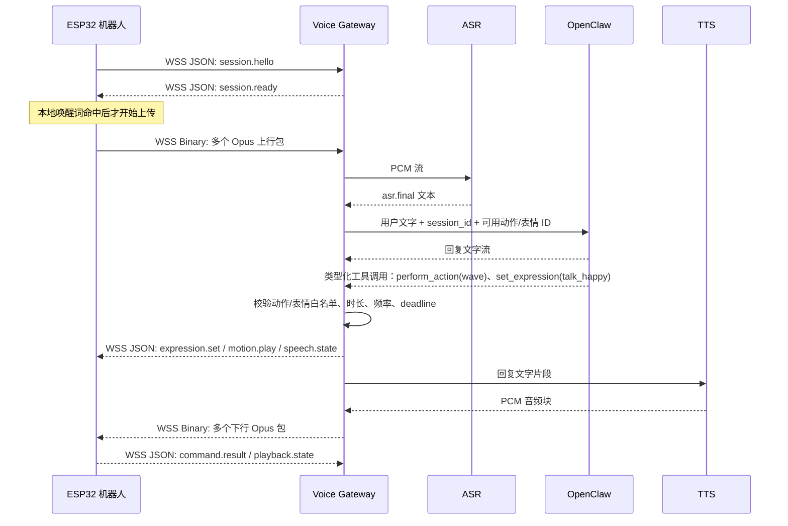

# Sesame Robot V3：Wi-Fi/WSS + OpenClaw 中台链路架构

> 日期：2026-07-26  
> 状态：当前权威架构（替代此前的 UART + 电脑麦克风方案）  
> 已确认硬件：ESP32-S3、INMP441 数字麦克风、MAX98357 I2S 功放、扬声器、OLED、8 路舵机。  
> 关键原则：ESP32 通过 Wi-Fi 建立 **WSS** 长连接；同一连接承载小型 JSON 控制消息和短 Opus 音频包。OpenClaw 是文字和决策中台，不接收 I2S、PCM 或 Opus。
> 完整单图总览：[当前完整架构图](sesame-robot-v3-current-complete-architecture.md)。

## 1. 先确定不再混淆的边界

| 名称 | 在本项目中的准确含义 | 不负责什么 |
| --- | --- | --- |
| ESP32 机器人端 | 采音、唤醒、Opus 编解码、WSS、播放、舵机、OLED 与本地安全 | ASR 推理、TTS 推理、OpenClaw、长期记忆 |
| Voice Gateway（语音网关） | 电脑上的本地服务；维护设备 WSS、Opus/PCM、VAD、ASR、TTS、打断、命令校验 | 自由决定动作或直接运行 Agent 工具 |
| OpenClaw 中台 | 对话、会话记忆、Agent 编排；输出回复文字和类型化工具调用 | 接收/转发逐包 Opus、直接访问 ESP32 IP、直接写舵机角度 |
| Control Adapter（控制适配器） | 位于 Voice Gateway；校验 OpenClaw 的工具调用，转换成设备 JSON | 让模型绕过动作/表情白名单 |

图中此前的“UART 协议任务”不是一个名为“U-Star”的协议；它原本只是 UART 串口任务。**本架构删除 UART 业务链路，改为 Wi-Fi + WSS。**USB 串口仅保留作烧录和调试。

## 2. 新的总链路图

```mermaid
flowchart LR
    User["用户\n说唤醒词、说话、打断；听语音、看动作和表情"]

    subgraph Robot["A. 机器人本体：ESP32-S3"]
        direction TB
        Mic["INMP441 数字麦克风\nI2S：BCLK、WS、DOUT"]
        I2sRx["I2S RX + DMA\n16 kHz / 16-bit / mono PCM"]
        Wake["本地唤醒与状态机\n待机 → 已唤醒 → 聆听 → 思考 → 播放"]
        OpusTx["Opus 编码\n每包 20 ms"]
        Wss["Wi-Fi + WSS 客户端\n心跳、重连、二进制/JSON 分流"]
        OpusRx["Opus 解码 + 有界播放缓冲"]
        I2sTx["I2S TX + DMA"]
        Amp["MAX98357 I2S 功放"]
        Speaker["扬声器"]
        Control["本地控制运行时\n动作白名单、表情白名单、命令回执"]
        Servo["8 路舵机"]
        Oled["128×64 OLED"]
        Safety["看门狗与安全停机\n连接/任务/命令超时；stop 最高优先级"]

        Mic --> I2sRx --> Wake --> OpusTx --> Wss
        Wss --> OpusRx --> I2sTx --> Amp --> Speaker
        Wss --> Control
        Control --> Servo
        Control --> Oled
        Safety --> Control
    end

    subgraph Wire["B. 一条 WSS 长连接：两类消息，绝不混成一个大文件"]
        direction LR
        Binary["Binary WebSocket message\n一个完整 Opus 包 + 小二进制头"]
        Json["Text WebSocket message\nJSON：握手、状态、动作、表情、回执、停止"]
        Rule["发送调度\nstop/flush > 控制 JSON > 音频；\n音频不逐包确认或重传"]
        Binary --- Rule --- Json
    end

    subgraph Voice["C. 电脑本地 Voice Gateway：实时数据面"]
        direction TB
        Entry["设备 WSS 接入\n设备认证、心跳、限流、帧校验"]
        Session["会话与打断管理\nsession_id / turn_id / generation_id"]
        Decode["Opus → PCM"]
        VadAsr["VAD + 流式 ASR\n只把 final 文字送给中台"]
        AgentAdapter["OpenClaw Adapter\n文字请求 / 回复流 / 工具调用"]
        Tts["流式 TTS\n回复文字 → PCM → Opus"]
        ControlAdapter["Control Adapter\nSchema、资产 ID、时长、频率、deadline 校验"]
        Sender["设备发送调度器\n控制 JSON + 下行 Opus"]
        Observe["结构化日志与调试\n只记 ID、阶段、耗时、错误码；不记原始音频"]

        Entry --> Session --> Decode --> VadAsr --> AgentAdapter
        AgentAdapter --> Tts --> Sender
        AgentAdapter --> ControlAdapter --> Sender
        Entry --> Observe
        Session --> Observe
        Sender --> Observe
    end

    subgraph OpenClaw["D. OpenClaw 中台：文字与受限控制面"]
        direction TB
        Gateway["OpenClaw Gateway\n本地 loopback WebSocket / 受控 API"]
        Agent["Agent + LLM\n理解文字、维护会话、生成回复"]
        Memory["会话记忆\n按用户/设备隔离"]
        Tools["仅 4 个 Sesame 工具\nset_expression / perform_action / stop / get_status"]
        Policy["工具策略与沙盒\n只开放白名单；禁止 shell、文件、任意网页和任意网络工具"]

        Gateway --> Agent
        Agent --> Memory
        Agent --> Tools --> Policy
    end

    subgraph Assets["E. 资产：一个统一 JSON 包"]
        direction TB
        Package["robot-assets.v1.json\nactions[] + expressions[] + version"]
        Registry["Gateway 资产注册表\n只给 OpenClaw 暴露已验收的 asset_id"]
        DeviceAssets["ESP32 预置/版本化资产\n运行时只接收 action_id、expression_id"]
        Package --> Registry --> DeviceAssets
    end

    User --> Mic
    Wss <-->|"WSS：Binary Opus + Text JSON"| Entry
    VadAsr -->|"final transcript + 会话上下文 + 允许资产 ID"| AgentAdapter
    AgentAdapter <-->|"文字请求、回复文字流、类型化 tool call"| Gateway
    Sender -->|"动作/表情/状态 JSON；下行 Opus"| Entry
    Registry --> AgentAdapter
    DeviceAssets --> Control
    Speaker --> User
    Servo --> User
    Oled --> User
```



### 2.1 关键结论

1. 机器人**不直接连接 OpenClaw**，只连接 Voice Gateway 的 WSS 地址；这样音频、设备身份、断线和物理安全由同一处控制。
2. OpenClaw 只接收 ASR 的最终文字，返回回复文字和工具调用；它不能拿到 Opus，也不能直接向 ESP32 发 WebSocket。
3. INMP441 与 MAX98357 都是 I2S 设备，可以共用 `BCLK`、`WS`，但各需一条数据线：`INMP441 DOUT → ESP32 DIN`，`ESP32 DOUT → MAX98357 DIN`。V3 已完成扩展排针核对并采用：`IO14=BCLK`、`IO47=WS/LRCLK`、`IO48=INMP441 DIN`、`IO2=MAX98357 DIN`、`IO1=MAX98357 SD/EN`。`IO3`、`IO45` 保留不用，因为它们是启动配置脚。

ESP32-S3 的标准 I2S 支持全双工，TX/RX 可共享 BCLK 和 WS；这说明方案在芯片能力上可行，但不等于当前 V3 PCB 的可用引脚已经满足。[ESP32-S3 I2S 全双工说明](https://docs.espressif.com/projects/esp-idf/en/latest/esp32s3/api-reference/peripherals/i2s.html)

## 3. OpenClaw 如何和每个部分连接



OpenClaw 官方 Gateway 本身也是 WebSocket + JSON 控制协议，并区分请求、响应和事件；你的 Voice Gateway 应作为它的受控客户端，而不是让 ESP32 冒充 OpenClaw 节点。[OpenClaw Gateway Protocol](https://docs.openclaw.ai/gateway/protocol)

OpenClaw 的输入应类似：

```json
{
  "session_id": "ses_01",
  "turn_id": "turn_12",
  "text": "你好小汉，跟我打个招呼",
  "allowed_actions": ["rest", "stand", "wave"],
  "allowed_expressions": ["idle", "thinking", "talk_happy"]
}
```

它的输出应拆成两类：回复文字流交给 TTS；工具调用交给 Control Adapter。例如：

```json
{
  "name": "sesame.perform_action",
  "arguments": {"action_id": "wave", "duration_ms": 1200}
}
```

Control Adapter 必须拒绝未知资产、过长时长、频率过高、过期命令和任何原始舵机角度。OpenClaw 的 sandbox（沙盒）和工具策略也应只开放这四个机器人工具，不能授予 shell、文件或任意网页访问权限。[OpenClaw 沙盒](https://docs.openclaw.ai/gateway/sandboxing)、[OpenClaw 安全说明](https://docs.openclaw.ai/gateway/security)

## 4. 你问到的概念，逐项解释

### 4.1 看门狗与安全停机是什么

看门狗不是日常控制器，而是“正常控制失效时的最后保险”。它至少分三层：

| 触发条件 | ESP32 要做什么 | 不应该做什么 |
| --- | --- | --- |
| Wi-Fi/WSS 断线，且机器人仍在执行可循环动作 | 取消待执行动作；保持或进入已验证安全姿态；OLED 显示离线/空闲 | 继续重复旧动作 |
| 收到 `robot.stop`、`flush` 或命令超时 | 立刻停止动作播放器、清空旧音频、回执停止结果 | 等当前动作自然结束 |
| 音频/网络任务卡死 | FreeRTOS Task Watchdog 记录并复位卡死任务或整机；启动后进入安全初始状态 | 静默卡死且保持危险动作 |

你目前没有舵机电流传感器，所以不能声称可以检测“舵机堵转”。这一步只能靠动作时长上限、机械校准、软件超时和物理断电开关；以后加电流采样才可做堵转检测。

### 4.2 消息信封、可靠性和“重要边界”

**统一消息信封**是每条 JSON 都带相同的识别字段，便于判断“是谁、哪一轮、哪条命令、是否过期”。例如：

```json
{
  "v": 1,
  "type": "motion.play",
  "session_id": "ses_01",
  "request_id": "req_92",
  "generation_id": 7,
  "seq": 103,
  "deadline_ms": 1760000000000,
  "payload": {"action_id": "wave"}
}
```

**可靠性**不是“所有数据都无限重发”：

- JSON 控制命令要有 `ack` 或 `error`；带副作用的命令用 `request_id` 去重，网络重连后可安全重试。
- WSS 用 `ping/pong` 心跳和断线重连；旧 `generation_id` 的音频一律丢弃。
- Opus 实时音频不逐包确认、不逐包重传；迟到的 20 ms 音频没有价值，只丢包并标记不连续。

**重要边界**指三种数据绝不混淆：控制指令是小 JSON；实时语音是短 Opus 二进制包；动作/表情资产是低频版本化文件。不能把 Opus Base64 塞进 JSON，也不能让 OpenClaw 处理每一个音频包。

### 4.3 INMP441、MAX98357 与唤醒词

INMP441 是 I2S 数字麦克风，MAX98357 是 I2S 数字功放。两者由 ESP32-S3 的 I2S 全双工任务驱动；建议首版使用 16 kHz、16-bit、单声道，先做**半双工**：机器人说话时暂停聆听。全双工需要 AEC（声学回声消除），单麦克风很难做稳。

“只有喊它才开始识别”可以直接在 ESP32-S3 上做，**不需要额外单片机**：待机时只运行本地 WakeNet 唤醒词检测；命中后进入 5–8 秒聆听窗口，才开始把 Opus 上传给 ASR。WakeNet 支持 ESP32-S3，且可同时支持最多 5 个唤醒词。[WakeNet](https://docs.espressif.com/projects/esp-sr/en/latest/esp32s3/wake_word_engine/README.html)

但有两个限制：

1. “你好小汉 / 你好小爱”不能只在配置中改一段字符串就获得可靠离线识别。若没有现成模型，需要定制唤醒词模型；乐鑫公开的流程涉及语料、训练周期和费用，不能在本项目里假定已经可用。[唤醒词定制要求](https://docs.espressif.com/projects/esp-sr/en/latest/esp32s3/wake_word_engine/ESP_Wake_Words_Customization.html)
2. 你现在只有一个 INMP441，只能做“**按唤醒词门控**”，不能做真实的“**声音方向识别**”（判断声音来自左/右或只听某个方向）。真要方向识别，至少需要双麦克风阵列和波束形成/声源定位；这不是多加一颗 MCU 就能解决的问题。

首版建议：先使用已验证的 WakeNet 模型跑通状态机；自定义“你好小汉”作为后续独立风险项。现有 V3 原始仓库是 Arduino 基线，但 WakeNet/音频任务最适合 ESP-IDF + ESP-SR；动作和 OLED 代码可以迁移复用，不能把 Arduino 单 `loop()` 直接当作实时音频架构。

### 4.4 TTS 适配器、机器人适配器、串口管理器、日志与调试

在新架构中“串口管理器”删除，替换成 **WSS 连接管理器**。

| 模块 | 作用 |
| --- | --- |
| TTS 适配器 | 屏蔽具体 TTS 供应商；输入文字，统一输出 PCM 音频块，支持取消旧请求。 |
| OpenClaw Adapter | 屏蔽 OpenClaw 的具体连接方式；输入最终文本，统一输出文字流和类型化工具调用。 |
| Control Adapter（此前称机器人适配器） | 把通过校验的 `action_id`、`expression_id`、`speech.state` 变成 WSS JSON，并等待 ESP32 回执。 |
| WSS 连接管理器 | 维护 ESP32 的身份认证、心跳、重连、连接状态和收发队列。 |
| 日志与调试 | 记录 `request_id`、阶段、耗时、错误码、命令结果；不记录 Opus 原始包、密钥或完整敏感对话。 |

## 5. 一个 JSON 包和 Opus 音频如何传

你的两个文件可以统一为一个版本化资产包：

```json
{
  "schema": "sesame.robot-assets.v1",
  "package_id": "base-v1",
  "version": "1.0.0",
  "actions": [
    {"id": "wave", "name": "挥手", "risk": "low", "max_duration_ms": 1200}
  ],
  "expressions": [
    {"id": "talk_happy", "mode": "loop", "fps": 8}
  ]
}
```

这个文件是**资产发布数据**，不是每一句对话都要发送。推荐分两条流程：

1. **低频资产同步**：首次刷机、版本升级或资产变更时，Voice Gateway 比较 `package_id/version/hash`；不同才下发资产清单和需要的分块文件。ESP32 校验完整性后写入 LittleFS/NVS 或使用已编译进固件的版本。
2. **高频对话运行**：OpenClaw 只选择 `action_id` 和 `expression_id`；Voice Gateway 先发动作/表情 JSON，再连续发 TTS 产生的 Opus 包。运行期不传完整动作帧和 OLED 位图。

所谓“动作、表情和语音一起发”，正确实现是**同一条 WSS 连接中按同一个 `generation_id` 并发编排、分帧发送**，不是把它们塞进一个 JSON：

```text
1. Text JSON  reply.begin        generation_id=7
2. Text JSON  expression.set     generation_id=7, expression_id=talk_happy
3. Text JSON  motion.play        generation_id=7, action_id=wave
4. Binary     Opus 下行包 #1..#N generation_id=7
5. Text JSON  reply.end          generation_id=7
```

发送器必须只有一个出口队列，优先级是 `stop/flush` > 控制 JSON > 音频。这样打断时可以先停止动作和清空播放缓冲，再丢弃旧 generation 的 Opus；不能由多个线程直接抢同一个 WebSocket。

## 6. “断电重组装检查”什么时候做

它不是最后才做的验收，也不是仅拆机时才做。你现在组装完、首次大电流上电前就要做一次；每次新增 INMP441、MAX98357、飞线、换电源或改舵机插头后都要重复。

当前检查内容：断电状态下确认 5 V 舵机电源与 3.3 V 逻辑/音频电源没有混接；所有模块共地；INMP441/MAX98357 只接 3.3 V 逻辑；功放电源按模块规格接；舵机电源不从 ESP32 的 3.3 V 取电；确认四条 I2S 信号线没有占用舵机/OLED GPIO；用万用表检查短路后，再先只给主控上电测试。

## 7. 本版实施顺序

1. **先查硬件可行性**：确认 V3 实际暴露 GPIO；为 I2S 留出 BCLK、WS、MIC_DIN、AMP_DOUT 四线；确认电源、共地和功放供电。此项不通过前，不写音频固件。
2. **再做无 OpenClaw 的音频闭环**：INMP441 → ESP32 → WSS → Voice Gateway → ASR/TTS → WSS → MAX98357。先半双工、先固定测试音频，再实时 Opus。
3. **再接本地唤醒**：WakeNet 命中才上传语音；没有命中不进入 ASR。先用可用模型，最后才评估定制“你好小汉”。
4. **最后接 OpenClaw 和资产**：只接文字、四个白名单工具和 `robot-assets.v1.json`；先 `wave/rest/stand` 与 `idle/talk_happy`，不开放原始舵机角度。

## 8. 当前未决项

1. V3 当前 PCB/排针是否真的能提供四个不与 8 路舵机、OLED 冲突的 GPIO；若不能，需要飞线、扩展板或调整原电路。
2. INMP441 和 MAX98357 的实际接线、供电电压、扬声器阻抗/功率尚未实测。
3. 你所说的“定向识别”是“只在唤醒词后识别”，还是“识别声源方向”；这两者的硬件需求不同。本设计先按前者实现。
4. 自定义“你好小汉 / 你好小爱”的 WakeNet 模型尚未取得或训练。
