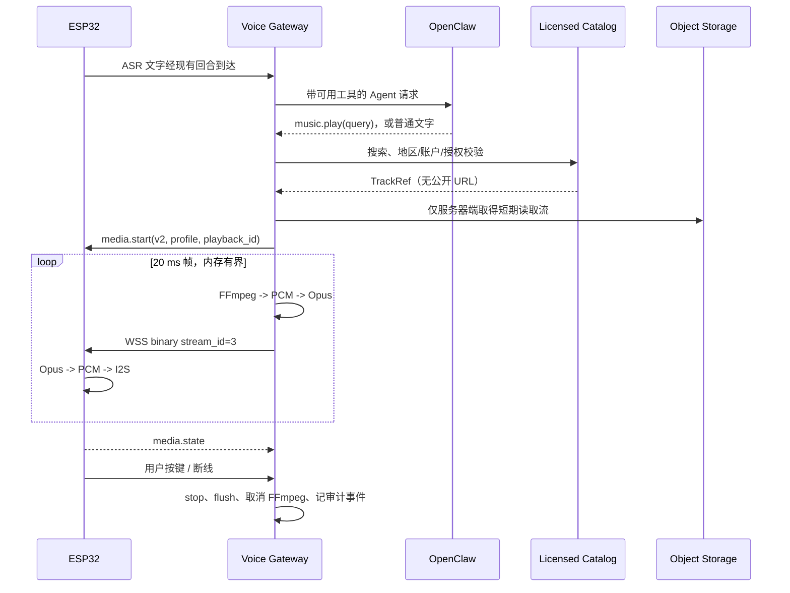

# 授权音乐流式播放 Implementation Plan

> **For Claude:** Use `${SUPERPOWERS_SKILLS_ROOT}/skills/collaboration/executing-plans/SKILL.md` to implement this plan task-by-task.

**Goal:** 在不改变现有语音对话能力的前提下，让 Sesame V3 可以由 Agent 按需调用 `music.play`、`music.control` 和 `music.status`，从有权分发的音乐目录持续读取音频、在 Gateway 实时转成 Opus、通过 WSS 下发给 ESP32，并支持开始、暂停、继续、停止、语音打断、断线清理、审计和权限撤销。

**Architecture:** OpenClaw 只决定是否提出受限的音乐工具调用；Voice Gateway 执行目录检索、授权校验、选择、流式解码/重采样/Opus 编码和会话管理；ESP32 只接收协议化的媒体帧并实时播放。第一方授权目录是默认生产实现：PostgreSQL 保存曲目和授权元数据，Alibaba OSS（或 S3 兼容对象存储）保存已获授权的母带文件。外部音乐服务只能以独立 Adapter 接入，且前提是合同明确允许 Gateway 获取并转码音频；绝不使用搜索结果、网页解析或用户给出的任意 URL 作为播放源。

**Tech Stack:** Python 3.11+、FastAPI/asyncio、现有 `opuslib`/Opus 编码链路、FFmpeg 子进程、PostgreSQL、Alibaba OSS（S3 兼容接口亦可）、ESP-IDF、I2S、Opus、WSS、pytest/unittest、ESP-IDF native tests。

---

## 0. 先锁定产品边界和内容权利

这是实现的前置条件，不是可选优化。

- 目录中的每个文件必须有可机器校验的 `license_id`、可播放地区、有效期和权利状态；上传人/运营人员对权利真实性负责。
- “我自己的文件”“已购买的音乐”不等于可转码并发送到设备。第一版生产目录只能收录自有版权、明确获得设备端流媒体分发权的文件，或与内容方签署了相应授权的文件。
- Apple Music 的官方路径是通过 MusicKit 在 App/Web 播放；Spotify 的 streaming 权限也是与设备上的 Spotify App 通信。由此可推断，这两类消费级播放集成不能直接满足“Gateway 取得可转码的原始音频并下发到 ESP32”的要求，除非另有服务端分发授权合同。[Apple MusicKit](https://developer.apple.com/musickit/) [Spotify scopes](https://developer.spotify.com/documentation/web-api/concepts/scopes)
- 如果未来要做“控制手机上的 Apple Music/Spotify”，把它定义成**外部播放器遥控功能**：手机/电脑出声，机器人只发控制命令；它不是本计划的机器人扬声器音乐下传功能。

**完成标准**

- 指定内容权利负责人、首批曲目来源和允许地区。
- 用一份可审计的导入清单验证至少 10 个获授权曲目。
- 未知权利、已过期、地区不匹配或撤销的曲目永远无法产生播放 URL。

## 1. 固化协议和状态机，再改代码

新增协议版本，保留当前 `control-event.v1` 和下行 TTS `stream_id=2` 的兼容性。不要把音乐复用为“长 TTS”，也不要让 TTS 与音乐同时写扬声器。

### 1.1 音频档位

| 档位 | 用途 | PCM | Opus | stream_id | 设备状态 |
| --- | --- | --- | --- | --- | --- |
| `voice_16k_mono` | 现有 ASR/TTS | 16 kHz、单声道、s16le | 20 ms | 1 上行 / 2 下行 | `VOICE` |
| `music_48k_stereo` | 正式音乐播放 | 48 kHz、双声道、s16le | 20 ms、`audio` application | 3 下行 | `MEDIA` |

`music_48k_stereo` 是本功能的正式验收档位。开发中可以在同一套会话和控制逻辑下暂时输出 `voice_16k_mono`，用于不具备 48 kHz 硬件条件的板子联调；它不是最终音乐质量目标。

### 1.2 媒体控制事件（v2）

创建 `contracts/schemas/control-event.v2.schema.json`，事件均带：`v: 2`、`event_id`、`timestamp_ms`、`playback_id`（UUID）和递增的 `generation`。

Gateway → ESP32：

```json
{"v":2,"type":"media.start","playback_id":"…","generation":4,"stream_id":3,"profile":"music_48k_stereo","title":"…","artist":"…","prebuffer_ms":300}
{"v":2,"type":"media.pause","playback_id":"…","generation":4}
{"v":2,"type":"media.resume","playback_id":"…","generation":4}
{"v":2,"type":"media.stop","playback_id":"…","generation":4,"reason":"user_interrupt"}
{"v":2,"type":"media.flush","playback_id":"…","generation":4}
```

ESP32 → Gateway：

```json
{"v":2,"type":"media.state","playback_id":"…","generation":4,"state":"buffering|playing|paused|ended|stopped|error","buffered_ms":0,"reason":"…"}
```

规则：一个设备同一时刻只有一个扬声器所有者 `NONE | TTS | MEDIA`；新所有者必须先停止旧所有者并等待确认/超时。`generation` 不匹配的控制事件和 Opus 帧一律丢弃。用户按键、断线、授权撤销、播放超时都统一走 `media.stop → queue flush → decoder cancel → state`。

### 1.3 Agent 工具协议（v3）

在 Agent 响应中加入严格白名单，而不是让模型写 URL：

```json
{"v":3,"status":"requires_tool","tool":{"name":"music.play","arguments":{"query":"周杰伦 晴天"}}}
{"v":3,"status":"requires_tool","tool":{"name":"music.control","arguments":{"action":"pause"}}}
{"v":3,"status":"requires_tool","tool":{"name":"music.status","arguments":{}}}
```

- 允许的 `music.control.action` 只有 `pause`、`resume`、`stop`、`next`；`query` 最大 256 字符。
- 每轮最多一次工具调用。`music.play` 由 Gateway 内部完成搜索与选择，不能让模型先拿到候选 URL 再播放。
- 搜索评分没有唯一可信结果时，工具返回“需要澄清”的结构化结果，Agent 只追问标题/歌手，不能猜一首歌播放。
- Agent 完全看不到对象存储路径、签名 URL、许可证字段、FFmpeg 命令或任何密钥。

## 2. 目标模块和数据流



建议新增目录：

```text
gateway/apps/voice_gateway/src/sesame_voice_gateway/
  music/
    models.py              # Track、License、PlaybackSession、结果类型
    catalog.py             # MusicCatalogProvider 抽象与输入/输出校验
    postgres_catalog.py    # PostgreSQL 元数据与权利查询
    object_storage.py      # OSS 受控短期读取流
    selection.py            # 明确、可解释的曲目评分与歧义判定
    authorization.py        # 地区、有效期、租户、撤销检查
    ffmpeg_decoder.py       # 受控 FFmpeg 流式 PCM 读取与取消
    encoder.py              # 48 kHz 双声道 Opus 分帧
    session.py              # 单设备播放状态机与互斥
    service.py              # play/pause/resume/stop/status 编排
  protocol/media.py         # v2 事件校验、stream_id=3 帧封装
  migrations/0001_music_catalog.sql
```

ESP32 侧新增：

```text
firmware/esp32_voice_idf/components/sesame_voice/
  include/sesame_voice/media_playback.h
  media_playback.cpp
firmware/esp32_voice_idf/components/sesame_audio/
  include/sesame_audio/audio_profile.h
  audio_profile.cpp
```

## 3. 数据模型、内容接入和安全边界

### 3.1 PostgreSQL 最小生产表

- `music_licenses(id, tenant_id, territory_codes, valid_from, valid_until, status, grant_reference, revoked_at)`
- `music_tracks(id, tenant_id, title, artist, album, duration_ms, object_key, content_sha256, license_id, territory_code, status, searchable_text)`
- `music_playback_sessions(id, device_id, tenant_id, track_id, state, started_at, ended_at, stop_reason, bytes_sent)`
- `music_playback_events(id, session_id, event_type, event_at, details_json)`

生产库启用按 `tenant_id` 的行级安全（Row Level Security，行级安全）或由独立数据库/连接池严格隔离。`object_key` 永不返回给 Agent 或设备。`object_key` 只能由目录服务换取限制对象、方法、过期时间、IP/网络边界（若可用）的短期读取权限。

### 3.2 目录 Adapter 合同

```python
class MusicCatalogProvider(Protocol):
    async def find_playable_tracks(self, *, query: str, context: PlaybackContext) -> list[TrackCandidate]: ...
    async def authorize(self, *, track_id: UUID, context: PlaybackContext) -> AuthorizedTrack: ...
    async def open_audio(self, *, authorized: AuthorizedTrack) -> AsyncIterator[bytes]: ...
```

第一方 `PostgresOssCatalogProvider` 是必须实现的正式 Adapter。任何商业目录 Adapter 必须提供相同合同，且代码评审时提供“允许服务端转码和本设备播放”的合同证据；否则只可实现外部播放器遥控 Adapter，不能接入 `open_audio`。

### 3.3 必须执行的防护

- FFmpeg 输入不接受模型、用户或 Web Search 给出的 URL；只允许授权服务签发的对象流，域名/桶名白名单固定。
- 读取前校验许可状态、地区、期限、对象 SHA-256、容器类型、最长时长、最大码率；禁止重定向到任意站点。
- 用 `asyncio.create_subprocess_exec` 传参数数组启动 FFmpeg，固定 `-nostdin -vn -f s16le -acodec pcm_s16le`，不经 shell；取消/超时必须终止子进程并回收 stdout/stderr。
- 记录内容 ID、会话 ID、结果和字节数，不记录签名 URL、对象 token、用户语音或完整查询文本。
- 对每设备设置并发 `1`、最大连续播放时长、每小时播放预算和失败熔断；授权撤销应取消正在运行的会话。

## 4. 分阶段实施任务

以下任务按顺序执行。每一任务先写失败测试，实施后只运行列出的最小验证；任务完成再进入下一项。仓库当前存在用户未提交的舵机改动，实施时只触碰下列明确文件，不重置、不格式化无关文件。

### Task 1：建立 v2/v3 合同与回归夹具

**Files:**

- Create: `contracts/schemas/control-event.v2.schema.json`
- Create: `contracts/schemas/agent-response.v3.schema.json`
- Modify: `contracts/protocols/esp32-voice-gateway.md`
- Modify: `contracts/protocols/voice-gateway-openclaw.md`
- Create: `gateway/tests/test_music_contracts.py`

**Steps:**

1. 写 schema 测试：合法 `media.start`、`media.state`、三种 Agent 音乐工具可以通过；URL、未知工具、未知 action、超长 query、错误 generation 必须拒绝。
2. 运行 `./.venv/bin/python -m unittest gateway/tests/test_music_contracts.py`，确认在 schema 未实现时失败。
3. 写 v2/v3 schema 和文档，明确 v1 不变、`stream_id=3` 只属于 `music_48k_stereo`。
4. 再次运行同一测试，随后运行 `git diff --check`。

### Task 2：把 Gateway 配置和健康检查变成显式依赖

**Files:**

- Modify: `gateway/apps/voice_gateway/src/sesame_voice_gateway/config.py`
- Modify: `gateway/apps/voice_gateway/src/sesame_voice_gateway/app.py`
- Modify: `gateway/.env.example`
- Modify: `gateway/README.md`
- Create: `gateway/tests/test_music_config.py`

**Steps:**

1. 为 `SESAME_MUSIC_ENABLED`、PostgreSQL DSN、OSS endpoint/bucket/region、允许的对象前缀、FFmpeg 路径、会话/时长限制、媒体 profile 建立不可默默回退的配置。
2. 测试缺少任一生产必要项时服务启动失败；禁用音乐时现有语音配置仍可启动。
3. 启动健康检查时验证 FFmpeg 的版本和 Opus 48 kHz 双声道能力；健康接口只报告是否就绪，绝不输出机密。
4. 运行 `./.venv/bin/python -m unittest gateway/tests/test_music_config.py`。

### Task 3：实现数据库迁移和授权目录的读模型

**Files:**

- Create: `gateway/migrations/0001_music_catalog.sql`
- Create: `gateway/apps/voice_gateway/src/sesame_voice_gateway/music/models.py`
- Create: `gateway/apps/voice_gateway/src/sesame_voice_gateway/music/catalog.py`
- Create: `gateway/apps/voice_gateway/src/sesame_voice_gateway/music/postgres_catalog.py`
- Create: `gateway/tests/test_music_catalog.py`

**Steps:**

1. 写测试覆盖：仅返回已发布、未过期、地区匹配、同租户的曲目；撤销后不可授权；查询参数永远参数化。
2. 建迁移、索引、外键和租户隔离策略；实现 `MusicCatalogProvider` 与 PostgreSQL Adapter。
3. 用测试数据库而非生产库运行 `./.venv/bin/python -m unittest gateway/tests/test_music_catalog.py`。
4. 导入 10 首已授权测试曲目元数据，核对迁移可重复执行策略与回滚说明。

### Task 4：实现确定性选曲和澄清策略

**Files:**

- Create: `gateway/apps/voice_gateway/src/sesame_voice_gateway/music/selection.py`
- Create: `gateway/tests/test_music_selection.py`

**Steps:**

1. 写候选完全匹配、歌手消歧、同名曲、低置信度和无结果的失败测试。
2. 实现不依赖 LLM 的评分和阈值：标题/歌手精确匹配优先，多个近似候选返回 `needs_clarification`。
3. 测试中断言结果含稳定 `track_id` 与可朗读的澄清文本，不含对象路径。
4. 运行 `./.venv/bin/python -m unittest gateway/tests/test_music_selection.py`。

### Task 5：实现受控对象存储读取与完整性检查

**Files:**

- Create: `gateway/apps/voice_gateway/src/sesame_voice_gateway/music/object_storage.py`
- Create: `gateway/apps/voice_gateway/src/sesame_voice_gateway/music/authorization.py`
- Create: `gateway/tests/test_music_storage_security.py`

**Steps:**

1. 写测试拒绝非白名单 bucket/prefix、过期授权、重定向、MIME/大小不符和 SHA-256 不匹配。
2. 实现仅服务端可见的短期读取流，以及授权检查的单一入口。
3. 所有异常转换成不含 URL/token 的领域错误；将详细原因写安全日志字段。
4. 运行 `./.venv/bin/python -m unittest gateway/tests/test_music_storage_security.py`。

### Task 6：实现 FFmpeg 的常数内存 PCM 生产者

**Files:**

- Create: `gateway/apps/voice_gateway/src/sesame_voice_gateway/music/ffmpeg_decoder.py`
- Create: `gateway/tests/test_music_ffmpeg_decoder.py`
- Create: `gateway/tests/fixtures/authorized-tone.wav`

**Steps:**

1. 用已授权的短测试音频写失败测试：迭代器按 20 ms 的 `48_000 × 2 × 2 × 0.02 = 3,840` byte PCM 帧输出，而不是读完整文件。
2. 实现 `create_subprocess_exec`；固定输入管道、输出 s16le、48 kHz、双声道、无视频；设置首帧、总时长和无输出超时。
3. 测试取消、FFmpeg 非零退出、截断输入和子进程清理。不得把整首音频放入 `bytes` 或 list。
4. 运行 `./.venv/bin/python -m unittest gateway/tests/test_music_ffmpeg_decoder.py`。

### Task 7：实现 48 kHz 双声道 Opus 编码和二进制媒体帧

**Files:**

- Create: `gateway/apps/voice_gateway/src/sesame_voice_gateway/music/encoder.py`
- Create: `gateway/apps/voice_gateway/src/sesame_voice_gateway/protocol/media.py`
- Modify: `gateway/apps/voice_gateway/src/sesame_voice_gateway/audio/opus.py`
- Modify: `gateway/apps/voice_gateway/src/sesame_voice_gateway/protocol/audio.py`
- Create: `gateway/tests/test_music_encoder.py`

**Steps:**

1. 写测试验证 3,840-byte PCM → 一个 20 ms Opus 包、`stream_id=3`、单调序列号/时间戳、帧头不与 TTS 冲突。
2. 将当前固定 16 kHz/单声道的 codec 改为显式 profile factory，保持 TTS 调用输出完全不变。
3. 为音乐使用 Opus `audio` application 和经测量决定的比特率范围；包大小超过协议上限必须失败而非截断。
4. 运行 `./.venv/bin/python -m unittest gateway/tests/test_music_encoder.py` 和现有音频测试。

### Task 8：实现 Gateway 的播放会话状态机和背压

**Files:**

- Create: `gateway/apps/voice_gateway/src/sesame_voice_gateway/music/session.py`
- Create: `gateway/apps/voice_gateway/src/sesame_voice_gateway/music/service.py`
- Modify: `gateway/apps/voice_gateway/src/sesame_voice_gateway/pipeline.py`
- Modify: `gateway/apps/voice_gateway/src/sesame_voice_gateway/observability.py`
- Create: `gateway/tests/test_music_session.py`

**Steps:**

1. 写状态转换测试：`IDLE → RESOLVING → BUFFERING → PLAYING → PAUSED/ENDED/STOPPED/FAILED`；非法转换失败。
2. 实现每设备一个 `asyncio.Task`、有界 queue、首播预缓冲、20 ms 节拍发送和下行背压。缓冲目标应由板级测试测量后配置，不能硬编码为无限队列。
3. 取消必须在一个有界时间内停止 FFmpeg、清理 queue、写最终事件；断线/授权撤销/新播放请求共用同一终止路径。
4. 记录首帧时间、缓冲不足次数、丢帧、播放时长和失败原因；运行 `./.venv/bin/python -m unittest gateway/tests/test_music_session.py`。

### Task 9：接入 OpenClaw 的按需工具调用

**Files:**

- Modify: `gateway/apps/voice_gateway/src/sesame_voice_gateway/openclaw/client.py`
- Modify: `gateway/apps/voice_gateway/src/sesame_voice_gateway/providers/base.py`
- Modify: `gateway/apps/voice_gateway/src/sesame_voice_gateway/pipeline.py`
- Modify: `gateway/apps/voice_gateway/src/sesame_voice_gateway/schema_resources.py`
- Create: `gateway/tests/test_openclaw_music_tools.py`

**Steps:**

1. 写测试：普通对话不调用目录；只有合法 `music.*` 工具才执行；同一 turn 的重试不重复启动；`web_search` 与音乐保持一轮一次的限制。
2. 在 Agent prompt 中把音乐工具写为“可选能力”，由 OpenClaw 判断需要时再返回 `requires_tool`；不可依赖关键词正则强制调用。
3. 执行 `music.play` 后把**已选择曲目的安全展示信息**和状态返回给 Agent，供其说“正在播放…”。TTS 完毕后才把扬声器所有权转给 `MEDIA`，避免语音和音乐混音。
4. 运行 `./.venv/bin/python -m unittest gateway/tests/test_openclaw_music_tools.py` 以及 Web Search 回归测试。

### Task 10：扩展 ESP32 音频 profile 与 Opus 解码器

**Files:**

- Create: `firmware/esp32_voice_idf/components/sesame_audio/include/sesame_audio/audio_profile.h`
- Create: `firmware/esp32_voice_idf/components/sesame_audio/audio_profile.cpp`
- Modify: `firmware/esp32_voice_idf/components/sesame_audio/include/sesame_audio/opus_codec.h`
- Modify: `firmware/esp32_voice_idf/components/sesame_audio/opus_codec.cpp`
- Modify: `firmware/esp32_voice_idf/components/sesame_audio/audio_hal.cpp`
- Modify: `firmware/esp32_voice_idf/components/sesame_audio/CMakeLists.txt`
- Create: `firmware/esp32_voice_idf/tests/test_audio_profile.cpp`

**Steps:**

1. 写 native test：`VOICE_16K_MONO` 与 `MUSIC_48K_STEREO` 的帧大小、声道、I2S slot 和不支持 profile 的拒绝路径。
2. 将音频 HAL 的格式切换封装为明确的 profile 切换，停止 RX/TX、排空 DMA、重设时钟、重新启动；不允许在 I2S 正在写时修改采样率。
3. Opus decoder 用 profile 初始化；音乐只创建解码器，不影响上行 16 kHz ASR encoder。
4. 运行项目已有的 ESP-IDF native test 命令（从 `firmware/esp32_voice_idf/README` 取得），并记录板子实际 CPU、内存和 I2S 时钟结果。

### Task 11：实现 ESP32 通用媒体播放控制器

**Files:**

- Create: `firmware/esp32_voice_idf/components/sesame_voice/include/sesame_voice/media_playback.h`
- Create: `firmware/esp32_voice_idf/components/sesame_voice/media_playback.cpp`
- Modify: `firmware/esp32_voice_idf/components/sesame_voice/include/sesame_voice/voice_controller.h`
- Modify: `firmware/esp32_voice_idf/components/sesame_voice/voice_controller.cpp`
- Modify: `firmware/esp32_voice_idf/components/sesame_voice/CMakeLists.txt`
- Create: `firmware/esp32_voice_idf/tests/test_media_playback.cpp`

**Steps:**

1. 写测试：只接受已 `media.start` 的 `stream_id=3`；generation 不一致、乱序超窗、queue 满、暂停和 stop 都不会播旧帧。
2. 复用或替换现有 `playback_buffer`，实现预缓冲、水位、实时解码 I2S 写入和 `media.state` 上报；不得累积整首歌。
3. 按键中断优先：立即停止媒体、清 queue、回切 `VOICE_16K_MONO`，然后进入现有录音流程。
4. 运行 native tests，刷入设备后以一首授权测试音频验证从 `media.start` 到 `ended`。

### Task 12：完成断线重连、恢复策略和控制闭环

**Files:**

- Modify: `gateway/apps/voice_gateway/src/sesame_voice_gateway/app.py`
- Modify: `gateway/apps/voice_gateway/src/sesame_voice_gateway/protocol/control.py`
- Modify: `firmware/esp32_voice_idf/components/sesame_voice/voice_controller.cpp`
- Create: `gateway/tests/test_music_reconnect.py`
- Create: `firmware/esp32_voice_idf/tests/test_media_reconnect.cpp`

**Steps:**

1. 写测试：WSS 断开、Gateway 重启、设备重启、重复 `event_id` 和迟到帧都不会导致旧音乐复活。
2. 第一版生产策略定为“断线即停止，不做自动续播”；重连后 Gateway 与 ESP32 都报告无活动会话。这样避免权限、位置和内容错播。
3. 若产品后续需要续播，另建设计：仅从已授权的 `track_id + offset_ms` 创建新 generation，绝不复用旧 URL 或旧帧。
4. 运行 `./.venv/bin/python -m unittest gateway/tests/test_music_reconnect.py` 与 ESP native tests。

### Task 13：管理端内容导入、撤销和审计 API

**Files:**

- Create: `gateway/apps/voice_gateway/src/sesame_voice_gateway/music/admin_api.py`
- Create: `gateway/apps/voice_gateway/src/sesame_voice_gateway/music/importer.py`
- Modify: `gateway/apps/voice_gateway/src/sesame_voice_gateway/app.py`
- Create: `gateway/tests/test_music_admin_api.py`
- Create: `docs/music-catalog-operations.md`

**Steps:**

1. 写测试：只有管理员可导入/撤销；上传必须有 hash、权利字段和时长；撤销会停止活动播放。
2. 实现认证后的导入、发布、下架、撤销和审计查询 API；音频上传走对象存储直传，Gateway 不作为大文件中转。
3. 在操作文档中写清权利审查、导入、事故撤销、密钥轮换、数据保留和客服查单步骤。
4. 运行 `./.venv/bin/python -m unittest gateway/tests/test_music_admin_api.py`。

### Task 14：安全、容量和真实设备验收

**Files:**

- Create: `gateway/tests/test_music_end_to_end.py`
- Create: `gateway/tests/test_music_chaos.py`
- Create: `docs/validation/music-streaming-acceptance.md`
- Modify: `gateway/README.md`

**Steps:**

1. 端到端测试以合法测试曲目运行：Agent `music.play` → 目录授权 → 48 kHz 立体声 Opus → ESP32 → `ended`；断言内存随播放时长不线性增长。
2. 以网络抖动、20/100/300 ms 延迟、丢包、重复包、FFmpeg 卡死、权限中途撤销和按键打断执行混沌测试。
3. 在真实扬声器和电源条件下跑至少 30 分钟连续播放、至少 100 次开始/暂停/继续/停止、至少 20 次按键打断；记录首帧时延、buffer underrun、CPU、heap、音画（音频）失真和重连行为。
4. `gateway/.venv/bin/python -m unittest discover -s gateway/tests`、ESP-IDF 全量构建/测试、`git diff --check` 全部通过后，才允许将 `SESAME_MUSIC_ENABLED=true` 用于受控试用设备。

## 5. 上线门槛

不得因为“能播出声音”就上线。以下条件全部满足才可启用：

1. 音乐来源具有可验证的设备端分发和转码授权，且导入/撤销操作可审计。
2. 当前语音、Web Search 和音乐工具的全量回归测试通过；普通问题不会无故检索或开启媒体会话。
3. Gateway 不能被 Agent、用户文本、网页结果或设备数据诱导访问任意 URL、命令或本地文件。
4. 48 kHz 双声道在目标 ESP32、MAX98357A、扬声器和供电组合上稳定；不稳定则不发布该 profile，而不是悄悄降质或丢帧。
5. 按键打断、断线、权限撤销、Gateway/设备重启均不会继续输出旧音频。
6. 仪表盘与日志可回答：正在播什么（内容 ID）、为谁播、何时开始/停止、为何失败；不泄露签名 URL 或密钥。

## 6. 明确不做的事

- 不从 Web Search、视频网站、搜索引擎、爬虫或任意用户 URL 抓音乐。
- 不把整首文件、完整 PCM 或整段 Opus 放进内存后再下发。
- 不让 OpenClaw 直接建立 ESP32 连接、持有设备密钥或发送二进制帧。
- 不修改既有 `stream_id=2` TTS 语义，也不在 TTS 与 MEDIA 间混音。
- 不对未验证硬件宣称可以稳定 48 kHz 双声道；测量失败时按验收门槛阻断发布。
