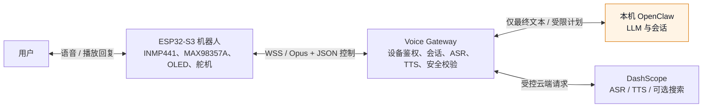

# Sesame V3：项目概览与当前边界

Sesame V3 是一个单设备、本机优先的语音机器人项目。ESP32-S3 负责麦克风、扬声器、舵机、OLED、唤醒与实时音频；电脑端 Voice Gateway 负责把语音识别、OpenClaw 和语音合成串成一轮对话；OpenClaw 只处理转写后的文本和受限的表达计划。

## 已有能力

| 区域 | 当前仓库中的能力 |
| --- | --- |
| ESP32-S3 固件 | I2S 音频、16 kHz 单声道 Opus、WSS、Wi-Fi/mDNS 发现、TLS、NVS 私密配置、WakeWord、网页控制、OLED、8 路舵机和动作安全策略。 |
| Voice Gateway | FastAPI/WSS 设备入口、设备 token 校验、DashScope ASR/TTS、OpenClaw Adapter、回合打断、响应计划、局域网 mDNS、仅本机可见的控制台与监控台。 |
| OpenClaw | 固定 `2026.7.1-1` 的本地运行时安装入口；Gateway 通过回环地址将 ASR 最终文本交给它。 |
| 控制安全 | 语音与模型只能请求 `rest`、`stand`、`wave`、`stop` 等白名单动作和受限表情；它们不能直接发送舵机角度、GPIO 命令、任意 URL 或宿主机命令。 |
| 隐私 | 原始 PCM/Opus 不落盘；控制台默认不显示 ASR/TTS 文本；云端语音和可选搜索需在 `.env` 中显式同意。 |

## 一轮对话如何运行

1. ESP32 通过 BOOT 按键、唤醒词或追问窗口开始采集；上行音频以 20 ms Opus 包经 WSS 发送给 Gateway。
2. Gateway 认证设备、解码音频，并调用已配置的 DashScope ASR 得到最终转写。
3. Gateway 把最终文本与本轮会话信息发送给仅监听 `127.0.0.1` 的 OpenClaw。
4. OpenClaw 返回文字、音色和允许的表情/动作计划；Gateway 再校验模式、白名单、时限和回合是否已过期。
5. Gateway 调用 DashScope TTS，把音频重新编码为 Opus，下发给 ESP32；设备播放语音、显示表情，并在允许时执行动作。
6. 用户打断、网络断线或任一 Provider 出错时，当前回合会取消，设备停止旧音频和旧动作并回到可恢复状态。

## OpenClaw 的位置

OpenClaw 运行在电脑，不运行在 ESP32。项目仅固定其版本和安装入口，实际的 token、会话、用户资料、sandbox 运行状态以及 `~/.openclaw/` 全局目录都不属于仓库。

它不接触 Opus/PCM、设备 token、私有 CA 或 ESP32 的网络连接。Gateway 是唯一能访问设备和 DashScope 凭据的组件；OpenClaw 只能通过 Gateway 接收文本并返回受限结果。这条边界不能因提示词、模型输出或工具调用而放宽。

## 需要现场配置的内容

克隆仓库后，以下内容仍必须由部署者为这台电脑和每台设备单独准备：

- `gateway/.env` 中的设备 token、DashScope API Key、OpenClaw token、会话密钥与 TLS 文件路径；
- 私有 CA、网关证书和与证书一致的 mDNS 主机名；
- 每台 ESP32 的 Wi-Fi、设备 ID、device token、根证书和 NVS 镜像；
- INMP441、MAX98357A、OLED、舵机电源与 GPIO 接线；
- 本机 Node.js、OpenClaw、Python 3.12、`uv`、系统 `libopus` 以及 ESP-IDF v5.5.4。

这些数据不能从 GitHub 推导或恢复。不要把 `.env`、`device-nvs.bin`、证书私钥、真实 token、Wi-Fi 密码或完整 `~/.openclaw/` 提交到 Git。

## 目录与阅读顺序

| 目录或文档 | 作用 |
| --- | --- |
| [`firmware/esp32_voice_idf/`](../firmware/esp32_voice_idf/) | 唯一正式 ESP-IDF 固件。 |
| [`gateway/`](../gateway/) | 电脑端 Voice Gateway。 |
| [`contracts/`](../contracts/) | ESP32、Gateway 与 OpenClaw 共同遵守的协议和 schema。 |
| [`ops/openclaw/`](../ops/openclaw/) | 固定版本的 OpenClaw 安装入口。 |
| [架构与联调边界](architecture.md) | 数据流、责任边界和固定 GPIO。 |
| [安全与隐私边界](security.md) | 信任边界、音频隐私、OpenClaw sandbox 与动作安全。 |
| [GitHub 范围与跨设备复现](setup/github-scope-and-replication-guide.md) | 哪些内容可从仓库得到，哪些必须另行配置。 |

先在没有实体设备的情况下建立 Gateway 和 OpenClaw 运行基线，再构建固件、写入每台设备的 NVS，最后连接硬件做 TLS、语音和动作联调。详细步骤见[换电脑后的搭建指南](setup/new-machine-setup-guide.md)。
