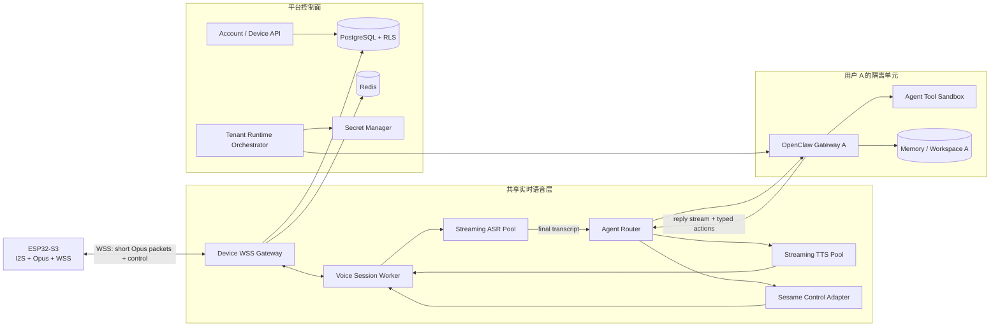

# Sesame Robot：ESP32 Opus + OpenClaw 多用户平台技术设计

> 日期：2026-07-21
> 状态：设计完成，待硬件引脚确认与实现
> 决策：采用 OpenClaw；OpenClaw 只进入 Agent 控制面，不进入实时音频数据面

## 1. 需求背景

### 1.1 业务背景

每位用户拥有自己的 Sesame Robot。机器人通过 ESP32-S3 采集麦克风音频，以 Opus 通过 Wi-Fi/WSS 发送到电脑或服务器；端侧完成 ASR、OpenClaw Agent、TTS，再将 Opus 音频流发送回 ESP32 播放。

平台需要同时满足实时语音、机器人动作、长期记忆、多场景工具调用、用户数据隔离和可扩展运维。

### 1.2 核心功能

- ESP32 双向流式 Opus 音频。
- VAD、ASR、LLM/OpenClaw、TTS 流水线。
- 用户打断、取消旧回复、清空播放缓冲。
- 每设备唯一身份与用户绑定。
- 每用户/家庭独立 OpenClaw Gateway、memory、workspace、token。
- OpenClaw 只可调用白名单 Sesame tools。
- 双层隔离：外层租户容器 + 内层 Agent tool sandbox。
- 音频默认不落盘，用户数据可查询、导出与删除。

## 2. 整体架构设计

### 2.1 系统架构图



### 2.2 组件职责

| 组件 | 职责 | 禁止承担 |
|---|---|---|
| ESP32 | I2S DMA、Opus 编解码、WSS、jitter buffer、播放 | LLM、OpenClaw、长期存储 |
| Device WSS Gateway | TLS、设备鉴权、帧校验、连接目录、限流 | ASR 推理、Agent 运行 |
| Voice Session Worker | VAD/ASR/TTS 会话、打断状态机、缓冲与背压 | 长期记忆、任意工具 |
| Agent Router | 将稳定文本路由到用户的 OpenClaw | 音频帧转发 |
| OpenClaw Gateway | session、memory、skills、tools、Agent 编排 | Opus、I2S、设备鉴权 |
| Control Adapter | 动作白名单、参数与速率校验 | 任意 shell/URL |
| Runtime Orchestrator | 创建/升级/暂停/删除每用户 Gateway | 接收用户任意镜像或挂载路径 |

## 3. ESP32 音频与网络设计

### 3.1 音频基线

- PCM：16 kHz、16-bit、mono。
- Opus：20 ms/packet；每包 320 samples。
- 目标码率：16–24 kbps，按实际语音质量调节。
- 一个完整 Opus packet 对应一个 binary WebSocket message。
- 不使用 Ogg 容器；不把整轮对话封装成一个大 message。

### 3.2 ESP32 任务划分

```text
I2S RX DMA
  → PCM capture ring buffer
  → Opus encode task
  → bounded WS TX queue
  → WSS network task

WSS network task
  → WS message assembler
  → bounded playback queue
  → Opus decode task
  → PCM playback ring buffer
  → I2S TX DMA

Robot task
  → servo / OLED，与音频任务分开
```

所有队列必须有界。起始参数：上行最多缓存 200–400 ms；下行预缓冲 60–120 ms、硬上限 300–500 ms。拥塞时丢弃完整旧 packet 并上报 discontinuity，禁止截断 Opus payload。

### 3.3 WebSocket 连接

```http
GET /device-audio
Upgrade: websocket
Authorization: Device <short-lived-token>
X-Device-Id: dev_xxx
X-Protocol-Version: 1
```

生产环境只允许 `wss://`。设备首次注册时写入唯一设备身份；日常连接使用设备证书或设备私钥签发的短期 token。后端根据认证结果解析 `tenant_id/user_id/device_id`，不接受 ESP32 自报的用户身份。

### 3.4 Binary audio message

固定网络字节序头部：

```c
struct AudioPacketHeader {
  uint8_t  version;
  uint8_t  type;             // 1=audio_up, 2=audio_down
  uint16_t flags;            // VAD_START/VAD_END/DISCONTINUITY
  uint32_t stream_id;
  uint32_t generation_id;
  uint32_t sequence;
  uint64_t timestamp_ms;
  uint16_t frame_duration_ms;
  uint16_t payload_length;
};
// followed by one complete Opus packet
```

`generation_id` 标识一轮机器人回复。ESP32 只播放当前 generation；收到更高 generation 时丢弃旧数据。

### 3.5 Control message

控制消息使用独立的小型 JSON message：

```json
{
  "type": "interrupt",
  "stream_id": 42,
  "generation_id": 7,
  "reason": "user_speaking"
}
```

其他类型：`hello`、`ready`、`vad_start`、`vad_end`、`interrupt_ack`、`flush`、`ping`、`pong`、`error`、`config_update`。

### 3.6 打断流程

1. ESP32 检测到用户重新说话，发送 `interrupt`。
2. Voice Worker 原子取消当前 OpenClaw run 和 TTS job。
3. 服务端发送 `interrupt_ack` 与 `flush`。
4. ESP32 清空 Opus decoder、PCM ring buffer 与 I2S TX buffer。
5. 后续只接受更大的 `generation_id`。

MVP 先做半双工：TTS 播放期间暂停上行或忽略 ASR。全双工版本必须加入 AEC，并把扬声器播放 PCM 作为 reference。

## 4. OpenClaw 设计

### 4.1 部署模型

共享：Device Gateway、Voice Workers、ASR/TTS/LLM inference pool、PostgreSQL、Redis。

隔离：每个用户或家庭一个 OpenClaw Gateway cell，包含独立的：

- Gateway token。
- state、session、transcript。
- workspace、memory。
- provider credentials/SecretRef。
- container network identity。

模型服务仍然共享，不为每个用户复制 ASR/TTS/LLM 模型。

### 4.2 Agent Router 接口

```http
POST /agent-response
Content-Type: application/json
```

```json
{
  "tenant_id": "ten_123",
  "user_id": "usr_123",
  "device_id": "dev_123",
  "session_id": "ses_123",
  "turn_id": "turn_123",
  "text": "你可以和我打个招呼吗",
  "locale": "zh-CN"
}
```

逻辑响应：

```json
{
  "turn_id": "turn_123",
  "reply_text": "当然可以，很高兴见到你。",
  "emotion": "happy",
  "actions": [
    {"name": "wave", "args": {"duration_ms": 1200}}
  ]
}
```

实际回复文本应流式返回，以句子或可朗读片段触发 TTS；actions 必须等完整结构化结果通过 schema validation 后执行。

### 4.3 Sesame tools

只开放窄工具：

```text
sesame.set_face(face)
sesame.perform_action(action, duration_ms)
sesame.stop()
sesame.get_status()
```

动作值采用枚举白名单；限制最大持续时间、调用频率和危险组合。OpenClaw 不直接访问 ESP32 IP，而是调用内部 Control Adapter，由 Adapter 定位当前设备连接。

禁止：通用 `exec`、`process`、文件读写、browser、nodes、gateway 管理、任意 URL 请求、用户提供的 shell、动态插件安装。

## 5. 沙盒与隐私安全

### 5.1 两层隔离

```text
宿主/集群
└── 用户 A 的 OpenClaw Gateway 容器（租户边界）
    └── 用户 A 某 session 的 Agent Tool Sandbox（工具执行边界）
```

外层容器保护用户之间的数据；OpenClaw 内置 sandbox 限制模型调用工具时的影响范围。两层不能互相替代。

### 5.2 外层 Gateway 容器基线

- rootless container，固定镜像 digest。
- 非 root UID；`read_only: true`；`no-new-privileges:true`。
- drop all Linux capabilities；PID/CPU/RAM/disk quota。
- 只挂载该租户的 state 与 workspace。
- 不挂 Docker socket、不挂宿主 HOME、不挂其他用户 volume。
- Gateway 仅绑定容器内部/loopback，由 Agent Router 访问。
- egress allowlist：只能访问共享 LLM endpoint、Control Adapter 和必要的内部服务。
- token/密钥由 Secret Manager 注入，不写镜像和日志。

### 5.3 OpenClaw 内层 sandbox 基线

```json5
{
  agents: {
    defaults: {
      sandbox: {
        mode: "all",
        backend: "docker",
        scope: "session",
        workspaceAccess: "none",
        docker: {
          network: "none",
          readOnlyRoot: true,
          capDrop: ["ALL"]
        }
      }
    }
  },
  tools: {
    profile: "minimal",
    allow: [
      "sesame.set_face",
      "sesame.perform_action",
      "sesame.stop",
      "sesame.get_status"
    ],
    deny: [
      "exec", "process", "read", "write", "edit", "apply_patch",
      "browser", "nodes", "gateway", "cron"
    ],
    elevated: { enabled: false }
  },
  gateway: {
    bind: "loopback",
    auth: { mode: "token" }
  }
}
```

配置字段需在固定 OpenClaw 版本上用 `openclaw config validate`、`openclaw sandbox explain` 和 `openclaw security audit --deep` 验证。修改后重建 sandbox runtime，旧容器不会自动获得新策略。

### 5.4 数据安全策略

| 数据 | 默认策略 |
|---|---|
| 原始 PCM/Opus | 仅内存流转，不落盘 |
| ASR 文本 | 按用户设置决定是否保存 |
| OpenClaw transcript/memory | 每租户独立加密 volume |
| TTS 音频 | 流式生成，短 TTL cache 或不缓存 |
| 日志 | 不记录原始音频、完整对话、token、密钥 |
| 删除 | 删除用户时清理 Gateway cell、volume、DB、cache、object storage |

数据库每张用户业务表必须包含 `tenant_id`，应用层鉴权和 PostgreSQL RLS 双重限制。Redis key、对象路径、trace attributes 均带 tenant_id；不得用用户输入直接拼接路径。

## 6. 数据模型

```sql
CREATE TABLE tenants (
  id UUID PRIMARY KEY,
  status TEXT NOT NULL,
  created_at TIMESTAMPTZ NOT NULL DEFAULT now()
);

CREATE TABLE users (
  id UUID PRIMARY KEY,
  tenant_id UUID NOT NULL REFERENCES tenants(id),
  status TEXT NOT NULL,
  created_at TIMESTAMPTZ NOT NULL DEFAULT now()
);

CREATE TABLE devices (
  id UUID PRIMARY KEY,
  tenant_id UUID NOT NULL REFERENCES tenants(id),
  owner_user_id UUID NOT NULL REFERENCES users(id),
  credential_fingerprint TEXT NOT NULL UNIQUE,
  firmware_version TEXT,
  status TEXT NOT NULL,
  created_at TIMESTAMPTZ NOT NULL DEFAULT now()
);

CREATE TABLE voice_sessions (
  id UUID PRIMARY KEY,
  tenant_id UUID NOT NULL REFERENCES tenants(id),
  user_id UUID NOT NULL REFERENCES users(id),
  device_id UUID NOT NULL REFERENCES devices(id),
  started_at TIMESTAMPTZ NOT NULL,
  ended_at TIMESTAMPTZ,
  audio_retained BOOLEAN NOT NULL DEFAULT false
);

CREATE TABLE agent_runtimes (
  id UUID PRIMARY KEY,
  tenant_id UUID NOT NULL UNIQUE REFERENCES tenants(id),
  runtime_name TEXT NOT NULL UNIQUE,
  image_digest TEXT NOT NULL,
  state_volume_ref TEXT NOT NULL,
  status TEXT NOT NULL,
  last_health_at TIMESTAMPTZ,
  created_at TIMESTAMPTZ NOT NULL DEFAULT now()
);
```

生产实现需为上述表启用 RLS，并以请求认证上下文设置当前 tenant。

## 7. 运维与扩展

### 7.1 Runtime Orchestrator

后端仅允许调用固定操作：create、start、stop、upgrade、health、delete。镜像、挂载路径、网络策略和资源限制来自服务端模板；用户不能传入 Dockerfile、镜像名、volume path 或命令。

OpenClaw Fleet 当前为 experimental，可用于开发验证；生产控制面应包装并锁定版本，不能让业务直接依赖其不稳定 CLI 契约。

### 7.2 可观测性

指标：active WSS、packet queue depth、ASR realtime factor、TTS first-chunk latency、agent first-token latency、end-to-end latency、interrupt success、Opus decode error、per-tenant quota、Gateway health。

trace 仅保存 ID、耗时、状态和模型用量，不默认保存原始对话与音频。

### 7.3 目标延迟预算

| 阶段 | 初始目标 |
|---|---:|
| ESP32 packetization + LAN | 20–80 ms |
| VAD endpoint | 200–500 ms |
| ASR final | 100–400 ms |
| OpenClaw/LLM first token | 300–1200 ms |
| TTS first audio | 150–500 ms |
| 下行 jitter/playback | 60–120 ms |

这些是工程目标，不是保证值，必须用目标硬件、真实 Wi-Fi 和选定模型压测。

## 8. 实施阶段

1. **硬件验证**：确认麦克风、DAC/功放、BCLK/WS/DIN/DOUT 引脚、电源与 AEC 路线。
2. **单设备半双工闭环**：ESP32 Opus ⇄ Voice Gateway ⇄ ASR/TTS，不接 OpenClaw。
3. **接入 OpenClaw**：实现 AgentAdapter 和四个 Sesame typed tools。
4. **单用户安全基线**：Gateway 外层容器 + 内层 sandbox + audit。
5. **多用户控制面**：设备鉴权、RLS、每租户 runtime、密钥和删除流程。
6. **全双工与规模化**：AEC、打断、GPU pool、休眠/唤醒、压测和容灾。

虽然最终架构采用 OpenClaw，第 2 步仍先绕过 OpenClaw验证实时媒体链路；这样能分别定位音频问题和 Agent 问题，不改变最终方案。

## 9. 关键风险

- V3 当前扩展口只确认 3 个空闲 GPIO，标准全双工 I2S 可能需要改板或飞线。
- 舵机电源噪声可能导致音频爆音、复位或 ASR 质量下降。
- WebSocket/TCP 在弱网下有队头阻塞；公网移动场景应评估 WebRTC。
- 每用户 Gateway 的固定资源和升级成本需要按真实并发测量。
- Prompt injection 不能依赖提示词解决，必须由 tool allowlist、schema validation、sandbox 和 egress policy 限制。
- OpenClaw Fleet 仍为 experimental，生产应锁版本并封装控制面。

## 10. 验收标准

- 30 分钟持续对话无内存持续增长或音频断流。
- 网络短断后设备自动重连，不播放旧 generation。
- 打断后 300 ms 级别停止旧 TTS（最终阈值以实测确认）。
- 用户 A 无法通过 API、session、memory、volume、cache 或日志读取用户 B 数据。
- Agent 无法执行 shell、读取宿主文件、访问任意公网或调用未授权动作。
- 删除用户后，其 Gateway、volume、数据库记录、缓存与对象存储按策略清理并生成审计记录。

## 11. 参考资料

- [RFC 6455 — WebSocket Protocol](https://www.rfc-editor.org/rfc/rfc6455.html)
- [RFC 6716 — Opus Codec](https://www.rfc-editor.org/rfc/rfc6716.html)
- [Espressif Audio Pipeline](https://docs.espressif.com/projects/esp-adf/en/latest/api-reference/framework/audio_pipeline.html)
- [Espressif AFE / AEC](https://docs.espressif.com/projects/esp-sr/en/latest/esp32s3/audio_front_end/README.html)
- [OpenClaw Gateway Protocol](https://docs.openclaw.ai/gateway/protocol)
- [OpenClaw Embedding](https://docs.openclaw.ai/gateway/embedding)
- [OpenClaw Sandboxing](https://docs.openclaw.ai/gateway/sandboxing)
- [OpenClaw Security](https://docs.openclaw.ai/gateway/security)
- [OpenClaw Multi-tenant Hosting](https://docs.openclaw.ai/gateway/multi-tenant-hosting)
- [小智 WebSocket 协议](https://github.com/78/xiaozhi-esp32/blob/main/docs/websocket.md)
- [小智 MCP 协议](https://github.com/78/xiaozhi-esp32/blob/main/docs/mcp-protocol.md)

结构化语音、表情和动作契约的专项设计见：

- [借鉴小智 AI 的 Sesame 结构化语音 Agent 设计](../../.internal/research/2026-07-22-xiaozhi-structured-voice-agent-design.md)
