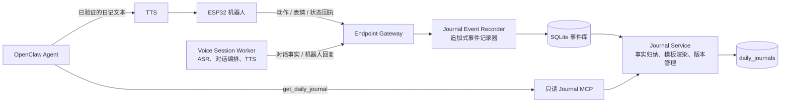

# Sesame Robot 每日小日记架构设计

> 日期：2026-08-09  
> 状态：设计完成，尚未实现  
> 适用范围：当前单设备、本机 `endpoint-gateway` 开发环境；保留向多设备平台迁移的边界。  
> 核心决策：每日小日记是 Gateway 管理的派生数据，不是 ESP32 存储功能，也不是 OpenClaw 长期记忆。

## 1. 目标与边界

机器人在一天中根据已确认的表情、动作、对话主题和回复语气，生成一篇简短的第一人称小日记。用户询问“今天的小日记”“读一下日记”或“我今天做了什么”时，机器人读取当天日记并通过 TTS 说出来。

本设计解决四件事：

1. 不丢失 Gateway 重启前的互动事实；
2. 不把“动作请求”误写成“动作已完成”；
3. 不保存原始音频或完整对话，也能保留当天互动的主题；
4. 让 OpenClaw 只能读取日记，不能伪造、修改或自行保存日记事实。

不在本期范围内：完整聊天记录、原始 PCM/Opus 音频存储、用户画像、跨设备合并日记、任意时间的后台主动播报。

## 2. 当前项目基础与缺口

现有项目已经具备日记功能的控制面入口：

- `/endpoint-gateway/src/sesame_endpoint_gateway/app.py` 会接收设备发来的 `status.update` 与 `action.result`，并处理动作、表情控制命令；
- `/firmware-work/Sesame_Robot_V3_IDF/components/sesame_voice/voice_controller.cpp` 已能接收 `expression.set` 和 `action.execute`，动作路径会发送 `action.result`；
- `/endpoint-gateway/src/sesame_endpoint_gateway/scenes.py` 已有办公、育儿、陪伴场景，可作为日记语气上下文。

但当前 Gateway 的设备状态和场景状态都只在内存中，Gateway 重启后会丢失。它也尚未实现 ASR、Agent 和 TTS 的完整编排，因此尚没有可写入日记的语言事实。固件目前在 `main/app_main.cpp` 中构造 `RobotAdapter(nullptr)`，真实 `RobotDriver` 未接入，动作和表情不能被当作已经完成的物理行为。

因此，日记功能应先建立可信事件账本，再逐步接入语音和真实硬件回执。

## 3. 总体架构



### 3.1 职责划分

| 组件 | 负责 | 不负责 |
|---|---|---|
| ESP32 | 执行表情、动作；回传状态与执行结果 | 持久化日记、生成文本、保存语音 |
| Voice Session Worker | 将 ASR final、机器人回复和回执关联到同一轮对话 | 直接写日记正文 |
| Gateway 事件记录器 | 校验、去重、记录可信事件 | 根据瞬时状态猜测历史 |
| Journal Service | 聚合当天事实，生成 `live` 或 `final` 日记 | 控制机器人、保存完整聊天 |
| OpenClaw | 在用户明确询问时读取并朗读日记 | 直接访问数据库、修改日记事实、后台生成日记 |

## 4. 事件模型

日记的源数据是**追加式事件**，不是 `latest_status` 这样的当前状态快照。每个事件写入一次，后续通过 `request_id`、设备序号和事件 ID 去重。

### 4.1 通用事件字段

```json
{
  "event_id": "evt_01J...",
  "device_id": "sesame-v3-001",
  "type": "action.completed",
  "source": "device",
  "occurred_at_utc_ms": 1786241400123,
  "received_at_utc_ms": 1786241400180,
  "timezone": "Asia/Shanghai",
  "local_date": "2026-08-09",
  "session_id": "ses_...",
  "turn_id": "turn_...",
  "request_id": "req_...",
  "source_sequence": 42,
  "payload": {}
}
```

- `received_at_utc_ms` 由 Gateway 写入，是审计和排序的基准；
- `occurred_at_utc_ms` 用于表示已经确认的发生时间；设备时间异常时以 Gateway 接收时间回退；
- `local_date` 在写入时按该设备的时区计算并保存，避免 Gateway 主机时区改变后篡改历史归属；
- 设备时区来自设备配置，例如 `SESAME_JOURNAL_TIMEZONE`，不使用运行 Gateway 的电脑时区；
- `source_sequence` 与 `request_id` 只用于去重和关联，不能向用户朗读。

### 4.2 日记使用的事件类型

| 事件类型 | 产生位置 | 是否可写入日记 | 说明 |
|---|---|---:|---|
| `conversation.fact.recorded` | Voice Session Worker | 是 | 只保存主题、语气等短事实，不保存原始转写。 |
| `robot.reply.recorded` | Voice Session Worker | 是 | 保存机器人回复主题和表达风格。 |
| `expression.requested` | Gateway | 否 | 仅代表命令已下发。 |
| `expression.applied` | ESP32 回执 | 是 | 只有设备确认应用后才能叙述。 |
| `expression.rejected` | ESP32 回执 | 否 | 仅用于诊断，不写成机器人行为。 |
| `action.requested` | Gateway | 否 | 仅代表请求。 |
| `action.started` | ESP32 回执 | 否 | 可用于运行状态，不视为完成。 |
| `action.completed` | RobotDriver 完成回调 | 是 | 唯一可叙述为已完成的动作事件。 |
| `action.rejected` / `action.failed` | ESP32 回执 | 否 | 只用于控制台和诊断。 |
| `interaction.started` / `interaction.ended` | Voice Session Worker | 可选 | 用于生成互动次数或时段摘要。 |

### 4.3 表情与动作回执要求

现有固件有 `action.result`，但表情没有等价回执。日记接入前需要新增 `expression.result`，例如：

```json
{
  "type": "expression.result",
  "request_id": "req_face_001",
  "payload": {
    "expression": "happy",
    "status": "applied",
    "error_code": null
  }
}
```

真实 `RobotDriver` 若是异步动作播放器，`action.result: completed` 必须在动作实际结束后发送，而不是在命令被队列接受时发送。Gateway 可以记录 `action.requested` 和 `action.started`，但日记只消费 `action.completed`。

## 5. 语言事实与隐私策略

日记需要理解“聊了什么”，但不需要保存完整对话。推荐默认使用 `summary_only` 模式：每轮 ASR final 与 Agent 回复完成后，在 Gateway 内把它们提炼成一个结构化事实，再丢弃原始文本。

```json
{
  "topic": "下午安排",
  "user_mood": "犹豫",
  "robot_tone": "鼓励",
  "scene_id": "companion"
}
```

规则如下：

- 不写入原始音频、完整 ASR 转写、token、设备凭据或会话 ID；
- 主题事实不得包含姓名、联系方式、地址、账号、精确位置或其他可识别资料；
- 一轮无法安全提炼时，记录 `conversation.fact.skipped`，日记只说“我们聊了一会儿”，不补写细节；
- 日记事件保留期和日记正文保留期必须可配置；建议默认分别为 30 天和 90 天，并提供按日或按设备删除；
- 若用户关闭语言摘要，日记仍可依据确认的动作、表情和互动次数生成。

## 6. 存储设计

当前单设备 MVP 使用 SQLite，不增加新的运行时依赖。数据库文件由 Gateway 进程持有，不能放在 OpenClaw workspace 中。

```sql
CREATE TABLE journal_events (
  event_id TEXT PRIMARY KEY,
  device_id TEXT NOT NULL,
  event_type TEXT NOT NULL,
  source TEXT NOT NULL,
  occurred_at_utc_ms INTEGER NOT NULL,
  received_at_utc_ms INTEGER NOT NULL,
  timezone TEXT NOT NULL,
  local_date TEXT NOT NULL,
  session_id TEXT,
  turn_id TEXT,
  request_id TEXT,
  source_sequence INTEGER,
  payload_json TEXT NOT NULL,
  created_at_utc_ms INTEGER NOT NULL,
  UNIQUE(device_id, source, source_sequence)
);

CREATE INDEX journal_events_by_device_day
  ON journal_events(device_id, local_date, received_at_utc_ms);

CREATE TABLE daily_journals (
  device_id TEXT NOT NULL,
  local_date TEXT NOT NULL,
  timezone TEXT NOT NULL,
  status TEXT NOT NULL CHECK(status IN ('live', 'final')),
  revision INTEGER NOT NULL,
  event_watermark_utc_ms INTEGER NOT NULL,
  source_event_count INTEGER NOT NULL,
  facts_json TEXT NOT NULL,
  content TEXT NOT NULL,
  renderer_version TEXT NOT NULL,
  created_at_utc_ms INTEGER NOT NULL,
  updated_at_utc_ms INTEGER NOT NULL,
  PRIMARY KEY(device_id, local_date)
);
```

未来进入多用户平台时，迁移到 PostgreSQL，并为两张表增加 `tenant_id`、设备绑定、行级隔离和加密备份策略；数据模型和事件契约保持不变。

## 7. 日记生成与版本规则

### 7.1 生成步骤

1. 按设备、日期读取事件；
2. 过滤掉未确认的动作、表情和失败事件；
3. 归纳得到有序事实包：场景、互动主题、已完成动作、已应用表情、互动次数；
4. 先使用确定性模板生成正文；
5. 若后续启用 LLM 润色，只允许输入事实包，输出必须带回使用的 `event_id`，并由 Gateway 校验；
6. 保存正文、事实包、事件水位和版本号。

确定性模板是第一版默认方案，因为它可验证、低成本，也不会因为模型生成而补出不存在的互动。LLM 润色是可选的第二阶段能力，不应成为日记可用性的前提。

### 7.2 `live` 与 `final`

- 当天被询问时生成或刷新 `live` 日记；
- 每天在设备本地日期结束后约 5 分钟，将前一天日记结算为 `final`，避免遗漏 23:55 到 24:00 的互动；
- Gateway 启动时扫描缺失的前序日期并幂等补齐；
- 已结算日期收到迟到但有效的事件时，更新日记并递增 `revision`，不覆盖审计事实；
- 动作按 Gateway 确认完成的时间归属日期，不按请求时间归属。

### 7.3 空日记示例

若当天没有可用事件，生成：

> 今天我们还没有开始聊天。我在桌边等你，等你想说话时叫我一声就好。

该句不宣称发生过动作、表情或对话。

## 8. OpenClaw 查询接口

新增受限 HTTP 接口，并沿用现有场景控制接口的 Bearer token 校验模式：

```http
GET /v1/openclaw/journal/{device_id}?date=YYYY-MM-DD
Authorization: Bearer $SESAME_SCENE_CONTROL_TOKEN
```

响应：

```json
{
  "device_id": "sesame-v3-001",
  "date": "2026-08-09",
  "status": "live",
  "revision": 2,
  "content": "今天我在陪伴场景里和你聊了下午的安排……",
  "source_event_count": 12
}
```

在新的 `openclaw_journal_mcp.py` 中只暴露一个只读工具：

```text
get_daily_journal(device_id?, date?)
```

Agent 规则：用户明确询问日记时调用该工具，取得 `content` 后直接作为回复朗读；它不能补写内容、调用写入接口或访问 SQLite 文件。若当天没有日记，按接口返回的空日记回复。

## 9. 当前项目的模块落点

```text
endpoint-gateway/src/sesame_endpoint_gateway/
├── app.py                    # 注入 JournalService；接入设备回执和只读 HTTP 接口
├── journal_store.py           # SQLite 建表、写事件、读日记、幂等控制
├── journal_service.py         # 事件校验、事实包、模板渲染、版本规则
├── journal_scheduler.py       # 单进程定时结算与启动补偿
├── openclaw_journal_mcp.py    # 只读 MCP bridge
└── voice_session.py           # 后续 ASR/Agent/TTS 编排时写入语言事实

firmware-work/Sesame_Robot_V3_IDF/
├── components/sesame_protocol/ # 新增 expression.result 控制事件类型
├── components/sesame_voice/    # 发送表情回执；按真实完成时机发送动作回执
└── main/app_main.cpp           # 接入真实 RobotDriver 后，才允许物理动作进入日记
```

`JournalScheduler` 在当前单 Gateway、单 Uvicorn worker 模式下运行。未来多进程或多实例部署时，必须改为独立 worker 或数据库锁，避免同一日期被重复结算。

## 10. 实施顺序

### 阶段 1：可信事件账本

- 建立 SQLite、事件写入和去重测试；
- Gateway 将动作请求、动作回执、表情请求写入事件库；
- 补齐表情确认回执协议；
- 控制台新增“今日小日记”只读预览。

### 阶段 2：日记服务与语音查询

- 实现确定性 `live` 日记；
- 新增受限 Journal MCP；
- Agent 在明确的日记询问下调用只读工具；
- TTS 朗读返回文本。

### 阶段 3：语言事实与每日结算

- 接入 ASR final 和 Agent reply 的短事实提炼；
- 实现设备时区、次日结算、启动补偿和版本更新；
- 实现按日、按设备删除。

### 阶段 4：真实硬件与质量增强

- 接入真实 `RobotDriver`，修正动作完成时机；
- 用真实设备验证表情回执、动作回执和跨午夜动作；
- 仅在事实校验稳定后评估 LLM 润色。

## 11. 验收标准

1. Gateway 重启后，当天已写入的事件与日记仍可读取；
2. 重复的设备消息不会让动作或互动次数重复计算；
3. 被拒绝、超时或未确认的动作和表情不出现在日记正文；
4. 用户当天询问时能得到 `live` 日记，次日能读到对应 `final` 日记；
5. 不同设备、时区和日期之间的事件不会混入同一篇日记；
6. 数据库中没有原始音频、完整 ASR 转写、token 或设备密钥；
7. OpenClaw 只能通过 `get_daily_journal` 读取文本，不能写事件或直接访问数据库；
8. 没有事件时输出空日记，不编造对话、动作或情绪。

## 12. 最终判断

该方案能在当前 Gateway 架构中落地，且不会改变 ESP32 的实时音频职责。第一版的关键不是“让模型写得多像日记”，而是先保证每一句日记都来自可追溯、已确认的事实。完成事件账本和只读查询后，语音、场景、真实动作和更丰富的文风都可以逐步加入，而不需要推翻数据边界。
